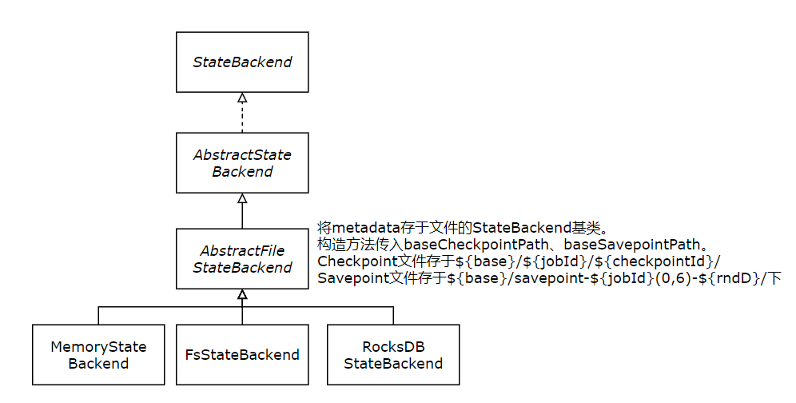
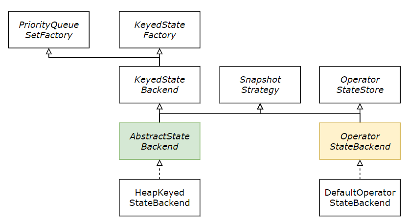

# FlinkSQL

TableAPI和SQL集成在同一套API中。这套API的核心是Table，用作查询的输入和输出。	

TableEnvironment是TableAPI和SQL的核心概念，负责：

- 在内部的catalog中注册Table
- 注册外部的catalog
- 加载可插拔模块
- 执行SQL查询
- 注册自定义函数（scalar、table或aggregation）
- 将DataStream及DataSet转为Table
- 持有对ExecutionEnvironment或StreamExcecutionEnvironment的引用。

Table与TableEnvironment绑定，不能在同一条查询中使用不同TableEnvironment中的表，如进行join、union操作。


TableEnvironment中维护着一个由标志符（identifier）创建的表catalog的映射。标志符由三部分组成：catalog名称、数据库名称、对象名称。


表可以是临时的，与单个Flink会话关联（存于内存）；也可以是永久的，在多个Flink会话和集群中可见。永久表需要catalog（如Hive MetaStore）以维护元数据。


不论流还是批，TableAPI及SQL查询都将被转换成DataStream程序。


将Table转换为DataStream有两种模式：

1. Append Mode： 在动态Table只通过INSERT进行修改时可用，仅为追加模式，之前的输出结果不会更新。
2. Retract Mode：任何情形下都可使用该模式，它使用Boolean对INSERT和UPDATE的数据进行标记。


## 整体执行框架

数据处理领域，无论实时还是离线，使用SQL简化开发将是趋势。SQL简化了开发，但将SQL等价转换到处理引擎中很困难，尤其在流数据处理领域。

### 背景知识

SQL执行主要分为四个阶段，`Parse` `Validate` `Optimize` `Execute`，Flink借用Calcite实现。

- Parse：语法解析，将SQL解析为一棵抽象语法树（AST），Calcite中使用`SqlNode`表示。
- Validate：语法校验，根据元数据进行校验。检查如查询表、使用函数是否存在等。校验后仍是`SqlNode`语法树。
- Optimize：查询计划优化，
  1. 先将`SqlNode`语法树转换为`RelNode`逻辑树。
  2. 基于规则使用优化器进行等价变换。如谓词下推、列裁剪等。
- Execute：逻辑查询计划转为物理执行计划，生成代码并提交运行。

> 关于 Calcite 的基本介绍可以参考这个[Slide](https://www.slideshare.net/JordanHalterman/introduction-to-apache-calcite)。

### 可插拔的SQLRunner

FlinkSQL抽象出`Planner`和`Runner`接口，用户可指定使用Runner。1.11版本后默认使用BlinkPlanner。

Planner有两个功能：主要是把关系型操作翻译成可执行、经过优化的Flink任务。

1. 通过getParser()获取SQL解析器，该解析器将SQL解析成对应的Operation树。
2. 将ModifyOperation（Operation子类）树进行组织、优化并转为可运行Transformation。

```java
public interface Planner{
    Parser getParser();
    List<Transformation<?>> translate(List<ModifyOperation> modifyOperations);
    String explain(List<Operation> operations, ExplainDetail... extraDetails);
    String[] getCompletionHints(String statement, int position);
}
```

Executor执行Planner生成的Transformations graph，将TableEnvironment从运行环境中解耦。

```java
public interface Executor{
    Pipeline createPipeline(List<Transformation<?>> transformations, TableConfig tableConfig, String jobName);
	JobExecutionResult execute(Pipeline pipeline) throws Exception;
    JobClient executeAsync(Pipeline pipeline) throws Exception;
}
```

TableEnvironment中定义了SQL入口，TableEnvironmentImpl中实现具体逻辑

```java
public interfact TableEnvironment{
    TableResult executeSql(String statement);
}
```
TableEnviromentInternal
```java
public interface TableEnvironmentInternal extends TableEnvironment {
    TableResult executeInternal(List<ModifyOperation> operations);
    TableResult executeInternal(QueryOperation operation);
    String explainInternal(List<Operation> operations, ExplainDetail... extraDetails);
}

```
TableEnvironmentImpl的executeOperation根据Operation类型调用excuteInternal的重载。如果是ModifyOperation则会调用内置Planner成员变量的translate方法将ModifyOperation集合转为Tranformation集合。再调用Executor.createPipeline()将Transformation集合串起来在调用executeAync执行。
```java
public class TableEnvironmentImpl implements TableEnvironmentInternal {
    public TableResult executeSql(String statement) {
		List<Operation> operations = parser.parse(statement);
    	return executeOperation(operations.get(0));
    }
    private TableResult executeOperation(Operation operation) {
        if (operation instanceof ModifyOperation) {
            return executeInternal(Collections.singletonList((ModifyOperation) operation));
         // bunch of cases
    }
}
```


### BlinkRunner

Blink的Runner实现为PlannerBase，只适用于流式场景。SQL解析在PlannerBase.parcer.parse()中实现

1. 使用Calcite解析出`SqlNode`
2. 在SqlToOperationConverter中调用FlinkPlannerImpl.validate()对解析后的SqlNode进行验证
3. 调用SqlToOperationConverter的convertXXX()系列方法将SqlNode转为Operation


### SQL的转化与优化

Planner.translate()将Operation转化为Transformation。

BlinkBase.translate()：

1. 将`ModifyOperation`转为`RelNode`: translateToRel()
2. 优化`RelNode`：optimize()
3. 转换成`ExecNode`： translateToExecNodePlan()
4. 转换成`Transformation`集合：translateToPlan()

### SQL执行

得到Transformation后可构建对应的StreamGrap，后提交运行。

​	

### TableAPI

除了使用纯SQL，Flink还支持TableAPI编程，主要接口有`Table` `Operation` `Expression`等。

`Operation`和`Expression`是对操作和表达式的抽象，都有各自一套继承体系对应Calcite中的`RelNode`和`RexNode`。通过TableAPI可以构建出语法树，树最终被转换为`RelNode`树。后再进入转换和优化逻辑。

`Operation`包含了对表的所有操作，如DQL、DML、DDL、DCL。通过Planner.parse(String)获取对应Operation。

`Table`是对于表的抽象，除了schema等信息外，底层对应一个`QueryOperation`。

使用`Table`的方法转换数据。使用`TableEnvironment`将`Table`转换成`DataSet`或`DataStream`。

```java
public interface Table{
    TableSchema getSchema();
    //返回表的底层逻辑表示
    QueryOperation getQueryOperation();
}
```

TableImpl

```JAVA
public class TableImpl implements Table {
    public Table select(Expression... fields) {
        List<Expression> expressionsWithResolvedCalls = preprocessExpressions(fields);
        CategorizedExpressions extracted = OperationExpressionsUtils.extractAggregationsAndProperties(expressionsWithResolvedCalls);
        if (!extracted.getWindowProperties().isEmpty()) {
            throw new ValidationException("Window properties can only be used on windowed tables.");
        }

        if (!extracted.getAggregations().isEmpty()) {
            QueryOperation aggregate =
                    operationTreeBuilder.aggregate(
                            Collections.emptyList(), extracted.getAggregations(), operationTree);
            return createTable(
                    operationTreeBuilder.project(extracted.getProjections(), aggregate, false));
        } else {
            return createTable(
                    operationTreeBuilder.project(
                            expressionsWithResolvedCalls, operationTree, false));
        }
    }   
}
```


## 元数据管理

## 时间属性

## 流和动态表

## 流表中join表现

## 流式概念

TableAPI与SQL是流批统一API，在批处理与流式计算中有着同样的语义。

### 动态表（Dynamic table）

SQL与TableAPI提供了对流式数据处理的灵活有效的适配。下面介绍如何将关系代数内容优雅地迁移到流式计算上，让无界流实现关系代数的语义。

| 关系代数、SQL                | 流式处理                       |
| ---------------------------- | ------------------------------ |
| 关系/表是有界元组集合        | 流是无界元组集合               |
| 批处理下，查询可访问完整数据 | 流处理下，查询无法访问完整数据 |
| 批处理有终点                 | 流处理无终点                   |

基于物化视图的思想来实现流上关系代数同语义转换：

- 数据库表是`insert` `update` `delete`等DML语句的stream结果，将其称为changelog stream
- 物化视图由SQL查询语句定义。更新视图需要不断的处理changelog stream。
- 物化视图是流式SQL查询的结果。

动态表是SQL、TableAPI可支持流式数据的核心概念。与静态表批处理数据不同，动态表的数据随时在改变。但系统如静态表一样在动态表上执行查询。动态表上的查询是连续不断地，这个过程不会终止，也不会产生新的动态结果（动态表）。查询会连续的将结果更新在当前动态表上。动态表上连续的查询操作与物化视图非常相似。

需要注意的是动态表上连续的查询输出与同样数据静态批处理下输出一致，即保证语义正确。

下图展示了动态表持续查询更新的过程：


1. 流数据转为动态表
2. 在动态表上运行持有状态的连续查询，并将结果输出到新动态表中
3. 结果动态表内容回写入流中

> 动态表更多是一个逻辑上的概念，并不需要在查询过程中完全物化。

动态表上的连续查询会将结果放在新的动态表中。与批处理不同的是，连续查询不会从输入表中读取数据并将更新写入结果表。任何时刻，任何数据下，连续查询的语义都与批处理相同。

下图展示了GROUP-BY COUNT的实现：


下图展示基于TumblingWindow的统计：


上两个示例看起来十分相似，但在结果写入方式上有着本质的不同：

- 第一个查询执行更新操作，定义结果表的changelog流中包含INSERT与UPDATE操作。
- 第二个查询结果只append到结果表中，结果表的changelog中仅含INSERT操作。

写入方式：

- 执行UPDATE的查询通常维护着大量的状态。
- 两种模式的表与流间的装换方法不同（append-only，update）。

FlinkTableAPI和SQL在动态表上有三种变化表示方式：

- Append-only stream：追加模式动态表上只运行INSERT变化。

- Retract stream：retract流有add和retract两种类型的消息。将INSERT封装为add消息，DELETE封装为retract消息，UPDATE封装为retract消息（以更新之前数据）。

  

- Upsert stream：upsert流有upsert和delete两种消息。动态表需要一个唯一键（可能为组合键）来转换upsert流。有唯一键的upsert动态表将INSERT和UPDATE操作封装为upsert消息，将DELETE封装为delete消息。与retract模式不同，upsert模式将UPDATE操作封装在一条消息中，因此更为高效。

  


### 时间属性

Flink提供时间：

- event time：事件时间
- processing time：处理时间


时间属性可以是每张表的一部分，可通过CREATE TABLE DDL创建，也可通过DataStream获取。时间属性同标准时间戳一样，可执行计算操作。一旦时间属性被用于计算，将会被物化且与标准时间无异。然而，普通的时间戳不能转换成时间属性。

事件时间可通过CREATE DDL指定，亦可通过DataStream-to-Table转换指定。

```sql
CREATE TABLE user_actions (
  user_name STRING,
  data STRING,
  user_action_time TIMESTAMP(3),
  -- declare user_action_time as event time attribute and use 5 seconds delayed watermark strategy
  WATERMARK FOR user_action_time AS user_action_time - INTERVAL '5' SECOND
) WITH (
  ...
);

SELECT TUMBLE_START(user_action_time, INTERVAL '10' MINUTE), COUNT(DISTINCT user_name)
FROM user_actions
GROUP BY TUMBLE(user_action_time, INTERVAL '10' MINUTE);
```


```java
// Option 1:

// extract timestamp and assign watermarks based on knowledge of the stream
DataStream<Tuple2<String, String>> stream = inputStream.assignTimestampsAndWatermarks(...);

// declare an additional logical field as an event time attribute
Table table = tEnv.fromDataStream(stream, $("user_name"), $("data"), $("user_action_time").rowtime());


// Option 2:

// extract timestamp from first field, and assign watermarks based on knowledge of the stream
DataStream<Tuple3<Long, String, String>> stream = inputStream.assignTimestampsAndWatermarks(...);

// the first field has been used for timestamp extraction, and is no longer necessary
// replace first field with a logical event time attribute
Table table = tEnv.fromDataStream(stream, $("user_action_time").rowtime(), $("user_name"), $("data"));

// Usage:

WindowedTable windowedTable = table.window(Tumble
       .over(lit(10).minutes())
       .on($("user_action_time"))
       .as("userActionWindow"));
```


### 流上join

Join在批处理中很常见，动态表上的join语义会相对难以理解。Flink提供了几种基于TableAPI和SQL的join方法。

#### 常规join

```sql
SELECT * FROM Orders
INNER JOIN Product
ON Orders.productId = Product.id
```

上述语句允许对输入表进行任意的更新操作（insert，update，delete）

常规join需要在Flink中保存两侧表的状态。如果其中一方或双方输入表持续增长，资源消耗也会无限增长。

#### 时间区间join

如果join限定时间属性必须在某个区间（时间窗口），那么就成为时间区间join

```java
SELECT * 
FROM
    Orders o,
	Shipments s,
WHERE o.id = s.oderId AND 
    o.ordertime BETWEEN s.shiptime - INTERVAL '4' HOUR and s.shiptime;
```

与常规join相比，时间区间join只支持带有时间属性的递增表。由于时间属性时单调递增的，Flink可以从状态中移除过期数据，而不影响结果的正确性。

#### 时态表join

时态表join只在Blink planner中支持。

##### 基于事件时间的时态join

##### 基于处理时间的时态join

### 模式检测

数据流场景中使用模式检测是一种常见的用例。Flink提供复杂事件处理库CEP在事件流中进行模式检测。

2016年iso组织发布的SQL标准中包括了在SQL中进行模式识别的标准（[ISO/IEC TR 19075-5:2016](https://standards.iso.org/ittf/PubliclyAvailableStandards/c065143_ISO_IEC_TR_19075-5_2016.zip)）。该标准允许Flink使用MATCH_RECOGNIZE子句融合CEP和SQL API，以便在SQL中进行复杂处理。

MATCH_RECOGNIZE子句启动以下任务：

- 使用PARTITION BY和ORDER BY对数据进行逻辑分区和排序
- 使用PATTERN子句定义要查询的行模式。类似于正则表达式语法。
- 使用DEFINE子句定义行模式变量的逻辑组合。
- 使用MEASURE子句定义可以在SQL查询其余部分中使用的measures。

```java
SELECT T.aid,T.bid,T.cid
FROM MyTable
    MATCH_RECOGNIZE(
		PARTITION BY userid
    	ORDER BY proctime
    	MEASURES
    		a.id AS aid
    		b.id AS bid
    		c.id AS cid
    	PATTERN (A B C)
    	DEFINE
    		A AS name = 'a'
    		B AS name = 'b'
    		C AS name = 'c'
	) AS T
```


使用MATCH_RECOGNIZE子句，需要添加CEP依赖。

每个MATCH_RECOGNIZE查询都包含以下子句：

- PARTITION BY：定义表的逻辑分区，类似于GROUP BY操作
- ORDER BY：指定穿入行的排序方式，因模式依赖顺序故必须指定
- MEASURES：定义子句的输出，类似于SELECT子句
- ONE ROW PER MATCH：输出方式，定义每个匹配项产生多少行
- AFTER MATCH SKIP：指定下一个匹配的开始位置，控制事件可隶属于多少个不同匹配项的方法
- PATTERN：允许使用类似于正则表达式的语法构造搜索模式
- DEFINE：定义了模式变量必须满足的条件

目前（1.12），MATCH_RECOGNIZE子句只能应用与追加表，其结果也是一个追加表

强烈建议对传入的数据进行分区，否则 MATCH_RECOGNIZE 子句将被转换为非并行算子，以确保全局排序。

`MATCH_RECOGNIZE` 子句假定升序的 [时间属性](https://ci.apache.org/projects/flink/flink-docs-release-1.12/zh/dev/table/streaming/time_attributes.html) 是 `ORDER BY` 子句的第一个参数。

对于示例 `Ticker` 表，诸如 `ORDER BY rowtime ASC, price DESC` 的定义是有效的，但 `ORDER BY price, rowtime` 或者 `ORDER BY rowtime DESC, price ASC` 是无效的。

`DEFINE` 和 `MEASURES` 关键字与简单 SQL 查询中的 `WHERE` 和 `SELECT` 子句具有相近的含义。


模式的最后一个变量不能使用贪婪量词。

目前不支持可选的勉强量词（`A??` 或者 `A{0,1}?`）。


时间约束：

Flink SQL 支持附加的（非标准 SQL）`WITHIN` 子句来定义模式的时间约束。子句可以在 `PATTERN` 子句之后定义，并以毫秒为间隔进行解析。

如果潜在匹配的第一个和最后一个事件之间的时间长于给定值，则不会将这种匹配追加到结果表中。

 通常鼓励使用 `WITHIN` 子句，因为它有助于 Flink 进行有效的内存管理。一旦达到阈值，即可修剪基础状态。

然而，`WITHIN` 子句不是 SQL 标准的一部分。时间约束处理的方法已被提议将来可能会改变。


AFTER MATCH SKIP子句四种匹配后策略：

- SKIP PAST LAST ROW
- SKIP TO NEXT ROW
- SKIP TO LAST variable
- SKIP TO FIRSET variable


时间属性：

- MATCH_ROWTIME()
- MATCH_PROCTIME()


编写MATCH_RECOGNIZE时，内存消耗是一个重要考虑因素。


## SQL

TableResult.collect()与TableResult.print()的行为在不同的checkpoint模式下略有不同：

- 对于批作业或没有配置任何checkpointing的流作业，TableResult.collect()与TableResult.print()既不保证精准一次的数据交付、也不保证至少一次的数据交付。查询结果产生后即可被客户端访问，作业失败重启时报错。
- 对于配置了精准一次checkpointing流作业，TableResult.collect()与TableResult.print()保证端到端精确一次的数据交付。一条结果数据只有在其checkpointing完成后才能在客户端访问。
- 对于配置了至少一次checkpointing流作业，TableResult.collect()与TableResult.print()保证端到端至少一次数据交付。查询结果在生成时即可访问，但同一结果可能多次发送给客户端。

# 时间、定时器和窗口

#### WindowOperator

```java
public void processElement(StreamRecord<IN> ele) throws Exception{
    final Collection<W> eleWins = windowAssigner.assignWindows(ele...);
    if(windowAssigner instanceof MergingWindowAssigner){
        //可合并分配器处理逻辑
        	
    }else{
        //不可合并分配器处理逻辑
    }
    
    if(isSkippedElement && isElementLate(ele)){
        if(lateDataOutputTag!=null){
            sideOutput(ele);//旁路输出
        }else{
            this.numLateRecordsDropped.inc();//丢弃计数
        }
    }
}
{//可合并分配器处理逻辑
	MergingWindowSet mergingWindows = new MergingWindowSet(windowAssigner,mergingSetState);
    for(W window : eleWins){
        //经过合并后的窗口
        W actualWindow = mergingWindows.add(window,new MergingWindowSet.MergingFunction<W>(){});
        //清除超时窗口
        if(window.isEventTime() && (cleanupTime(window)<=internalTimerService.currentWatermark())){
            mergingWindows.retireWindow(actualWindow);continue;
        }
        W stateWindow = mergingWindows.getStateWindow(actualWindow);
        windowState.setCurrentNamespace(stateWindow);
        windowState.add(ele.getValue);
        triggerContext.key = key;
        triggerContext.window = actualWindow;
        TriggerResult triggerResult = triggerContext.onElement(ele);
        //触发输出逻辑,将窗口及数据发给userFunction.
        if(triggerResult.isFire()) emitWindowContents(actualWindow,contexts);
        if(triggerResult.isPurge()) windowState.clear();
        registerCleanupTimer(actualWindow);//加上allowedLateness作为内容清除时间.调用InternalTimerService注册超时时间.
    }
    mergingWindows.persist();//清除MergingWindowState中的ListState,将内存中的Map元素逐个添加到ListState中.
}
{//不可合并分配器处理逻辑
    for(W window: eleWins){
        if(isWindowLate(window)) continue;//丢弃超时窗口
        //设置namespace
        //将元素值加入liststate中
        //调用Trigger.onElement
        //若isFire调用emitWindowContents()输出至userFunction
        //若isPurge调用windowState.clear()
        //调用internalTimerService注册超时时间
    }
}
```

#### MergingWindowSet

```java
public W addWindow(W newWindow, MergeFunction<W> mergeFunction) throw Exception{
    List<W> windows = new ArrayList<>();
    windows.addAll(this.mapping.keySet);//存在内存Map中的状态(非Flink提供状态).
    windows.add(newWindow);
    
    final Map<W,Collection<W>> mergeResults = new HashMap<>();
    windowAssigner.mergeWindows(windows,new MergeWindowAssigner.MergeCallback())
}
```

# State管理

## State

```java
public interface State{
    void clear();
}
```

State仅可被KeyedStream中的方法访问。Key由系统自动提供，所以其中方法总是看到value指向当前元素的key。如此，系统可以将流及状态分区同时处理。


### CheckpointedFunction

```java
public interface CheckpointedFunction{
    void snapshot(FunctionSnapshotContext context) throw Exception;
    void initializeState(FunctionInitializationContext context) throw Exception;
}
```

`CheckpointedFunction`是有状态转换函数的核心接口，此类function在流记录中维持着状态。该接口灵活支持keyed state及operator state。

> Flink1.5之前使用`ListCheckpointed`处理`OperatorState`，1.5之后统一使用`CheckpointedFuntion`处理。

`AbstractStreamOperator` 有一成员变量`StreamOperatorStateHandler`，用于管理对应状态的初始化及快照。`StreamOperatorStateHandler`内部调用`CheckpointedFunction`的实现方法。

#### Initialization

`initializeState(FunctionInitializationContext) `于 `Transformation`分布式运行实例创建时调用。该方法允许`FunctionInitializationContext`的访问，`FunctionInitializationContext`又将访问权赋予`OperatorStateStore`及`KeyedStateStore`。`OperatorStateStore`及`KeyedStateStore`提供对实际存储状态的访问，如`ValueState`及`ListState`。

> `KeyedStateStore` 仅被用于调用过`keyBy()`的`DataStream`。

#### Snapshot

`snapshotState(FunctionSnapshotContext)`在检查点对状态执行快照保存时调用。方法内部通常保证设置检查点的数据结构是最新的。snapshot context提供对检查点元数据的访问。

> 可使用此方法作为与外部系统同步的hook。

### RuntimeContext

```java
public interface RuntimeContext{
    <T> ValueState<T> getState(ValueStateDescriptor<T> stateProperties);
    <T> ListState<T> getListState(ListStateDescriptor<T> stateProperties);
    <T> ReducingState<T> getReducingState(ReducingStateDescriptor<T> stateProperties);
	<IN, ACC, OUT> AggregatingState<IN, OUT> getAggregatingState(AggregatingStateDescriptor<IN, ACC, OUT> stateProperties);
    <UK, UV> MapState<UK, UV> getMapState(MapStateDescriptor<UK, UV> stateProperties);
}
```

`RuntimeContext` 可用于获取`KeyedState` 实例，仅适用于执行过`keyBy()`操作后的`KeyedStream`。

`RuntimeContext`包含functions运行时信息。function的每个并行实例均有一个可访问静态环境信息、累加器、广播变量等。

可通过`AbstractRichFunction.getRuntimeContext()`获取运行时环境。

`RuntimeContext` 实现类 `StreamingRuntimeContext` 内部维护一个成员变量 `KeytedStateStore`。以上状态的获取均来自对应 `KeyedStateStore`。

## StateBackend


```java
public interface StateBackend{
    resovleCheckpointLocation(String externalPointer) throws IOException;
    createCheckpointStorage(JobID jobId) throws IOException;
    createKeyedStateBackent() throws IOException;
    createOperatorStateBackend(env,opIdentifier,handler,cancel) Throws Exception;
}
```

StateBackend定义了如何进行流应用**状态保存**及**检查点处理**。不同的StateBackend使用不同的数据结构及策略管理状态。

1. MemoryStateBackend将state存于TaskManager中，将checkpoint存于JobManager中。MemoryStateBackend不使用外部依赖，轻量级，但不支持高可用且只适用于小容量的状态。
2. FsStateBackend将状态存于TaskManager堆内存，将检查点存于文件系统（如HDFS，S3等）。
3. RocksDBStateBackend将状态存于RocksDB，默认将检查点存于文件系统。


字节存储及Backends（Raw Bytes Storage and Backends）

StateBackend提供对字节数据存储、KeyedState、OperatorState的服务。（通过CheckpointStreamFactory）对字节数据的存储提供基础的容错服务。JobManager保存checkpoint，恢复元数据，存储带checkpoint的KeyedState、OperatorState也使用类此容错服务。StateBackend创建的AbstractKeyedStateBackend及OperatorStateBackend定义了如何保存工作中的状态。


Serializability

StateBackend需要可序列化，因其与代码一同分布在并行的处理进程上。因此，**StateBackend的实现类（通常是AbstractStateBackend的子类）更像是一个工厂**，该工厂生成可访问持久存储、持有KeyedState及OperatorState的数据结构。因此，StateBackend相当轻量，仅包含一些配置信息，序列化很方便。


Thread Safety

StateBackend的实现类必须线程安全，因可能由多个线程同时创建流及StateBackend。

### implements



#### MemoryStateBackend

MemoryStateBackend管理TaskManager虚拟机堆内存中的工作状态。MemoryStateBackend直接将状态checkpoint到JobManager的内存中，但这些checkpoint会因HA设置及savepoint被持久化到文件系统。MemoryStateBackend是基于文件系统的StateBackend，无法在无文件系统依赖条件下使用。

MemoryStateBackend应只用于测试、快速本地设置、及仅含轻量级状态的应用，因其将checkpoint存于JobManager的内存中，大容量的state会占用JobManager大量的主存。FsStateBackend的state也存于TaskManager，但其checkpoint直接存放在外部系统。

#### FsStateBackend

FsStateBackend将working state放于TaskManager虚拟机堆内存，将state checkpoint存于文件系统（如HDFS,S3等）。每次checkpoint会在base目录下创建chk-num目录以存放文件。

working state存于TaskManager虚拟机堆内存中。若一个TaskManager多个slot并行执行任务，那么所有任务对应的aggregate state将存于JobManager中。FsStateBackend存储带metadata的状态小块，以避免产生大量的小文件。获取整个checkpoint的metadata存于JobManager中。

FsStateBackend的Checkpoint数据存于外部文件系统。FsStateBackend支持savepoint及外部checkpoint。

FsStateBackend可在单个应用中完成配置，亦可使用Flink全局配置。

### api

createCheckpointStorage(jobId) : CheckpointStorage

为指定job创建一个CheckpointStorage，CheckpointStorage用于写入检查点数据及元数据。


<K> AbstractKeyedStateBackend<K> createKeyedStateBackend(
		Environment env,
		JobID jobID,
		String operatorIdentifier,
		TypeSerializer<K> keySerializer,
		int numberOfKeyGroups,
		KeyGroupRange keyGroupRange,
		TaskKvStateRegistry kvStateRegistry,
		TtlTimeProvider ttlTimeProvider,
		MetricGroup metricGroup,
		@Nonnull Collection<KeyedStateHandle> stateHandles,
		CloseableRegistry cancelStreamRegistry) throws Exception;

创建一个AbstractKeyedStateBackend，用于处理KeyedState的保存及checkpoint操作。


OperatorStateBackend createOperatorStateBackend(
		Environment env,
		String operatorIdentifier,
		@Nonnull Collection<OperatorStateHandle> stateHandles,
		CloseableRegistry cancelStreamRegistry) throws Exception;

创建一个OperatorStateBackend，用于存储OperatorState。OperatorState关联并行的operator或function，不同于KeyedState关联于指定key。

### factory product



#### OperatorStateBackend

#### AbstractKeyedStateBackend

## OperatorStateStore

OperatorStateStore提供注册带有可管理存储operator state的方法。

```java
public interface OperatorStateStore{
    <K,V>BroadcastState<K,V> getBroadcastState(MapStateDescriptor) throws Exception;
    <S>ListState<S> getListState(ListStateDescriptor) throws Exception;
    <S>ListState<S> getUnionListState(ListStateDescriptor) throws Exception;
    Set<String> getRegisteredStateNames();
    Set<String> getRegisteredBroadcastStateNames();
}
```

### implements

#### OperatorStateBackend

OperatorStateBackend同时继承了OperatorStateStore及SnapshotStrategy。

## KeyedStateStore

OperatorStateStore提供注册带有可管理存储keyed state的方法。

```java
pulic interface KeyedStateStore{
    <T>ValueState<T> getState(ValueStateDescriptor) throws Exception;
    <T>ListState<T> getListState(ListStateDescriptor) throws Exception;
    <T>ReducingState<T> getReducingState(ReducingStateDescriptor) throws Exception;
    <IN,ACC,OUT>AggregatingState<IN,OUT> getAggregatingState(AggregatingStateDescriptor) throws Exception;
    <UK,UV>MapState<UK,UV> getMapState() throws Exception;
}
```


## KeyedStateBackend

## SnapshotStrategy


# 端到端精准一次

Flink1.4时提出了一个流式处理里程碑式的概念：`TwoPhaseCommitSinkFunction`抽离出两阶段提交的公共逻辑，使得创建从源到输出端到端精准一次应用成为可能。它提供了层级抽象，只需要用户实现少量方法即可达成精准一次语义。

本文介绍内容：

- 保障精准一次语义中检查点的作用
- 展示两阶段提交协议实现的精准一次语义下，flink如何与data source及data sink交互
- 简单示例演示`TwoPhaseCommitSinkFunction`如何实现精准一次语义

## 应用中的精准一次

我们说的精准一次语义是指每个输入事件只会影响最终结果一次，即使是发生故障也不会有事件重复或遗漏。Flink的checkpoint是实现精准一次语义的核心。

开始前，先简单介绍下checkpoint算法的核心：

checkpoint是当前状态及输入流位置的连续快照。Flink按照固定、可配置间隔生成检查点，并将其写入持久存储中（如HDFS、S3）。checkpoint写入是以异步方式，不会阻塞应用。

在应用失败重启时，Flink会从最近一次检查点处恢复。Flink在应用恢复运行前，将应用状态恢复并将输入流位置回滚至检查点保存处。如同失败没有发生过。

1.4之前只保证应用内的精准一次语义，并不保证与外部系统间交互的精准一次。

为了提供含外部系统的端到端精准一次语义，写入外部系统的内容需要被存入flink状态中，且外部系统需提供commit及rollbacks的功能。

通常使用两阶段提交协议实现分布式系统中的协同commit及rollbacks。Flink通过`TwoPhaseCommitSinkFunction`实现端到端的精准一次语义。


## Flink的端到端精准一次

我们通过一个Kafka应用来看Flink如何通过两阶段提交协议实现端到端的精准一次语义。Kafka是Flink经常合作使用的消息系统，在0.11版本时提供了对事务支持。这意味着Flink可以在与Kafka结合的应用中实现精准一次语义。

但Flink可提供端到端精准一次语义的场景不只Kafka，可以在任何source/sink环境下提供端到端精准一次语义。其他source/sink可通过`TwoPhaseCommitFunction`实现端到端精准一次语义。


在data sink中实现精准一次，需要在一个事务范围内将所有数据写入kafka。一次commit包裹两次checkpoint间所有的内容。这可确保失败时写入的正确回滚。

但是，在分布式系统中，持续运行的有多个sink操作时，一次commit或rollback不足以实现精准一次。因为所有的组件必须同时被commit或rollback。Flink使用两次提交协议及预提交阶段来处理此问题。

checkpoint的开始标志着两阶段提交协议中的预提交阶段。在checkpoint开始时，JobManager向data stream中注入一个checkpoint barrier，该栅栏将当前批次checkpoint数据与下一批次checkpoint数据区分开。栅栏在operator间传递，每当operator收到栅栏时，会触发该operator的state backend快照操作。


数据源存储Kafka的偏移量，在存储完成后将检查点栅栏传递给下一个operator。存储偏移量仅在operator有内部state时有效。内部状态由Flink StateBackend管理。仅有内部状态的进程中，在state中数据被checkpoint前无需做任何其他操作。Flink会负责写入信息检查点设置及失败清除操作。


在进程有外部状态时，状态的处理略有不同。外部状态通常是写入外部系统方式存在，如写入Kafka。在写入外部的情况下，需要外部系统支持集成两阶段提交协议的事务功能，以实现精准一次语义。


预提交阶段在检查点栅栏通过所有operator且快照回调完成时结束。此时检查点设置成功，包含了整个应用内连续的状态，包括预提交阶段的外部状态。失败情况下，从检查点重新开始。

接下来便通知所有operator检查点设置成功。现在进入两阶段提交协议的提交阶段，JobManager负责确认应用中每个operator的回调。data source和window operator没有外部状态，在此阶段无需任何操作。data sink需要将外部输出的事务提交。


- 一旦所有的operator完成了预提交，将会执行提交操作
- 如果有一个预提交操作失败，其他所有预提交被丢弃，并回滚到上一次成功检查点处
- 在预提交结束后，需要确保内部operator及外部系统最终提交成功。如果提交失败（如网络错误），整个Flink应用进入失败状态，并依照设定策略重启尝试另一次提交操作。此阶段非常重要，如果不保障提交阶段最终成功，将会导致数据丢失。

因此，我们可以肯定所有的operator在检查点上保持一致性：数据要么提交成功，要么被丢弃回滚。

## Flink实现两阶段提交操作

完全实现两阶段提交协议有点复杂，Flink将公共的逻辑抽离放入抽象类`TwoPhaseCommitSinkFunction`中。

扩展`TwoPhaseCommitSinkFunction`需要实现四个方法以提供精准一次：

- `beginTransaction`：事务开始前，在目标文件系统临时目录下创建一个临时文件。在过程中将数据写入该临时文件
- `preCommit`：预提交阶段，我们刷新并关闭文件，之后不再操作该文件。同时可以进入下一检查点事务的预提交阶段。
- `commit`：提交阶段，将预提交阶段的文件移动到真实存放路径。注意这会增大输出数据的延迟。
- `abort`：丢弃临时文件

如我们所知，Flink在遇到失败时会回滚到最近一次成功检查点处。如果在预提交结束，提交成功前失败，则会回滚到预提交结束时的状态。

## Wrapping Up

- flink的checkpoint为两阶段提交协议及端到端精准一次语义提供基础
- flink并不将每一步的计算结果都写入磁盘
- flink提供的`TwoPhaseCommitSinkFunction`提取了两阶段提交协议的公共逻辑，使得flink可以去其他外部系统交互时提供端到端的精准一次语义。
- kafka提供的事务功能在`TwoPhaseCommitSinkFunction`上层实现


# Checkpoint

Flink使用checkpoint及savepoint来保障状态的容错性。

Flink容错机制最核心的部分是保存分布式数据流及算子状态的快照。快照是可用于恢复的连续的检查点。

## Barrier

Flink分布式快照的一个核心概念是Barrier。这些barriers被注入数据流并随着数据一同流动，barrier在数据流中的位置不会改变。一个barrier将数据流分为一个个数据段，每个段中的数据隶属于一个快照。每个barrier携带着前一个快照的id。barrier并不中断数据流，因此很轻量级。同一数据流中可能存在多个barrier，意味着多个快照可在同时进行（流水线）。


接收多个输入源的operator需要在接收处对齐barrier。


## Snapshotting Operator State

当operator含有state时，state也需要执行快照。在收到barrier时对state进行快照操作。因为state快照可能很大，因此将其存于一个可配置的state backend中，默认在JobManager的内存中，生产环境可配置可靠存储如HDFS。


# Savepoint

所有开启checkpoint的应用都可从savepoint中恢复。savepoint允许更新应用程序及Flink集群时不丢失任何状态。

savepoint是手动触发的checkpoint，将程序快照写入state backent。savepoint依赖于checkpoint机制实现。

savepoint和checkpoint的主要区别是由用户触发，不会自动失效。

savepoint是依据checkpoint机制创建的流作业执行状态一致性镜像。可使用savepoint进行flink作业的停止与重启、fork或更新。

Savepoint由两部分组成：

1. 稳定存储（如HDFS、S3）上的二进制文件目录：稳定存储上的文件表示作业执行状态的数据镜像。
2. 元数据文件：元数据文件上有指向稳定存储文件的指针。

checkpoint的主要目的是为了意外失败的作业提供恢复。其生命周期由Flink管理，无需用户参与。作为恢复与定期触发的作业，checkpoint要求尽可能小、尽可能快。相反，Savepoint由用户创建、拥有和删除。多为有计划的备份恢复，如升级等。且Savepoint在作业停止后还存在。概念上讲，Savepoint的创建、恢复成本更高，更关注作业移植性及作业更改的支持。


# StateBackend

在启动checkpoint机制时，为防止数据丢失、保障恢复时的一致性，状态会随着checkpoint一同持久化。状态内部的存储格式、何时何地持久化取决于选用的StateBackend。

## Flink内置三种StateBackend：

默认使用MemoryStateBackend

- MemoryStateBackend：
- FsStateBackend：
- RocksStateBackend：


### MemoryStateBackend

在MemoryStateBackend内，数据以java对象的形式存储在堆中。kv类型的状态及window operator持有存储数据、触发器的哈希表。

在checkpoint时，StateBackend对状态进行快照，并将快照信息作为Checkpoint响应的一部分发送给JobManager（master）。JobManager在收到快照信息时将其存入堆内存中。

MemoryStateBackend支持异步快照，默认使用异步快照。推荐使用异步快照，减少数据流阻塞。

MemoryStateBackend的限制：

- 默认情况下，每个独立状态大小限制为5MB。在MemoryStateBackend构造器中可增加其大小。
- 无论配置的最大状态内存多少，都不能大于akka frame的大小。
- 聚合后的状态必须能够放入JobManager内存中。

MemoryStateBackend适用场景：

- 本地开发和调试
- 状态很小的job


### FsStateBackend

FsStateBackend需要配置一个文件系统的URL，如“hdfs://namenode:40010/flink/checkpoints”。

FsStateBackend将正在运行的状态数据保存在TaskManager内存中。Checkpoint时，将状态快照写入配置的文件系统中。少量的元数据信息存储在JobManager内存中。

FsStateBackend默认使用异步快照方式防止写状态时对数据处理造成的阻塞。


# backpressure

反压通常产生于这样的场景：短时负载高峰导致系统接收数据的速率远高于它处理数据的速率。许多日常问题都会导致反压，例如，垃圾回收停顿可能会导致流入的数据快速堆积，或者遇到大促或秒杀活动导致流量陡增。反压如果不能得到正确的处理，可能会导致资源耗尽甚至系统崩溃。

Flink 没有使用任何复杂的机制来解决反压问题，因为根本不需要那样的方案！它利用自身作为纯数据流引擎的优势来优雅地响应反压问题。

Flink 在运行时主要由 **operators** 和 **streams**  两大组件构成。每个 operator 会消费中间态的流，并在流上进行转换，然后生成新的流。对于 Flink  的网络机制一种形象的类比是，Flink 使用了高效有界的分布式阻塞队列，就像 Java  通用的阻塞队列（BlockingQueue）一样。还记得经典的线程间通信案例：生产者消费者模型吗？使用 BlockingQueue  的话，一个较慢的接受者会降低发送者的发送速率，因为一旦队列满了（有界队列）发送者会被阻塞。Flink 解决反压的方案就是这种感觉。