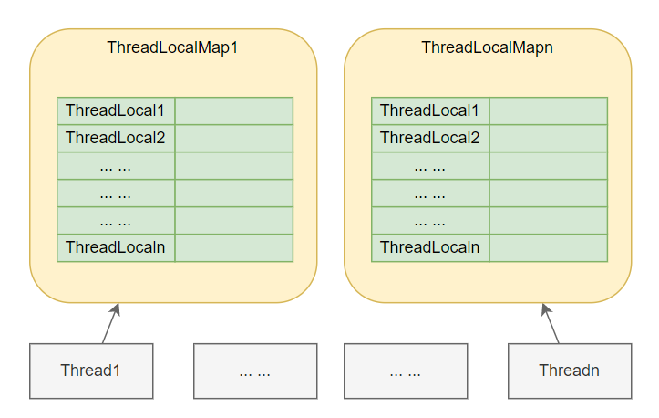
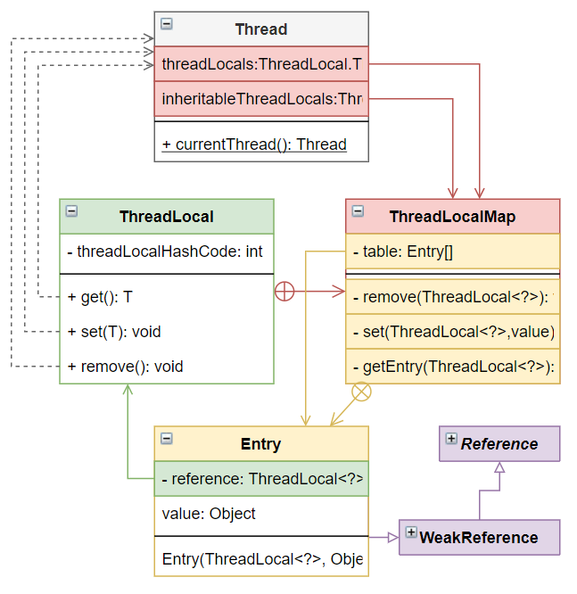
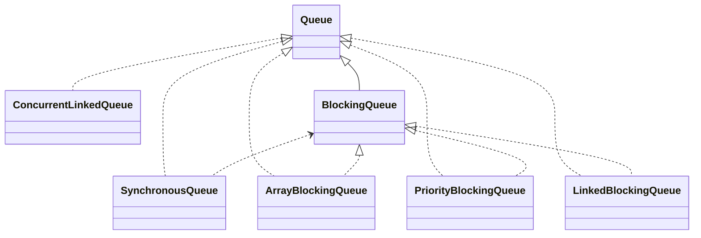
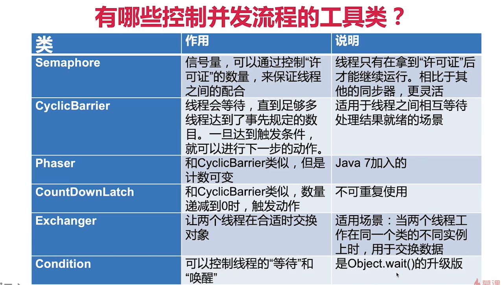
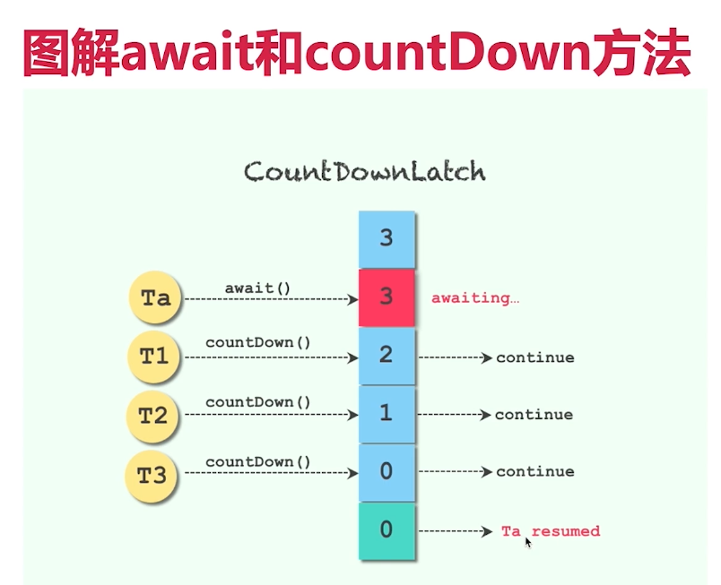

# JUC

# 分类

1. 为了**并发安全**：**互斥同步**、**非互斥同步**、无同步方案(`ThreadLocal` `volatile`)：
2. 管理线程、提高效率：
3. 线程协作：

## 为了线程安全（底层原理角度分类）

### 互斥同步

#### 使用各种互斥同步的锁

##### synchronized

##### ReentrantLock

##### ReadWriteLock

#### 使用同步的工具类

##### Collections.synchornized

##### Vector

### 非互斥同步

#### Atomic包，原子类

### 结合互斥同步及非互斥同步

#### 并发容器

### 无同步方案、不可变

## 为了线程安全（使用者角度分类）

### 避免共享变量

### 共享变量，但加以处理

### 使用成熟工具类

## 为了方便管理线程、提高效率


## 为了线程间配合，满足业务逻辑


# 线程池

## 线程池自我介绍

### 线程池的重要性

对线程池的提问可以层层递进。

### 什么是“池”

软件中的“池”，可以理解为计划经济。如固定数量的线程池，预创建指定数量线程。可以复用线程、控制线程的总量。

如果不使用线程池、每个任务都新开一个线程处理。

系统创建与回收线程开销大，使用线程池减少创建开销。过多的线程消耗大量内存。

### 为什么要使用线程池

问题一：反复创建线程开销大	

解决：少量线程反复工作

问题二：过多的线程占用太多内存	

解决：用少量的线程

### 线程池的优点

1. 速度快，无需反复创建与收回；节省线程创建与回收时间。
2. 合理利用CPU和内存。
3. 统一管理资源。

### 线程池适用场景

1. 服务器接收到大量请求时，适用线程池非常合适，可大大减少线程的创建和销毁次数，提高服务器工作效率。
2. 开发中，如果需要创建5个以上的线程，那么就可以适用线程池来管理，

## 创建和停止线程池

### 线程池构造函数的参数

1. corePoolSize: 线程池核心线程数。默认情况下，线程池在初始化后没有任何线程，直到任务到来时再创建线程执行任务。corePoolSize指定线程池首个任务到达时生成的线程数量，类似minSize。
2. maxPoolSize: 线程池最大上限。达max后拒绝请求，交handler处理。
3. keepAliveTime: 多余corePoolSize数量的线程在超过keepAliveTime时被回收。
4. workQueue: 线程数处于corePoolSize与maxPoolSize间先将任务加入队列，队列满则创建新线程。
   1. 直接交换：SynchronousQueue，无队列缓冲，maxPoolSize需要设置大一些。
   2. 无界队列：LinkedBlockingQueue
   3. 有界队列：ArrayBlockingQueue
5. threadFactory: 新线程都由ThreadFactory创建。
6. handler:

corePoolSize与maxPoolSize相同为固定大小的线程池。

线程池希望保持较少的线程数，只有负载增大时才增加。

如果workQueue使用的是无界队列，如LinkedBlockingQueue，那么线程数不会超过......

### 线程池应手动创建还是自动创建

手动创建更好，可以更明确线程池的运行规则，避免资源耗尽风险。

直接调用JDK提供线程池可能带来风险：

1. newFixedThreadPool: corePoolSize与maxPoolSize相同，workQueue使用无界队列LinkedBlockingQueue，有内存溢出的风险。
2. newSingleThreadExecutor: corePoolSize与maxPoolSize设1，workQueue使用无界队列LinkedBlockingQueue。
3. newCachedThreadPool: corePoolSize为1，maxPoolSize为Integer.MAX_VALUE，keepAliveTime为60s，workQueue使用SynchronousQueue。
4. newScheduledThreadPool: corePoolSize传入，maxPoolSize为Integer.MAX_VALUE，workQueue使用DelayWorkQueue，threadFactory可传入。
   1. 提供schedule(Runnable, initialDelay, period, timeUnit)，可周期性执行任务。

业务调研后设计线程参数。

1.8后加入workStealingPool，与之前线程池有很大不同：

1. 子任务：子任务放入子任务独有的队列中
2. 窃取：若其他线程空闲，可帮助其他线程子任务队列中的任务执行，要求执行任务不加锁。任务执行顺序不被保证。

### 线程池的线程数量设定为多少比较合适

CPU密集型（加密、计算hash等）：最佳线程数为CPU核心数1-2倍。

IO密集型（读写数据库、文件、网络通信等）：以JVM线程监控显示繁忙情况为依据，保证线程空闲可衔接。参照Brain Goetz推荐计算方法：CPU cores * (1+avg_wait/avg_working)。

最为精准的线程数量设置根据压测结果设定。

### 线程池停止

1. shutdown(): 初始化整个关闭过程，不保证线程池关闭。将正执行的任务及等待队列中的任务执行完成后再关闭，拒绝接受新任务。
2. isShutdown(): 
3. isTerminated(): 
4. awaitTermination(): 等待一段时间看线程池是否关闭，仅用于检测。
5. shutdownNow(): 关闭线程池，中断正在运行线程，返回等待执行任务队列。

## 任务太多，怎么拒绝

### 拒绝时机

1. Executor关闭时，新任务会被拒绝。
2. Executor队列满，且线程达maxSize，新任务会被拒绝。

### 4种拒绝策略

1. AbortPolicy：抛出异常 RejectedExecutionException
2. DiscardPolicy：丢弃任务，不通知
3. DiscardOldestPolicy：丢弃队列中最老的任务
4. CallerRunsPolicy：由提交任务线程执行该任务

1-3中会有任务损失，4不会有任务损失。

4可以使提交速度降低，负反馈，给线程池缓冲时间。

## 钩子方法，给线程池加点料

在每个任务执行前后做一些操作，如日志、统计。

## 实现原理、源码分析

### 线程池组成

1. 线程池管理器：
2. 工作线程：
3. 任务队列：
4. 任务接口（Task）：

### Executor家族

Executor

ExecutorService

Executors

### 线程池实现线程复用原理

相同线程执行不同任务

## 线程池注意点

线程池状态：

1. RUNNING：
2. SHUTDOWN：
3. STOP：
4. TIDYING：
5. TERMINATED：

避免任务堆积：

避免线程数过度增加：

排查线程泄漏：已执行完毕，但线程未被回收


# ThreadLocal

## 两大使用场景

1. 每个线程需要一个独享的对象（通常是工具类，典型需要使用的有SimpleDateFormat与Random）。主要诉求是工具类线程不安全。
2. 每个线程内需要保存全局信息（例如在拦截器总获取用户信息），可以让不同方法使用，避免参数层层传递的麻烦。主要诉求是避免参数传递麻烦。

### 每个线程需要一个独享的对象

每个Thread内有自己的实例副本，不共享。

比喻：教材只有一本，一起做笔记有线程安全问题。复印后没问题。

SimpleDateFormate进化之路

### 每个线程内需要保存全局信息，避免参数传递麻烦

### 总结

1. 让某个需要用到的对象在**线程间隔离**（每个线程都有自己的独立对象）
2. 在任何方法中都可以轻松的获取到对象，`ThreadLocal::get`

根据共享对象的生成时机不同，选择initialValue与set设置值

1. initialValue：在ThreadLocal第一次get的时候把对象初始化出来，对象的初始化时机可以由我们掌控。
2. set：保存包ThreadLocal中的对象的生成时机不由我们随意控制。如拦截器中生成的用户对象。

## ThreadLocal好处

1. 线程安全
2. 不需要锁，提高执行效率
3. 更高效地利用内存、节省开销
4. 免去传参的繁琐，降低代码耦合度

## ThreadLocal原理



每一个Thread对象中都持有一个ThreadLocalMap成员变量



Entry可视为以ThreadLocal为key的键值对。

ThreadLocalMap类似HashMap，但与HaspMap在处理Hash冲突时不同。ThreadLocalMapHash冲突时使用线性探测法。

### 主要方法

1. initialValue(): 调用get()时延时加载; 若get()前调用了set()方法则不会执行initialValue(); initialValue()只会执行一次
2. set(): 
3. get():
4. remove():

## ThreadLocal注意点

### 内存泄漏

某个对象不再使用，但占用内存却未被回收。最终导致内存耗尽抛出OOM。Entry.key or Entry.value泄漏。

Entry中的key（ThreadLocal）存于弱引用中，而弱引用可被GC回收。但Entry中value为强引用，不能不GC回收。

正常情况下，线程终止时value会被回收。但若线程不终止，那么线程的value就不能回收。

JDK中Entry的set、remove、rehash等方法在发现key为null时，将value置为null，断掉强引用。

> 在使用完ThreadLocal后，主动调用remove方法清除ThreadLocal。

### 空指针异常

ThreadLocal指定的为包装类型。若ThreadLocal包装类型未赋值，get时会返回null，若此时get值赋值为原始类型则会抛出空指针异常（为null的封装类型拆箱抛出NullPointerException）。

### 共享对象

如果每个线程中ThreadLocal.set()传入值本来就是多个线程共享的对象，如static对象，那么多个线程的ThreadLocal.get()获取的还是共享对象本身，有并发访问问题。

### 如果可以不使用ThreadLocal，尽量不使用

如任务少时，局部变量即可解决问题。

### 优先使用框架的支持

如Spring中可使用RequestContextHolder、DateTimeContextHolder。


# 锁

## Lock接口

### 简介、地位、作用

锁是一种工具，用于控制对**共享资源**的访问。

Lock和synchronized是两个最常见的锁，他们都可达到线程安全目的，但在使用及功能上有较大不同。

Lock不是用来替代synchronized的，而是补充synchronized不具备的高级功能。

Lock接口最常见的实现类是ReentrantLock。

通常情况下，Lock只允许一个线程访问上锁资源。但有时，特殊的实现可允许并发访问，如ReadWriteLock中的ReadLock。

### Why Lock？

为什么synchronized不够用？

1. 效率低：锁的释放情况少、视图获取锁时不能释放定超时、不能中断一个正在试图获取锁的线程。
2. 不够灵活：加锁和释放的时机单一，每个锁仅有单一的条件
3. 无法知道是否成功获得锁

### 方法介绍

lock()：最普通的获取锁

Lock不会像synchronized一样在异常时自动释放，因此需在finally中释放锁。

tryLock()用来尝试获取锁，如果锁未被占用则获取成功，否则返回false

tryLock(long time, TimeUnit unit)：超时就放弃。

### 可见性保证

happens-before原则

Lock的加解锁和synchronized有同样的内存语义，下一个线程加锁后可以看到前一个线程解锁前发生的所有操作。

## 锁的分类

分类是从不同角度出发，这些角度并不互斥，可能并行。如ReentrantLock即时互斥锁又是可重入锁

### 是否锁住同步资源

乐观锁与悲观锁

### 多线程能否共享一把锁

共享锁与独占锁，最典型为读锁/写锁

### 多线程竞争时是否排队

公平锁与非公平锁

### 是否可中断

可中断锁与不可中断锁

### 等锁过程

自旋锁与非自旋锁

## 乐观锁与悲观锁

### （悲观锁）互斥同步锁的劣势

阻塞和唤醒带来的性能劣势：核心态用户态切换、上下文切换等

可能陷入永久阻塞：若持有锁线程被永久阻塞，其余线程得不到执行

优先级反转：获得锁的低优先级线程不释放锁

### 什么是乐观锁与悲观锁

乐观锁假设出错是小概率事件，悲观锁假设出错是一种常态

悲观锁认为不锁住资源，别人会来争抢。Java中悲观锁实现为synchronized及Lock。

乐观锁认为处理操作时不会受到干扰，其不锁住被操作对象。如果操作失败，则选择放弃、报错、重试等策略。乐观锁一般使用CAS算法。典型实现为原子类、并发容器等。

Git就是乐观锁的典型例子。当我们向远端仓库push时，git会检查远端仓库版本是否领先当前版本。若远端和本地版本不一致，表明其他人修改了远端代码，则此次更新失败。若远端与本地版本一致则提交到远端。

数据库中select for update是悲观锁，用version来控制是乐观锁。

### 开销对比

悲观锁适合并发写入多的情况，适用于临界区持锁时间比较长的情况，可避免大量无用的自旋操作。

乐观锁适合写入少，大部分是读取的场景，不加锁能让读取性能大幅提升。

## 可重入锁与非可重入锁（ReentrantLock）

再次申请锁时，无需释放当前锁即可获取锁（同一把锁）。可重入锁又称递归锁。好处是避免死锁、提高封装性。


## 公平锁与非公平锁

### 什么是公平和非公平

公平指按照线程请求的顺序来分配锁；非公平指不完全按照请求顺序，在一定情况下可以插队。

什么是合适的时机？

### 为什么有非公平锁

可提高效率，避免唤醒带来的空档期。

### 特例

在tryLock()时，若有线程释放锁，会立刻获得锁。

### 对比公平和非公平的优缺点

|          | 优势                                                     | 劣势                                         |
| -------- | -------------------------------------------------------- | -------------------------------------------- |
| 公平锁   | 各线程公平平等，每个线程在等待一段时间后，总有执行的机会 | 更慢，吞吐量更小                             |
| 非公平锁 | 更快，吞吐量更大                                         | 有可能产生线程饥饿，部分线程长时间得不到运行 |


## 共享锁与排它锁（ReentrantReadWriteLock）

排它锁又称为独占锁、独享锁。

共享锁又称读锁。获得共享锁后可查看但无法修改和删除数据，其他线程此时可获得共享锁。

在没有读写锁之前，若使用ReentrantLock，那么在多线程同时读时造成一定的资源浪费。

换一种思路更易理解：读写锁只是一把锁，有读锁定、写锁定两种。

锁的升降级：

1. 支持锁的降级，不支持锁的升级。可在获取写锁时降级为读锁，读锁升级写锁会带来阻塞。（ReentrantReadWriteLockLock，避免死锁）

总结：

1. ReentrantReadWriteLock实现了ReadWriteLock接口，最主要的方法有两个：readLock与WriteLock
2. 锁申请和释放策略：
   1. 多个线程只申请读锁，都可以申请到
   2. 有线程持有读锁时，其他线程申请写锁会等待读锁被释放
3. 插队策略：为了防止饥饿，读锁不能插队
4. 升降级策略：只能写锁降级为读锁，不能读锁升级成写锁（避免死锁）
5. 使用场景：相比于ReentrantLock使用于一般场景，ReentrantReadWriteLock适用于读多写少的情况，合理使用可进一步提高并发效率。

## 自旋锁和阻塞锁

### 概念：

阻塞或唤醒一个Java线程需要OS切换CPU状态来完成，这种状态转换需要耗费处理器时间。

如果同步代码块中的内容过于简单，状态转换消耗的时间有可能比用户代码执行时间还要常。

许多场景中，同步资源的锁定时间很短，为了这一小段时间去切换线程，线程挂起和恢复现场的花费可能让系统得不偿失。

如果物理机有多个处理器，能够让两个或以上的线程并行执行，我们可让后面请求锁的线程不放弃CPU的执行时间，看持有锁的线程是否很快释放锁

而为了让当前线程“稍等一下”，我们需要让当前线程进行自旋。如果在自旋完成后前面锁定同步资源的线程已释放锁，那么当前线程就可以不必阻塞而是直接获取同步资源，避免线程切换的开销，这就是自旋锁。

阻塞锁与自旋锁相反，阻塞锁如果遇到没拿到锁的情况，会直接把线程阻塞，直到被唤醒。

### 缺点：

若果锁被占用的时间过长，那么自旋线程会浪费处理器资源

在自旋的过程中，一直消耗CPU。虽然自旋锁起始开销低于悲观锁，但随着时间的增加，开销线性增长。

### 原理和源码分析

Java5及以上版本并发包atomic下的类基本都是自旋实现。

AtomicInteger的实现：自旋锁的实现原理是CAS。AtomicInteger中调用unsafe进行自增操作的源码中的do-while循环就是一个自旋操作，如果修改过程中遇到其他线程竞争导致修改失败，则在while中死循环至修改成功。

### 适用场景

自旋锁一般用于多核的服务器，在并发度不是特别高的情况下，比阻塞锁的效率高。

另外，自旋锁适用于临界区比较短小的情况，否则如果临界区很大（线程一旦拿到锁很久才释放），那是不合适的。

## 可中断锁

在Java中，synchronized就是不可中断锁，而Lock是可中断锁，因为tryLock(time)和lockInterruptibly都能响应中断。

如果某一线程A正在执行锁中的代码，另一线程B正在等待获取该锁。可能由于等待时间过程，线程B不想等待而去处理其他事情。此时我们可以中断它，这种就是可中断锁。

## 锁优化

### JVM对锁的优化

1. 自旋锁和自适应：在长时间自旋获取不到锁后，可能直接进入阻塞状态。
2. 锁消除：判定方法全为私有，直接清除锁
3. 锁粗话：过程中许多方法加锁、解锁，直接将上锁范围扩大，无需反复的加锁、解锁。

### 写代码时如果优化和提高并发性能

1. 缩小同步代码块
2. 尽量不要锁住方法（一般不需要锁住这么大范围）
3. 减少锁的次数
4. 避免人为制造“热点”
5. 锁中尽量不要再包含锁
6. 选择合适的锁类型或合适的工具类


# 原子类

## 什么是原子类，有什么用

不可分割：一个操作是不可中断的，即便是多线程的情况下也可保证

原子类的作用和锁类似，是为了保证线程安全。原子类优于锁的地方：

1. 粒度更细：原子变量将竞争范围缩小到变量级别，是可获得的最细粒度
2. 效率更高：通常，使用原子类效率比锁高，除了高度竞争情况

## 6类原子类总览

基本类型

1. AtomicInteger
2. AtomicLong
3. AtomicBoolean

数组类型

1. AtomicIntegerArray
2. AtomicLongArray
3. AtomicReferenceArray

引用类型：

1. AtomicReference
2. AtomicStampedReference
3. AtomicMarkableReference

升级类型原子类：

1. AtomicIntegerFieldUpdater
2. AtomicLongFielUpdater
3. AtomicReferenceFieldUpdater

Adder累加器：

1. LongAdder
2. DoubleAdder

Accumulator累加器：

1. LongAccumulator
2. DoubleAccumulator

## Atomic*基本类型原子类（AtomicInteger）

### 常用方法

1. get()

2. getAndSet

3. getAndIncrement
4. getAndDecrement
5. getAndAdd
6. compareAndSet():

## Atomic*数组

## Atomic*Reference引用类型原子类

## 普通变量升级为原子类

## Adder累加器

是java8引入的，相对较新

高并发下LongAdder比AtomicLong效率高，不过本质上是空间换时间

竞争激烈的时候，LongAdder把不同线程对应到不同的Cell上进行修改，降低了冲突的概率，是多端锁的理念，提高了并发性。

## Accumulator累加器

Accumulator与Adder相似，但更为通用


# CAS

## 什么是CAS

主要用于并发编程领域

我认为V的值应该是A，如果是的话我把他改成B。如果不是A说明被别人修改了，那么我就不修改。避免并发修改导致的错误。

CAS有三个操作数：内存值V，预期值A，要修改的值B。

CAS要利用CPU的特殊指令

```java
//CAS 等价语义
class SimulatedCAS{
    private volatile int value;
    public synchronized int compareAndSwap(int expectedValue, int newValue){
        int oldValue = value;
        if(oldValue==expectedValue){
            value = newValue;
        }
        return oldValue;
    }
}

class TowThreadCopetition implements Runnable{
    
    public void run(){
        compareAndSwap(0,1);
    }
}
```

## 应用场景

1. 乐观锁：数据库版本号
2. 并发容器：ConcurrentHashMap


### 如何利用CAS实现原子操作

1. AtomicInteger加载Unsafe工具，用来直接操作内存数据
2. 用Unsafe来实现底层操作
3. 用volatile修饰value字段，保障可见性。  

### Unsafe类

1. Unsafe是CAS的核心类。Java无法直接访问底层操作系统，而是通过native方法来访问。不过JVM可通过Unsafe类，其提供了硬件级别的原子操作
2. valueOffset表示的是变量值在内存中的偏移地址。Unsafe类通过内存偏移地址直接操作内存数据。

## CAS缺点

1. ABA问题：引入版本号
2. 自旋时间过长

# Final关键字和不变性

## 什么是不变性Immutable

1. 如果对象在被创建后，状态不能被修改，那么其为不可变。引用及内容均不变。
2. 具有不变性的对象一定是线程安全的（只读）。

## Final的作用

1. 类防止被继承、方法防止被重写、变量防止被修改。
2. 天生是线程安全的，不需要额外的同步开销

## 三种用法：类、变量、方法

### 修饰变量：

含义：被final修饰的变量，意味着值不能被修改。如果变量是对象，那么对象的引用不能变，但是对象自身的内容仍然可变。

三种变量：

1. final instance variable 类中final属性
2. final static variable 类中static final属性
3. final local variable 方法中的final属性

final修饰变量：赋值时机

类中final属性：

1. 声明变量时，等号右边赋值
2. 构造函数中赋值
3. 类初始化代码块中赋值
4. 若不采用1赋值，必须在2、3中选一方式赋值，这是final语法规定

类中final static 属性：

1. 声明时赋值
2. 静态代码块赋值

方法中的final属性（local variable）：

1. 不规定赋值时机，只要求在使用前被赋值。

### 修饰方法

不允许final修饰构造方法。

final修饰方法不可被重写。

引申：static方法不可被重写。但子类可声明重名的static方法。

### 修饰类

final修饰类不可被继承。如String类就是被final修饰的。

## 注意点

final修饰对象时，只是引用不可变，内容可变

在知道对象创建后不修改，养成良好的编程习惯


## 不变性与final关系

简单实用final不意味着不可变：

1. 对于基本数据类型，final修饰后就具有不可变性
2. 对于对象（引用）类型，需要该对象保证自身被创建后，状态永远不可变才行

如何利用final实现对象不可变：

1. 把所有属性都声明为final？

   若属性为引用类型，仍然内容可变。

满足以下条件，对象才是不可变

1. 对象创建后其状态就不能修改
2. 所有属性都是final修饰的
3. 对象创建过程中没有发生溢出

把变量写在线程内部--栈封闭：在方法里新建的局部变量，实际上是存储在每个线程私有的栈空间。而每个栈的空间不能被其他线程所访问，故不会有线程安全问题。


# 并发容器

## 并发容器概览

ConcurrentHashMap：线程安全的HashMap

CopyOnWriteArrayList：线程安全的List

BlockingQueue：接口，表示阻塞队列，适合用于数据共享通道

ConcurrentLinkedQueue：高效的非阻塞并发队列，使用链表实现。可以看做一个线程安全的LinkedList。

ConcurrentSkipListMap：是一个Map，使用跳表进行查找

## 集合类的历史

Vector和Hashtable是JDK早期部分，最大的缺点是性能不好。synchronized修饰在方法上，并发性能差。

HashMap与ArrayList利用Collections.synchronizedList()、Collections.synchronizedMap()转为线程安全。同步代码块中加入mutex锁。

## ConcurrentHashMap

### Map简介

HashMap

Hashtable

LinkedHashMap

TreeMap

### Why ConcurrentHashMap？

Collections.synchronizedMap()并发并能差

HashMap不安全：

1. 同时put在hash值相同时导致数据丢失
2. 同时扩容时导致死循环造成的CPU100%占用

### HashMap分析

1. 非线程安全
2. 迭代时不允许修改内容
3. 只读的并发是安全的
4. 如果一定要把HashMap用在 并发环境，用Collections.synchronizedMap()


### 1.7ConcurrentHashMap实现

1. 最外层是多个segment，每个segment的底层数据结构与HashMap类似，仍然是数组和链表组成的拉链法
2. 每个segment独立持有ReentrantLock锁，segment间不相互影响，提升并发效率
3. 默认16个Segments，最多支持16个小城并发写。默认值可在初始化时修改，初始化后不可修改。

### 1.8ConcurrentHashMap实现

1.8将1.7ConcurrentHashMap完全重写，不采用Segments改用Node，使用synchronized与CAS共同保证并发安全。

putVal：

1. 判断 key value 不为空
2. 计算hash值
3. 根据对应位置节点的类型来赋值、helpTransfer、增长链表或给红黑树增加节点
4. 达到阈值则“红黑树化”
5. 返回oldVal

get：

1. 计算hash值
2. 找到对应位置根据情况进行
   1. 直接取值
   2. 红黑树取值
   3. 链表取值
3. 返回结果

红黑树：

1. 每个节点要么是红色要么是黑色，但根节点永远是黑色
2. 红色节点不能连续（红色节点的孩子和父亲都不能是红色）
3. 从任一节点到其子树中每个叶子结点的路径都包含相同数量的黑色节点
4. 所有叶节点都是黑色的

### 对比1.7与1.8ConcurrentHashMap

数据结构：1.7采用segment；1.8采用node+红黑树。并发度从16改为n。

hash碰撞：1.7采用拉链法；1.8达到条件时使用红黑树。

保证并发安全：1.7在segment中上ReentrantLock；1.8使用CAS与synchronized结合。

查询复杂度：红黑树改为log(n)。

为什么超过8转为红黑树：红黑树占用空间约为链表两倍，通过泊松分布得出hash碰撞达到8时概率极低（千万分之几），权衡时间与空间设置红黑树阈值为8。

### 组合操作：ConcurrentHashMap也不是线程安全的

### 实际生产案例


## CopyOnWriteArrayList

### 诞生的历史和原因

java5中提出了CopyOnWriteArrayList，用以代替Vector和SynchronizedList。

Vector和SynchronizedList锁粒度过大，并发效率低，迭代时无法编辑。

Copy-on-Write并发容器还包括CopyOnWriteArraySet，用于替代同步Set。

### 适用场景

1. 读操作尽可能快，而写操作慢一些没有太大关系
2. 读多写少：黑名单、每日更新；监听器：迭代操作远多于修改操作

### 读写规则

读写锁：RR共享，RW、WW、WR互斥。

读写锁规则的升级：读取完全不需要加锁，写入时也不会阻塞读取。只有写入与写入间需要同步等待。

### 实现原理

创建新副本，读写分离

迭代期间数据可能是过期的

### 缺点

数据一致性问题：CopyOnWrite容器只能保证数据的最终一致性，不能保证数据的实时一致性。如果希望写入数据马上被读取到则不要使用CopyOnWrite容器。

内存占用问题：CopyOnWrite写操作是复制机制，写过程内存中同时驻扎两个对象。

### 源码分析


## 并发队列（阻塞队列、非阻塞队列）

并发队列不仅仅是阻塞队列，但阻塞队列最为总要

### 为什么要使用队列

用队列可以在线程间传递数据：生产者消费者模式、银行转账

考虑锁等线程安全问题的重任从“你”转移到了“队列”

### 并发队列简介

Queue

BlockingQueue


### 并发队列关系图



### 阻塞队列 Blocking Queue

阻塞队列是具有阻塞功能的队列，首先是一个队列，其次有阻塞功能。

通常阻塞队列的一段是给生产者放数据用，另一端给消费者拿数据用。阻塞队列是线程安全的，生产者和消费者都可以是多线程。

take()，put()：出错时阻塞

add，remove，element出错时不阻塞直接抛出异常

offer，poll，peek出错时返回false/null

阻塞队列可有界可无界

阻塞队列与线程池关系：阻塞队列是线程池的重要组成部分

### 非阻塞队列

### 如何选择适合自己的队列


## 并发容器总结


# 线程协作、控制并发流程

## 什么是控制并发流程

控制并发流程的工具类，作用就是帮助程序员更容易让线程之间合作

让线程之间相互配合，来满足业务逻辑

比如让线程A等待线程B执行完毕后再执行等合作策略



## CountDownLatch倒计时门闩

CountDownLatch作用：并发流程控制的工具

1. 倒数门闩：购物拼团；大巴人满发车。倒数结束前一直处于等待状态，倒计时结束后才继续工作。

主要方法：

1. CountDownLatch(int count)：仅有一个构造方法，count为需要倒数的数值
2. await()：调用await方法的线程会被挂起，知道count为0才继续执行
3. countDown()：将count减一，直至为0



两个主要的用法：

1. 一个等待多个完成
2. 多个等待一个完成

CountDownLatch不能回滚重置，想重置需要新建实例

## Semaphore信号量

## Condition接口（又称条件对象）

## CyclicBarrier循环栅栏


