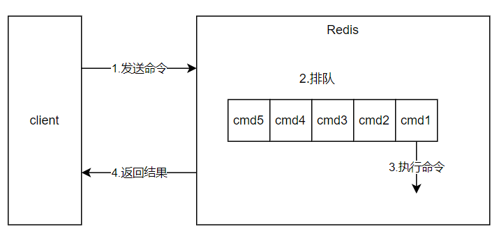
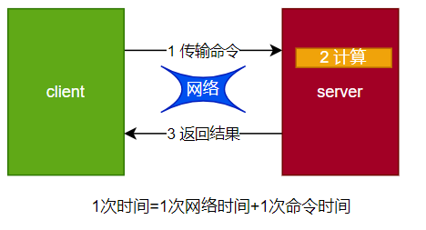
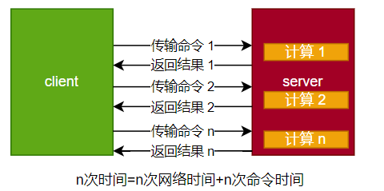
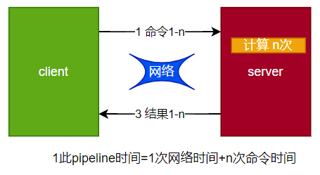
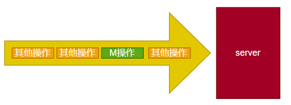
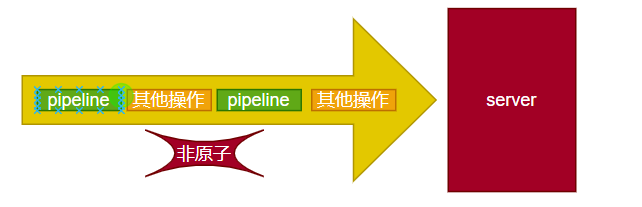
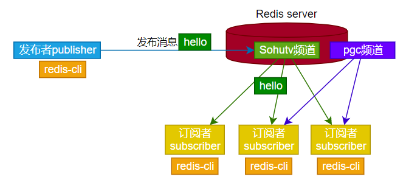
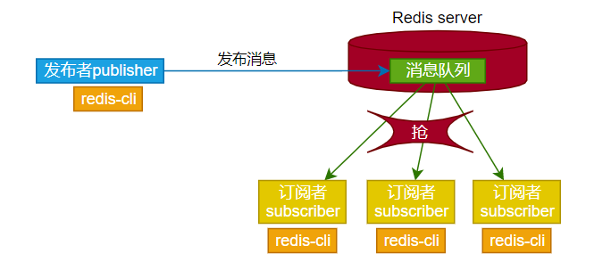
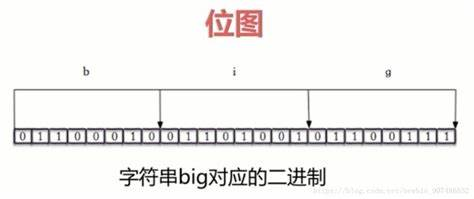
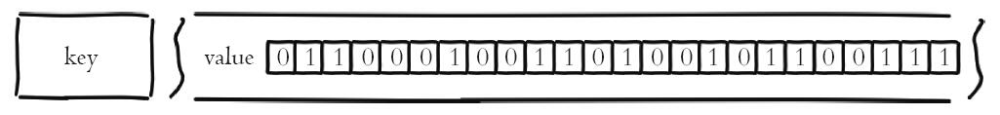

# Redis

Redis是个单线程程序，对于O(n)级别指令要小心使用。通过非阻塞IO实现并发（时分复用）。

Redis全部数据存在内存中，将数据以RDB及AOF方式持久化至硬盘防止数据丢失。RDB是快照方式，是一次全量备份；AOF是连续的增量备份。快照数据正在存储上紧凑，AOF只存储数据修改的指令记录。Redis使用COW（copy on write）方式实现持久化，修改时复制一份数据再对复制数据进行修改。

Redis的AOF先做参数校验与逻辑处理，没问题立即将指令文本添加到AOF日志中，不同于其他存储引擎先存储日志再做逻辑处理。


# 网课redis

## redis其他功能

### 慢查询

- 生命周期
- 两个配置
- 三个命令
- 运维经验

#### 生命周期



慢查询发生在第三阶段（执行命令阶段）

客户端超时不一定是慢查询，但慢查询是客户端超时的一个因素

#### 两个配置

slowlog-max-len：默认128

慢查询日志存于内存中固定长度的先进先出队列

1. 先进先出队列
2. 固定长度
3. 保存在内存中


slowlog-log-slower-than

1. 慢查询阈值（单位微秒），默认10ms
2. slowlog-log-slower-than=0，记录所有命令
3. slowlog-log-slower-than<0，不记录任何命令


config set slowlog-max-len 1000

config set slowlog-log-slower-than 1000


#### 三个命令

- slowlog get [n]：获取n条慢查询日志
- slowlog len：获取慢查询队列长度
- slowlog reset：清空慢查询日志


#### 运维经验

- slowlog-max-len不要设置过大，默认10ms，通常设置1ms
- slowlog-log-slower-than不要设置过小，默认128，通常设置1000左右
- 理解命令的生命周期
- 定期持久化慢查询


### pipeline

- 什么是流水线
- 客户端实现
- 与原生操作对比
- 使用建议

一次网络命令通信模型：



批量网络命令通信模型：



#### 什么是流水线



- redis命令时间通常是微秒级别
- pipeline每次条数要控制（网络时间）


#### pipeline-jedis实现


#### 原生multi操作与pipeline对比

- multi操作是原生命令，在server端一次执行，是原子操作

  

- pipeline打包传输，但在server端逐条执行，不是原子操作

  


#### 使用建议

- 注意每次pipeline携带数据量
- pipeline每次只能作用在一个redis节点上，不允许使用在多个redis节点上
- m操作与pipeline区别

### 发布订阅

#### 角色

发布者publisher、订阅者subscriber、频道channel

#### 模型

redis不提供消息的堆积




#### API

```
publish channel message

public sohutv:1 hello

subscribe sohutv:1

unsubscribe sohutv:1

psubscribe [pattern...] #订阅模式
punsubscribe [pattern...]
```


#### 发布订阅与消息队列

消息队列模型：




### bitmap





```
set key offset value #value只能为0/1
##可以做独立用户统计功能
##setbit跨度切记不能过大

bitcount key [start end] #获取位图指定范围内值为1的个数
bitop op destkey key [key...] #做多个bigmap的并、交、非、异或操作，并将结果保存在destkey中
bitpos key targetBig [start] [end] #计算位图指定范围，第一个偏移量对应的值等于targetBit的位置
```

独立用户统计：

1. 使用set和bitmap
2. 1亿用户，5千万独立

bitmap每个userid占用空间32位（假设整型），bigmap的userid占用1位


使用经验：

1. type=string，最大512MB。大小不足可使用多个bitmap实现
2. 注意setbit时的偏移量，可能有较大的消耗
3. 位图不是绝对的好


### hyperLogLog

- 是否是新兴数据结构
  1. 基于HyperLogLog算法：绩效空间完成独立统计
  2. 本质还是字符串
- 三个命令
  1. pfadd key element [element ...]：向hyperloglog添加元素
  2. pfcount key [key ...]：计算hyperloglog的独立总数
  3. pfmerge destkey sourcekey [sourcekey ...]：合并多个hyperloglog
- 内存消耗
- 使用经验
  1. 是否能容忍错误？官方给出错误概率0.81%
  2. 是否需要单条数据？无法取出单条数据

### GEO

- GEO是什么？

  1. GEO（地理信息定位）：存储经纬度，计算两地距离，范围计算等

- 5个城市经纬度

- 相关命令

  1. getadd: geo key longitude latitude member
  2. geopos: geopos key member [member ...]
  3. geodist: geodist key member1 member2 [unit]
  4. georadius: 

- 相关说明

  1. since 3.2+
  2. type geoKey = zset

  

  ## Redis持久化的取舍和选择

  ### 持久化作用

  - 什么是持久化：redis所有数据保存在内存中，对数据的更新将异步地保存到磁盘上
  - 持久化方式：
    1. 快照：某时某点数据完整的备份（MySQL Dump、Redis RDB）
    2. 写日志：更新操作（MySQL BinLog、Hbase HLog、Redis AOF）

  ### RDB

  - 什么是RDB：
  - 三种触发方式
    1. save 同步：大量save容易造成阻塞
    2. bgsave 异步：需要fork，消耗内存
    3. 自动
  - 触发机制-不容忽略方式
    1. 全量复制：
    2. debug reload：
    3. shutdown：
  - 试验

  ### AOF

  ### RDB与AOF抉择

  

