# 介绍Instruction

现代操作系统包括一个或多个处理器，一些主存，硬盘，打印机，键盘，鼠标，显示器，网络接口以及大量的输入输出设备。总的来说，如果要求应用给程序员从细节上理解各个组件的方方面面，那么他们可以不写代码了。除此之外，管理这些组件且以最优的方式使用是一件极具挑战的事情。因此，计算机引入操作系统级的软件用，管理以上组件，提供用户以更简单、优质、简洁的计算机模型。


硬件包括芯片、主板、硬盘、键盘、显示器以及其他物理硬件。硬件之上是软件层。多数电脑有内核态和用户态两种操作模式，其中操作系统最基础的部分运行在内核态(也称管态)。对硬件的所有访问在内核态完成，且在内核态可以执行该机的各种指令。用户态只能执行部分指令，如控制机器或IO的指令在用户态被禁用。内核态与用户态在操作系统中扮演着重要的角色。

用户接口程序、shell以及GUI是用户态的最底层，它们允许用户启用其他诸如浏览器、音乐播放器等上层应用。如图1-1所示，操作系统直接运行硬件之上，对上层软件/应用提供最基础的服务。

## 什么是操作系统What is an operating system?

不能简单的说操作系统是运行在内核态的程序，部分原因是操作系统提供两个重要但与内核态不相关的功能：为应用程序屏蔽底层复杂硬件细节，提供计算资源的高级抽象，并管理这些硬件资源。应用程序员的角度可以将操作系统视为外部扩展机，操作系统设计者将其视为资源管理器。

### 视为外部扩展机

从汇编语言视角看，多数电脑的基础编程部件（架构）对程序而言过于原始且复杂，如指令集、内存管理、IO（尤为复杂）、总线等等。现今，没有人愿意直接对诸如硬盘等硬件直接编程，取而代之的是使用硬盘驱动去处理硬件细节操作，只需调用驱动提供的接口即可。操作系统包含许多控制I/O设备的驱动。

但就是硬盘驱动对大多数人而言也过于底层，操作系统为此提供了硬盘的更高级抽象--文件。在文件抽象下，人们无需关注创建、读取、写入等操作的具体细节。

抽象是管理复杂性的关键。好的抽象将不可能任务一分为二：一是定义并实现抽象；二是利用抽象解决问题。文件就是如上抽象汇总最容易理解的一个。操作系统的主要任务是提供好的抽象并将其实现。理解OS提供的抽象是学号操作系统的关键。

操作系统的一个主要任务是隐藏硬件细节，为应用程序提供美观、整洁、连续、优雅的抽象（可以是OS提供的接口）。如图1-2所示，OS美化接口。

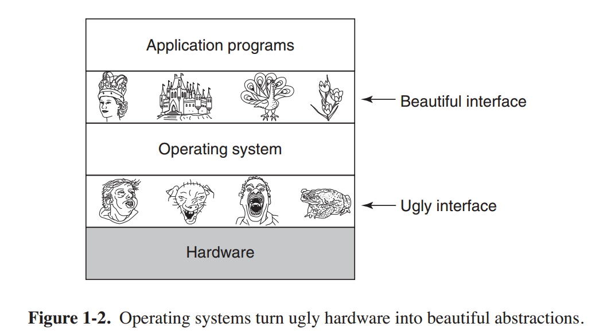

需要注意的是操作系统真正服务的对象是应用程序开发者，而非终端用户。应用程序开发者直对接对OS提供的抽象，如文件、内存、IO设备等。终端用户更多是使用应用程序开发者提供的用户接口/应用程序。


### 视为资源管理器

将OS视为高级抽象是一种自上而下的视角。而自下而上的方式将OS视为复杂系统的管理者，管理着计算机的处理器、内存、计时器、硬盘、鼠标、网络接口等各种各样的设备。在这种视角下，操作系统的任务是提供对资源（处理器、内存、IO等）有序可控的分配。

现代做系统允许多个应用程序在内存中同时运行。

当操作系统有不止一个用户时，对管理与保护内存、IO设备及其他资源的需求更旺盛，以防用户间的相互干扰。同时，用户不仅需要共享硬件，多数时候也需要共享信息（文件、数据库等）。简单的说，操作系统需要跟踪每个程序在使用哪些资源、批准资源申请、统计资源使用量、调解不同程序与用户间的冲突请求。

资源管理包括时间和空间两种不同方式的多路资源复用（资源共享）。时间上的共享如单核心的处理机使用，同一时刻只能有一个进程使用处理机。操作系统的一个工作是决定资源如何时分复用，哪个进程将获得下次使用权、可使用的时间长度。

另一种复用方式是空间复用，不同于时分，空间复用是每个申请者获取已定份额的资源。如主存通常被多个运行程序占用，使得程序可以同一时刻驻留（等待获得下一次处理机使用权）。 内存中分给多个进程比分给单一进程效率更高（局部性原理）。

## 操作系统历史


## 计算机硬件回顾

操作系统和计算机硬件联系紧密，它扩展了硬件的指令集并且管理硬件资源。因此，操作系统必须知道硬件如何工作，至少应知道硬件以何种形式面对程序猿。

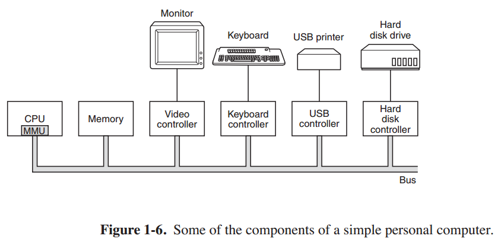

PC的基本硬件如图1-6所示，CPU、内存、IO设备等通过总线连接（有多重总线连接方式）。

### 处理器

CPU是电脑的大脑，它从内存中取指令并执行，直至程序运行结束。有取指、析指（译码）、执行几个基本流程。

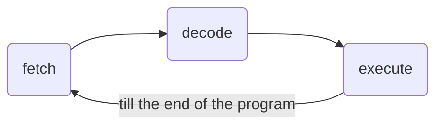
```mermaid
graph LR
	f(fetch)
	d(decode)
	e(execute)
	f-->d
	d-->e
	e-->|till the end of the program|f
	
	
```

每个CPU有自己的指令集，亦可以说指令集硬件相关。故机器代码不可以跨平台（不同指令集）执行，现在高级语言如JAVA通过不同平台的虚拟机完成硬件相关代码的翻译工作，使其高级语言代码具有跨平台特点。

因为CPU运行指令的速度远快于程序从内存读取程序（或数据）的速度，所以CPU内置部分寄存器用于缓存指令、数据及运算结果（三级缓存也是解决部件间运行速度不匹配的方案）。

对于缓存数据的通用寄存器，有部分对程序员是可见的。比如**程序计数器**`program counter`，简称PC，存放内存中下一指令的地址（在访问时优先访问快表，不命中再访存），在取指结束后指向再下一条指令。

另一个为**栈指针寄存器**`stack pointer`，指向内存中当前栈顶部。栈中为每个入栈但还未执行函数分配的一个栈帧区用于存放入参、本地变量、临时变量等。

> 栈与栈帧？：栈是操作系统分配给进程（或线程）的内存空间中存放程序调用相关信息的空间；栈帧是栈中每个方法调用的空间，栈帧是推送到栈上的数据帧，包含本地变量、入参、返回地址、子程序调用的返回结果。
>
> 栈与堆？：

还一个为**程序状态字寄存器**`Program status Word`，PSW包含条件码位(由比较指令设置)、CPU优先级、用户或内核模式、以及大量的控制位。用户通常可读入PSW的全部信息，但只能写入部分信息。程序状态字在系统调用与IO处理中起着重要作用。

操作系统需要全面知晓寄存器的信息，在分时系统中，CPU常在运行程序间来回切换（并发），每次切换都需要存储上一程序的全部信息以及读取下一程序的信息。

> 并发与并行?:

为提高性能，CPU摈弃简单的取指、译码、执行过程，引入流水线机制提高并行度。流水线机制可将n条指令执行时间缩短约为n个取指周期（视取指、译码、执行周期相等）。

> 时钟周期、指令周期、机器周期？：

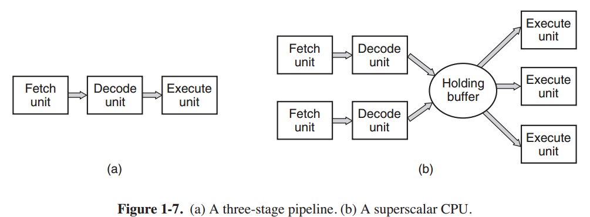

图1-7（a）为标准的三阶段流水线，（b）为更先进的超标量CPU。超标量CPU将不同类型的运算分开，如整数计算、浮点计算、布尔计算。多个取指和译码单元同时启动，将解析后的指令放入缓存区中直至分单元执行。

#### 多线程多核心芯片

摩尔定律指出芯片上晶体管数量每18个月翻一番。现在摩尔定律基本已经不适用了。这么多的晶体管如何利用？上面提到的超标量技术是一种方式。

很明显下一步不仅是多个功能单元，也包括多个控制逻辑单元。Intel在奔腾四中引入了**多线程**和**超线程**技术，x86架构的处理器和SPARC、Power5、因特尔Xeon以及Inter core系列。它使得CPU保持两个不同个线程的状态并在纳秒时间范围内切换（线程是一个轻量级的进程）。比如一个线程需要读取内存时（需要多个时钟周期），多线程CPU可以切换到其他线程运行。多线程并不提供真正意义的并行。同一时刻只能有一个进程在运行，但是线程的切换可以减少到纳秒级别。

> x86架构?
>
> 纳秒：$10^{-9}$ ； 微秒：$10^{-6}$；  毫秒：$10^{-3}$

因为线程对操作系统而言就像单个CPU（线程是CPU运行的基本单位），所以多线程对操作系统很有意义。比如两个CPU，每个有两个线程，这对操作系统来说如同有四个CPU。若某一时刻只有两个线程的工作量，那么只会有一个CPU上运行这两个线程的工作量，另一个CPU会完全闲置，这将会降低效率。

> 多核心CPU与单核心CPU在单并行度与多并行度任务间的差异?


多数CPU现在有4、8甚至更多的核心数，`Intel Xeon Phi` 和 `Tilera TilePor`在单个芯片上有超过60个核心。每个核心可以视为独立的CPU单元。在多数方面，GPU的运算能力都强过CPU，如图像渲、并行运算，但是GPU不太胜任串行任务。故操作系统不太可能运行在GPU之上。

> CPU与GPU区别？
>
> 三级缓存与CPU连接方式？


### 内存

内存是计算机中第二重要的单元。理想化的内存应该足够快（跟上CPU指令执行速度）、足够大、且便宜。但现在的技术不满足这些条件，所以采用了如图1-9所示的分层内存结构。

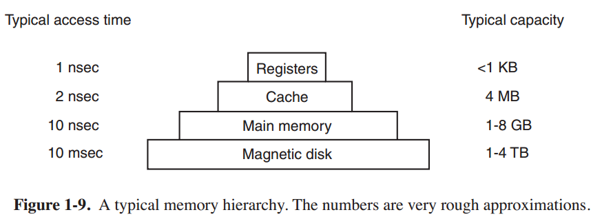

最上层个的寄存器`Register`内置在CPU中，它们制作原件与CPU其他部件相同，故有着相同的速度。其大小在32位CPU上为$32\times32位 $，在64位CPU上为$64\times64 位$，通常其大小不超过1kb。

> 为什么是32$\times$32, 64$\times$64?

再下一级是缓存`Cache`, 通常由硬件控制(对比操作系统控制主存). 主存被分为高速缓冲行`cache line`, 通常一行64字节. 使用最频繁的缓冲行会置于CPU内部或靠近CPU的缓存中. 当程序需要读取内存字时会首先查找缓存, 若查找到则成为缓存命中, 若没查到则会通过总线访问主存. 部分机器会有多级缓存.

> 缓存物理位置? 逻辑位置?
>
> 局部性原理?

缓存在许多计算机科学领域发挥重要作用, 不仅仅是主存的缓冲行. 当资源可以被切分成小片时, 某一部分会比其他部分使用频率更高(时间局部性原理), 缓存这部分可以显著提高程序效率. 例如, 操作系统会将多次访问的文件放置于内存减少磁盘访问的消耗. 同时也可以将文件路径对应的地址缓存的到内存中, 避免重复寻址. 网站的URL路径对应的IP地址也可以缓存以减少重复操作(计算机网络中的DNS服务, 本地也会维护DNS表). 

> 网站请求中的热数据如何安置? 设计?

所有的缓存系统都需要考虑一下问题:

1. 在何时将新条目放入缓存中.
2. 将新条目放入哪一条缓存行中.
3. 在缓存满时将那条内容移除缓存.
4. 移除内容放置于何处.

在具体缓存场景, 并不是每一个问题都需要考虑. 比如在CPU中的缓存行, 在每次缓存未命中时都会调入新的条目. 

缓存的应用效果很好, 现代CPU通常拥有2级缓存. 一级缓存常置于CPU内部用于将已解码的指令调入CPU执行引擎中. 多数CPU多设置一个一级缓存用以存放重复使用的数据自. 通常单个一级缓存大小为16KB. 二级缓存用于存放最近使用过的内存数据, 通常几mb大小. 一级缓存访问没有延迟, 二级缓存访问延迟在一到两个时钟周期内.


如图所示, 设计者需要决定将缓存放在CPU中哪一位置. 如图1-8(a)所示, 多个核心共享二级缓存, Intel多核心CPU以这种方式实现. 而图1-8-(b)中每个核心都有自己的二级缓存, AMD多如此实现. 两种实现方式各有优劣, Intel实现由更大的二级缓存但是管理起来更加的困难.

缓存之下是主存, 主存是整个内存系统的主力. 通常内存也被称为RAM, 因其硬件实现得名. 

> 存储器的硬件实现分类及用途?


### 硬盘

硬盘(磁盘)比内存价格低两个数量级, 但其对数据的随机访问速度比内存慢三个数量级.

> 磁道, 柱面, 扇区, 磁头..

虚拟内存技术中内存映射由CPU中的存储器管理单元`MMU`完成. 程序切换时有时需要将内存写回磁盘(虚拟内存空间), 将会极大的影响程序效率.

### 输入输出设备

IO设备通常由设备驱动器以及设备本身组成. 控制器是一个或一组物理上控制设备的芯片, 它从接收来自操作系统的指令. 多数情况下, 对设备的实际控制十分复杂, 所以控制器的一个功能是提供一个相对简单的接口给操作系统, 如磁盘的读写接口. 

每类设备设备控制器都不同, 需要不同的控制软件. 与硬件控制机交互的程序称为设备驱动程序`device driver`. 控制器厂商需要提供对不同操作系统支持的专属驱动. 

设备驱动程序必须加入操作系统中, 以使其可以在内核态运行(此处关联中断等知识). 将设备驱动程序装入操作系统有三种方式: 1. 将内核与新驱动重新链接再重启系统, 多数UNIX系统采用这种方式; 2.在特定的操作系统文件中设置一个入口以告诉操作系统需要此驱动再重启操作系统, 在系统启动阶段操作系统会加载相关驱动. Windows采用这种方式. 3.操作系统能够在运行时接受新的设备驱动程序并且立即将其安装好，无须重启动系统. 比如USB等热插拔设备.

每个控制器都有少量用于通信的寄存器, 如磁盘控制器有用于声明磁盘地址, 内存地址, 扇区等信息的寄存器.

部分电脑将设备寄存器映射入了操作系统的地址空间, 故设备寄存器可以像普通内存一样读写. 这些电脑不需要特殊的IO相关指令. 另一类电脑则需要特殊的IO指令, 用以在内核态操作驱动进行读写. 后者不使用地址空间但是需要特殊的指令. 两种方式的计算机都被广泛使用.

输入和输出可以以三种不同的方式完成. 1.用户程序发出一个系统调用, 内核将其翻译成相应设备的过程调用. 然后设备驱动程序持续监测至IO结束. 此方式称为忙等待`busy waiting`, 缺点是长期占用CPU; 2.第二种方式是驱动启动设备, 并让设备完成IO操作时发起一次中断请求; 3.第三种方式是使用特殊的直接存储器访问`DMA`芯片.

### 总线

随着处理器和存储器速度的提升, 总线逐渐成为性能瓶颈, 以往的单总线结构被摒弃.

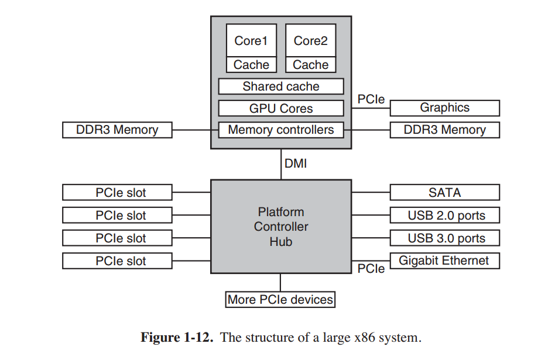


### 计算机启动流程

1. 启动BIOS.
2. 检查RAM数量以及键盘等基础设备是否正确安装.
3. 扫描PCIe和PCI总线上连接的设备.
4. 尝试启动CMOS表中的设备.
5. ...


## 操作系统大观园

大型机操作系统

服务器操作系统

多处理器操作系统

个人pc操作系统

掌上操作系统

嵌入式操作系统

传感器操作系统

实时操作系统

智能卡操作系统

## 操作系统概念

### 进程

进程本质上是一个运行的程序. 和进程相关的是它的地址空间, 地址空间是进程能够读写的在内存中的存储区域. 地址空间包含运行着的程序, 程序的数据, 以及程序的堆栈. 同时和进程相关的还有寄存器, 打开的文件, 相关联的进程, 以及其他程序运行相关信息. **进程基本上是一个包含运行程序所需信息的容器**.

多数的操作系统中, 进程的所有信息都存在进程表中, 进程表是一个数组或者链表, 当前存在的进程要在其中记录.

### 地址空间

### 文件

### IO

### 保护

### shell

### 个体重复系统发育

## 系统调用

操作系统有两个最基本的功能: 为用户程序提供高级接口抽象以及管理计算机资源. OS管理计算机资源的过程对用户程序透明.

引发系统调用的实际机制机器间差异很大, 且需用汇编语言编写, 通过给高级语言提供库函数调用. 

在某种程度上, 系统调用可以视为一个特殊的过程调用.

在用户态调用OS库函数至系统调用流程: 

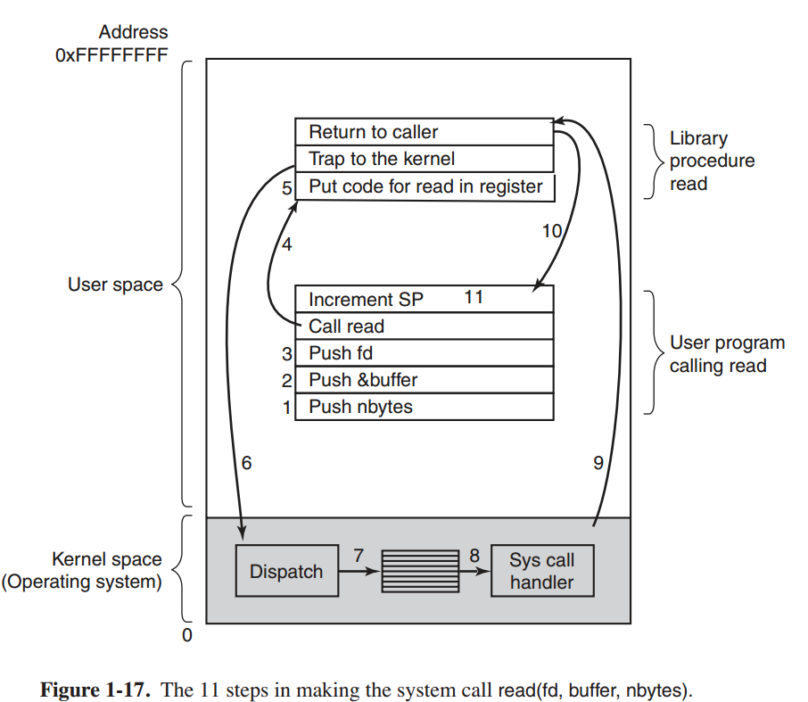

1. 将用户态库函数参入栈(C与C++逆序方式入栈). 
2. 实际调用read库函数.
3. 将对应系统调用编号置于寄存器中.
4. 执行TRAP指令, 由用户态切换至内核态.
5. 检查系统调用编号并分配给对应的系统调用处理器. 通常在系统编号对应处理器指针表中查询.
6. 处理机运行系统调用.
7. 结果**可能**跟随TRAP指令将结果返回库函数.(如等待IO时间处理机切换了当前运行进程, 需等到该进程处理机占用时才可继续)
8. 库函数通过函数调用返回给用户程序.
9. 整体从上到下逐次弹栈.

系统调用分类: 进程管理, 文件管理, 目录和文件系统, 各种系统调用

### 进程管理的系统调用

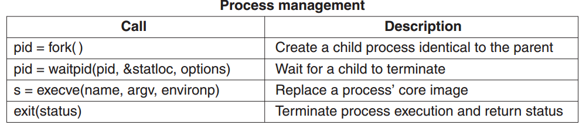

UNIX将进程分为三个部分: 正文段`text segment`用于存放程序代码; 数据段`data segment`用于存放变量等; 堆栈段`stack segment`. 正文段大小固定, 堆栈段从上向下扩展, 数据段从下往上扩展. 

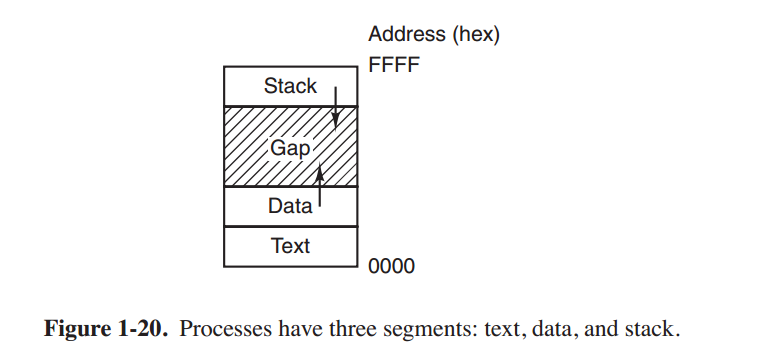

### 文件管理的系统调用

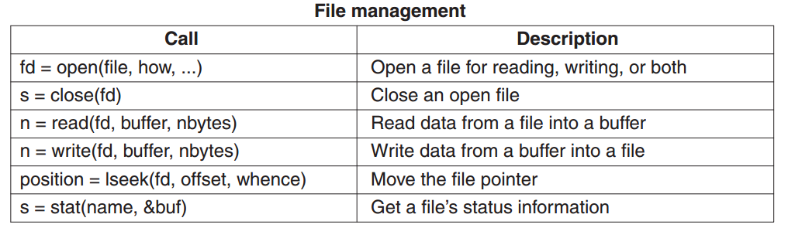

### 目录管理的系统调用

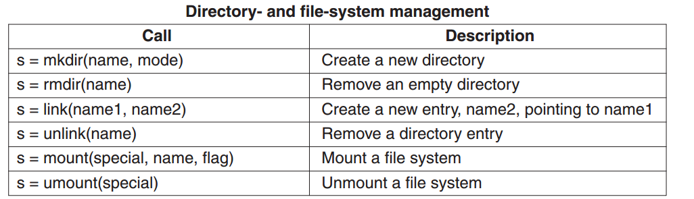

### 各种系统调用

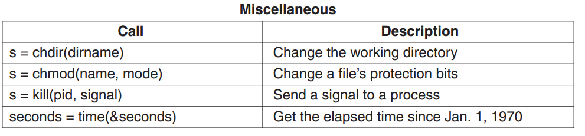

微内核架构`Microkernels`

采用分层结构, 设计者可以决定用户与核心的边界. 只将尽可能少的必须的模块放入核心模块可以减少BUG导致系统崩溃的概率. Basilli等人的研究表明, 工业系统中每千行代码有大约两个BUG.

微内核的中心思想是将操作系统切分成细小的, 精心定义的模块以达到高可靠性. 仅有微内核部分可以在核心态运行.

一般的桌面操作系统不使用微内核架构, 在实时,工业,航空,及军事领域使用微内核架构保障系统高可靠性.

https://github.com/Stichting-MINIX-Research-Foundation/minix  是开源的微内核操作系统MINIX3的源码, 仅包含12,000行C代码及1400行汇编代码.

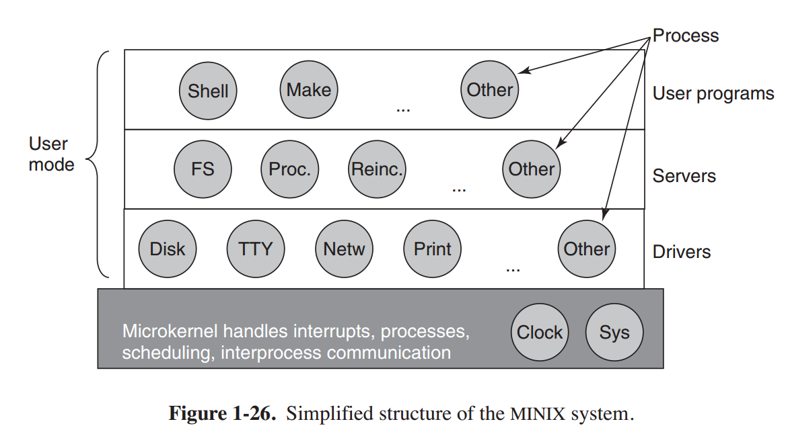

## C语言相关


## 操作系统研究方向


# 进程及线程

进程是一个运行程序的抽象. 使单个CPU支持伪并发操作能力.

## 进程

现代计算机可以在同一时间做多种事情. 在多道程序设计系统中, 严格的说同一时刻CPU只能运行一个进程, 但CPU可在运行的进程间快速地切换, 每个进程运行几十到几百毫秒($10^{-3}s$).  这种伪并行的结构要和真正的多处理机系统硬件上的并行区分开. 设计者开发了顺序进程`sequential processes`模型使得并行管理更简单.

### 进程模型

在顺序进程模型下, 所有可运行软件有时包括操作系统也被组织进了顺序进程中, 也可简称为进程. 一个进程是一个正运行的程序的实例, 实例中包括程序计数器,寄存器,以及变量的值. 理论上说, 每个程序有自己的虚拟CPU(从较大的时间间隔来看, 程序一直在运行). 实际上真实CPU是在进程间来回切换运行的. 这种在进程间快速切换执行的方式成为多道程序设计.

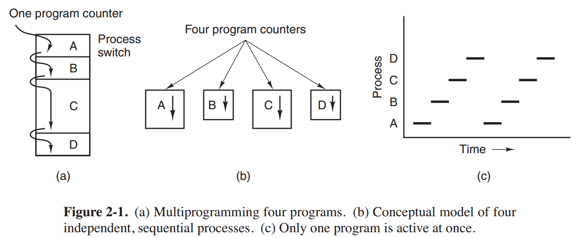

图2-1(a)表示了多道计算机系统同, 四个伪并行程序在内存中结构. 2-1(b)表示了此四道程序在逻辑上独立, 且逻辑上又有各自的程序计数器(实际上只有一个, 进程不占用处理机时计数器相关信息会存放在内存中). 2-1(c)展示了各程序真实的运行情况.

当CPU在进程间切换时, 进程内的运算速率不能得到保证. 故不能在进程代码中设计时序需求. 

进程和程序的区别很细微, 但很关键. 进程是动态的, 程序是静态的. 进程有程序代码,输入,输出,以及状态. 一个处理机可被多个进程共享, 处理机使用调度算法在进程间来回切换. 程序则被存在硬盘的某处, 没有做任何事. 值得一提的是, 如果程序被多次运行, 则会产生多个进程.

### 进程创建

以下四种情况会创建进程: 系统初始化, 运行程序请求了创建进程的系统调用, 用户请求创建新进程, 批处理作业.

操作系统启动时, 会创建大量的进程, 有部分是和用户交互的前端进程, 另一部分是位于后端的功能进程. 后端进程处理诸如邮件,web页面,新闻,打印等任务的后台工作, 因此也被称为守护进程`daemons`. 大型OS有大量的守护进程, UNIX中可通过`ps`命令查看.

同一程序中, 不同进程执行不同的功能。如代码中不同的模块、不同的分层，例如框架底层与数据库保持的连接池。

`fork`命令创建子进程时，会将父进程整个进程内容、内存空间、变量、以及已打开文件到子进程中。但父子进程的地址空间等独立，各自的改变不会影响到彼此（不对另一方可见）。

### 进程终结

进程终结的四种情况：

1. 正常退出：进程主动调用退出进程的系统调用，UNIX为`exit`，Windows为`ExitProcess`。交互服务的程序还提供退出可视化按钮。
2. 出错退出：程序发现错误主动退出，如找不到文件。
3. 严重错误：多由程序内部BUG导致，如执行了非法指令、访问了不存在的地址空间、执行除零操作。
4. 被其他进程杀死：UNIX为`kill`，WINDOWS为`TerminateProcess`。

### 进程层级

子进程可以继续创建子进程，新进程层级结构。UNIX中进程的子嗣构成一个进程组，信号会发往组内所有的成员。

UNIX进程层级结构另一个重要例子是，UNIX在BOOTED之后会启动一个特殊的进程`init`。`init`会扫描文件找到有多少个终端，并采用`fork`为每一个终端创建一个子进程。终端在用户登录后可运行命令产生更多的进程。因此，整个系统可以归根到以`init`为根的一颗进程树上。

Windows中进程没有层级概念，所有的进程都是平行的。只是父进程可以通过句柄`handle`去控制子进程，且句柄可以被父进程转移给其他进程。

### 进程状态

尽管进程是一个独立的实体，但是进程间经常需要相互关联。如一个进程以另一进程的输出作为输入（同步），在等待上一进程输出时，当前进程会阻塞。引入进程的三个主要状态：就绪、运行、阻塞。

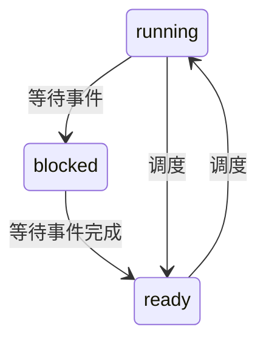
```mermaid
stateDiagram
running-->blocked:等待事件
blocked-->ready:等待事件完成
ready-->running:调度
running-->ready:调度
```


### 进程实现

为实现进程模型，操作系统维护了一张进程表`process table`，每个进程占用一个进程表项，全部的进程表项又被称为进程控制块`process control blocks`。

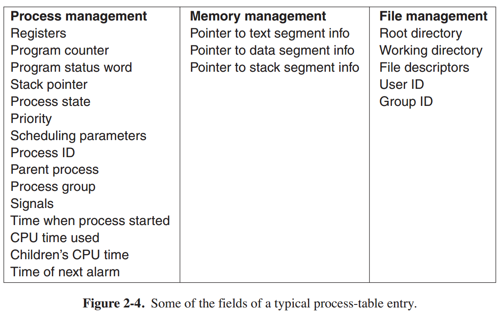

进程表项中维护的一些字段如图2-4所示。

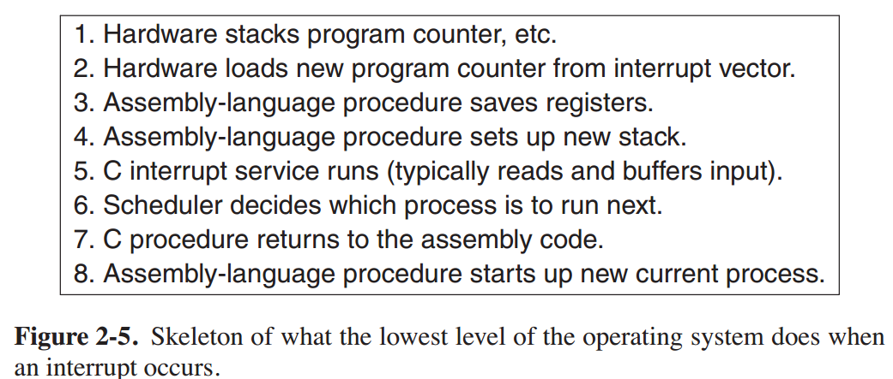

每一类IO关联一个中断向量`interrupt vector`，中断向量含中断程序的入口地址。中断发生后OS底层流程如图2-5所示：

1. 硬件将PC等信息入栈
2. 硬件从中断向量中加载新的信息至PC
3. 汇编过程保存寄存器信息（被中断进程的相关信息）
4. 汇编过程设置新的堆栈
5. C中断服务程序执行（读写缓冲区）
6. 调度器决定下一运行进程
7. C程序返回至汇编程序
8. 汇编程序启动新的进程

一个进程执行期间可被中断上千次，重要的是中断结束进程会恢复至中断前状态，整个中断过程对应用程序透明。

### 多道程序设计模型

假设一个进程等待IO时间的概率为`p`，若同时有`n`个进程驻留内存，则CPU的使用率估计为$1-p^n$。

## 线程

传统操作系统中，每个进程都有一个独立的地址空间以及一个控制线程。在多数情况下，同一地址空间拥有多个控制线程以并行的方式运行是有好处的。

### 线程使用

在许多应用中，多种活动同时运行，其中部分会随着时间推移被阻塞。通过将应用分解为多个准并行的线程，可以简化编程模型。

#### 引入线程原因/优势

引入线程增加了并行活动（同进程中线程）共享地址空间及数据的能力（进程间共享需通过通道等实现）。

线程相比进程更加轻量级，他们的创建及销毁更简单，通常创建进程比创建线程快10-100倍。

当应用为CPU密集型时，多线程并不能提升性能。但应用含大量的CPU运算以及IO处理时，多线程允许活动彼此重叠（并行），加快程序效率。

举例：

word文档一线程与用户交互（键盘），一线程完成排版（显示器），一线程后台自动保存（硬盘） 。若设计为单线程，则IO操作等对阻塞其他操作，来回切换内核与用户态的中断也增大了编程难度。相比三个进程，线程不尽快，且可以共享内存空间与数据。

> 输入-计算-输出三部分分离--分解思想。

Web Server的一种组织方式：设置一个分组线程`dispatcher`读取网络的请求，`dispatcher`将请求分配给合适的工作线程`worker thread`。

### 经典线程模型

进程模型基于两个独立的概念：资源分组处理以及执行。有时将其分离可提高性能，这便引入了线程概念。

可以将进程视为相关资源分组的一种方式。进程地址空间包括程序段、数据段、打开文件、子进程、时钟信息、信号量等等。进程用于把资源集中到一起，而线程则是在CPU上被调度执行的实体。  

线程使得进程模型可以在统一进程环境下执行多个独立线程。多线程中，线程间共享当前进程的地址空间等资源。在计算机角度，多个进程共享计算机的CPU、磁盘、内存等物理硬件。因此，从某种意义上说线程是一种轻量级的进程`lightweight process`。如图2-11所示。

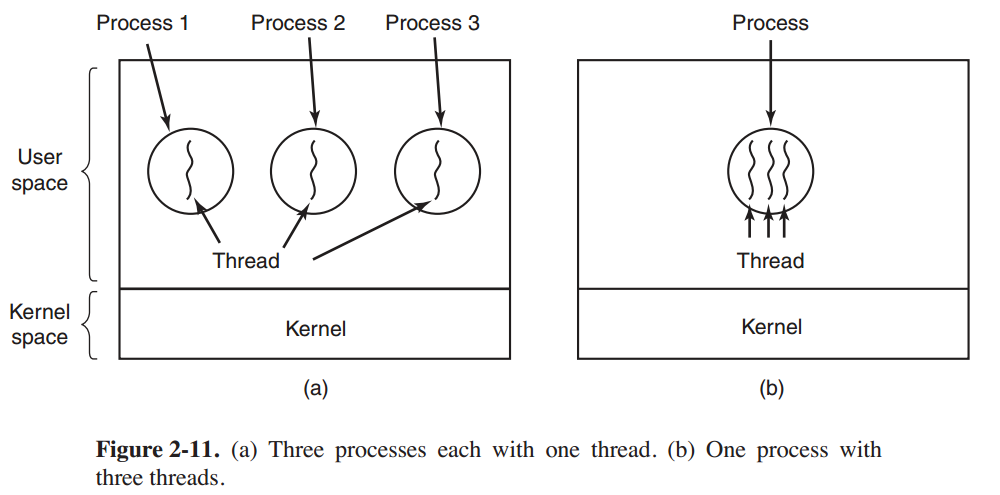

同一进程中的不同线程不如进程间的独立性高。全部线程拥有几乎一致的地址空间，他们共享全局变量。尽管线程间可相互读写共享数据及线程独自的数据，并没有设置线程间的访问控制。因为不同于进程，不同的进程代表由不同人编程的程序，他们可能会对其他进程有恶意；而线程程序都是由一个作者所编写，他可保证线程间合作不冲突。进程与线程拥有的内容如图2-12所示：

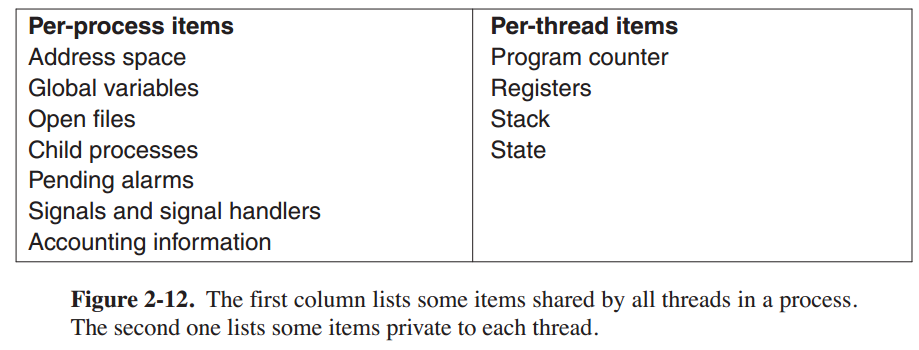

一个线程打开的文件对同进程内的其余线程可见，与进程是资源分配基本单位一致。若每个线程独有自己的地址空间、打开文件、时钟等，那他们应被称为进程。

和传统进程类似，线程应处于以下几种状态之一：运行、阻塞、就绪、以及终结。

意识到线程有自己的栈空间很重要，如图2-13所示。每个线程的栈为每个还未结束的过程调用安置一个信息帧。这个帧包含过程调用的本地变量以及过程结束时的返回地址。线程有自己调用栈的主要原因是每个线程在运算上独立，可有自己的执行过程。

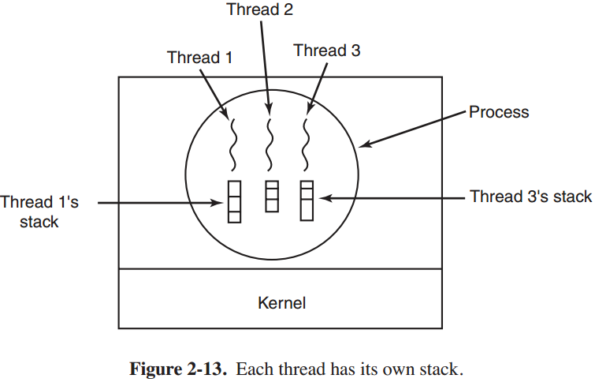

### POSIX线程

为了线程程序的可移植性，IEEE定义了一个标准1003.c，其中线程包被称为`Pthreads`。`Pthreads`中定义了60多种函数调用，这里只看图2-14中关键的几个。

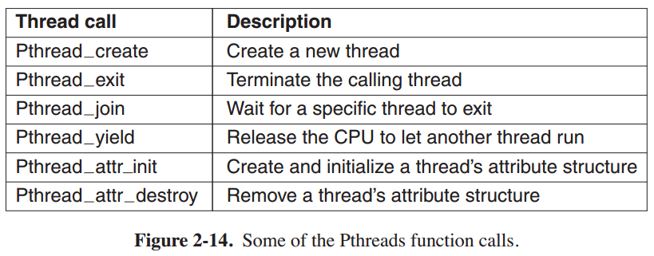

多线程间没有强制的时钟中断实现，主动退让处理机让其他线程运行的`pthread_yeild`操作便很重要。`pthread_yeild`为进程内线程间的切换，与CPU进程调度区分。

### 用户空间实现线程

线程实现可以在用户空间也可在内核空间，两种实现方法互有利弊，也可以两者混合的方式实现。

第一种实现方式是将线程包整体放在用户空间，内核对其一无所知。对内核来说，这些线程被视为一个进程。这样做最大的一个好处是可以在不支持多线程的操作系统中实现用户级的多线程。此种方式线程以函数库的方式实现。

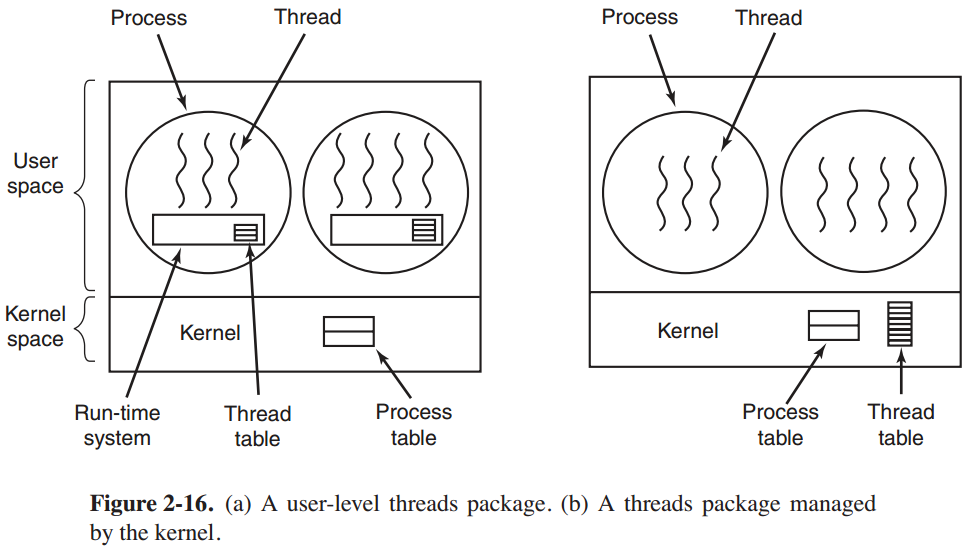

在用户空间管理多线程，每个进程需要一个自己的线程表，用于追踪每个线程的信息。线程表和内核空间的进程表类似，但其只记录线程独有的属性，如PC、栈指针、寄存器、状态等等。线程表由运行系统管理，当一个线程发生转台转换时，重新启动时必要的信息会存入线程表中，正如进程切换时信息存入进程表一样。

当一个线程执行某个导致本地阻塞的活动时，如等待其他进程完成，他会调用一个运行时系统过程去检测是否需要将当前线程置入阻塞态。若果需要转入阻塞态，系统过程会在线程表中存储线程寄存器等信息，并在线程表中选择一个就绪态的线程去运行，同时将要运行线程数据恢复至寄存器中。进行这样的线程切换要比陷入内核切换快几个数量级，这也是用户级线程的突出优点。

保存线程状态以及线程调度器的过程都在本地，所以会比内核调用更高效。除此之外，无需陷入指令，没有状态（核心/用户）切换，无需内存及缓存的刷写，就使得线程调度非常快。

用户级线程还有其他的优点，比如可以使每个进程拥有自己的线程调度算法。例如，那些有垃圾收集线程的应用程序就不用担心线程会在不合适的时刻停止（内存不足）。同时线程表扩容也比内核中的进程表更加轻松。

用户级线程也有一些缺点，其中最大的缺陷是如何实现阻塞的系统调用。如果进程中有一个线程在等待键盘输入，那么让整个进程中的线程都阻塞等待是不太合理的。将阻塞的系统调用（如`read`）改为非阻塞的系统调用需要修改操作系统，这不太科学，同时系统调用的修改也需要其他的应用程序进行修改。另一种方式是在可能阻塞系统调用前先判断是否会导致阻塞，如果阻塞则不调用，等到情况允许时在执行该操作。大多数Unix系统提供`select`系统调用用以检查`read`是否引起阻塞，这类在系统调用周围从事检查工作的代码称为包装器`jacket or wrapper`。

> 缺页中断与阻塞系统调用类似。在内存中未找到指定页面时，会阻塞进程直至从硬盘中读取制相关代码至内存。

因用户级线程中不存在时钟中断机制，如果一个线程始终不调用`thread_yeild`操作退让处理机，那么其他线程永远无法执行。一个方式是引入时钟中断信号，但这种方式编程繁琐且困难，并且周期性的时钟中断也带来很大的开销。

对用户级线程最大的负面争议是，程序员通常在经常发生阻塞的应用中才希望使用多线程。一旦线程阻塞，内核很难对线程进行切换。而对于CPU密集型应用而言，很好发生阻塞，这样的多线程意义不大。

### 内核空间实现线程

在内核态维护线程表，当一个线程想要创建新线程或销毁已存在线程时，需要调用内核调用以更新内核空间中的线程表。内核空间中的线程表拥有和用户空间线程表一样的内容，保存线程寄存器、状态、计数器等信息，只是存放在内核空间。内核空间与维护者原有的进程表。

所有导致线程阻塞的调用都以系统调用方式实现，这种调用开销比用户空间的运行时系统的调用大的很多。当线程阻塞时，内核可运行其他线程（可当前进程内，亦可非当前进程的线程）。

因为内核空间线程的创建与销毁代价较大，一些系统会重复利用线程（类比线程池）。线程销毁只是逻辑上的销毁，在内核空间中将其标记为`inactive`。当有新线程被创建时，分配`inactive`线程，置标记为`active`，可节省一部分开销。用户级线程也可如此实现，只是用户级线程创建与销毁开销小，没有这个必要。

内核线程无需新的非阻塞系统调用，因在内核空间有线程阻塞时可轻易切换到其他非阻塞线程。内核线程最大的弊端是系统调用会带来比较大的开销。

另一个问题是传统模型下，信号是发送给进程的。在信号到来时如何分配信号？

### 混合空间实现线程

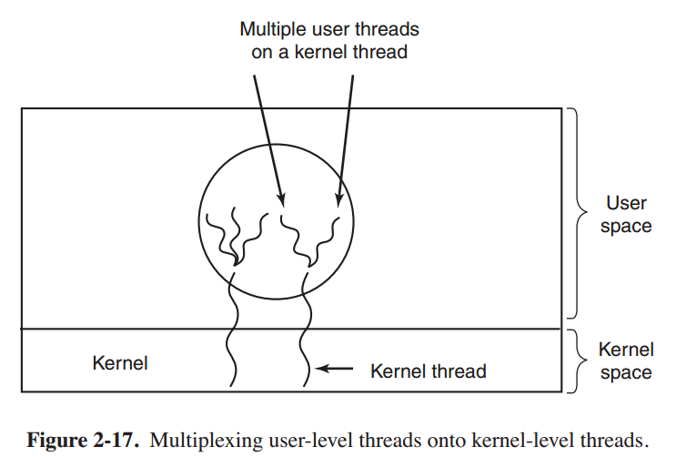

由程序员决定分配几个内核线程，几个用户线程。内核仅知晓内核空间线程。

### 调度程序激活机制

尽管内核级线程在某些方面比用户级线程有优势，但进场被诟病速度较慢。Anderson在1992年提出了调度器激活`scheduler activations`。调度器激活的主要目的是模仿内核线程的功能，在用户空间为线程包提供更大的了灵活性。特别是如果用户线程的系统调用时安全的，那就不应采用非阻塞调用或提前检查。无论如何，只要线程因系统调用或缺页中断阻塞，就应该可以运行该进程中的其他就绪线程。

减少用户空间与内核空间的转换可以提高效率。需要用户空间的运行时系统阻塞同步线程而调度其他线程。

使用调度程序激活策略时，内核为每一个进程分配一定数量的虚拟处理器，并让用户空间运行时系统将线程分配到虚拟处理器上。进程可申请和退回虚拟处理器，内核也可提前收回虚拟处理器。当内核检测到线程被阻塞时（运行了阻塞系统调用或发生缺页中断），内核会通过参数的形式将这一信息传递给用户空间运行时系统。这种机制称为上行调用`upcall`。一旦运行时系统收到阻塞信息，会将当前线程标记为阻塞，并从调度其他线程。当内核发现之前阻塞线程可运行时又会通知运行时系统，此时运行时系统再将该线程由阻塞态改为就绪态。

调度程序激活依赖上行调用，但上行调用违反分层结构的概念。通常，上层可以调用下层服务，下层不可调用上层过程。

### 弹出式线程

线程在分布式系统中经常使用。一个典型的例子是如何处理收到的消息。传统的方式是一个线程阻塞在`receive`系统调用上等待接收信息。当信息到达时接收、解压、测试数据以及执行操作。另一种方式是监听线程收到新信息时创建一个弹出式线程`pop-up thread`来响应请求。弹出式线程可以显著减少消息接收与处理之间的间隔。

将弹出式线程放置于内核空间比放在用户空间更快，同时也可以更轻松的访问内核表以及IO设备。

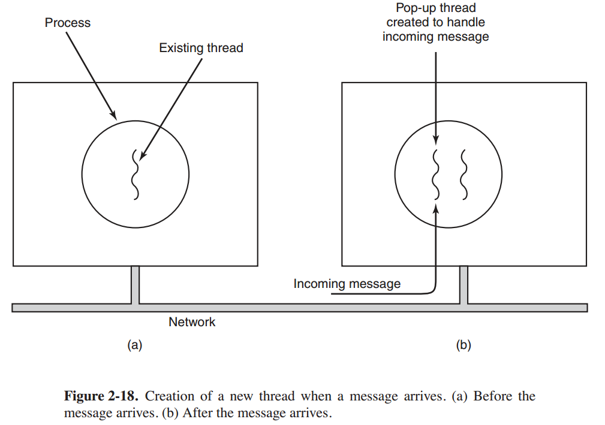

### 使单线程代码多线程化

## 进程间通信

进程间经常需要有信息交互，因此不使用中断在两个进程间提供优良机构的信息交互方式很重要。进程间通信主要有三方面的问题：

1. 进程间如何传递信息。
2. 如何避免交互进程相互干扰。
3. 在同步进程中如何保障正确的执行顺序。

第一个问题在线程中很容易解决，同一进程中的不同线程有共享的地址空间。但剩余两个问题线程和进程在处理方式上相同。

### 竞争条件

在一些操作系统中，协同工作的进程可能会共享一部分大家均可读写的存储空间。存储空间可能在内存中（如内核的数据结构）也可能是一个共享文件，共享空间所在的位置并不会改变竞争这个本质。当两个或多个进程读写某些共享数据时，最终的结果跟确切的运行顺序相关时，这些情况称为竞争条件`race conditions`。竞争条件带来的问题通常难以解决，随着并行度的提升，竞争条件越发平常。

### 临界区

解决竞争条件带来的问题的一种方式是避免多个进程在同一时刻对共享的内存、文件、或其他任何东西的并发访问，也就是所谓的互斥`mutual exclusion`。为实现互斥选择合适的原语操作在所有操作系统的主要设计内容。

程序访问临界资源（互斥资源，竞争条件）的那部分代码称为临界区`critical region or critical section`。如果我们可以避免进程同时进入临界区，那么我们就可以避免竞争。但上种方式不利于共享数据的并行进程提高效率与准确率。可以通过以下四个条件来改进：

1. 没有两个进程可以同时进入临界区。
2. 不对CPU数量和速度做要求。
3. 临界区外的进程不应阻塞其他进程。
4. 进程进入临界区不应无线等待。（有限等待）

> 空闲让进、忙则等待、有限等待、让权等待

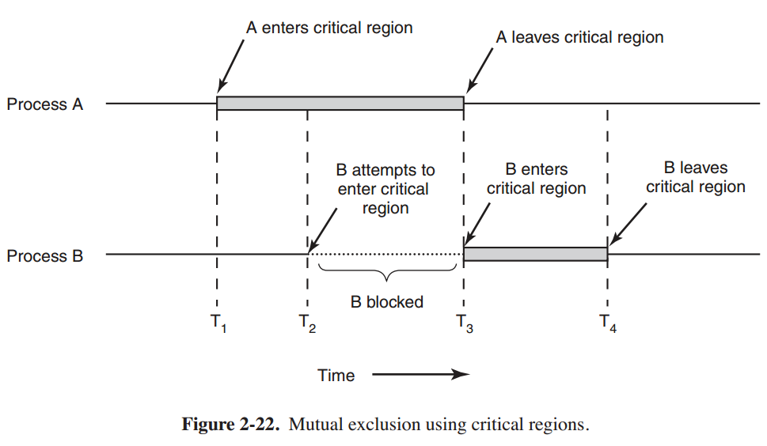

### 带忙等待的互斥

#### 禁用中断`Disabling Interrupts`关中断

在单核处理机系统中，实现互斥最简单的方式是在程序进入临界区时禁用中断，在退出临界区时开启中断。关中断后时钟中断不会发生。处理机进程切换只会由时钟中断或其他中断产生。只要关闭中断，进程在处理共享数据时不用担心被其他进程干预。

但通常关中断给予用户线程关闭中断的权利，这不太可取。另外，如果系统为多核心CPU，那关中断只在进程所处核心上有效，其余核心还是可能访问临界资源。

操作系统的内核在某些更新变量等的指令上使用关中断可以带来很大的便利。总之，关中断对操作系统来说很有用，但不适合用户线程将其作为互斥的解决方案。

在今天，因多核CPU的普及，关中断也越来与不适用。多核CPU中，一个核心关中断并不会影响其他的核心。

#### 锁变量`lock variables`

锁本身也是一个临界资源，亦会发生并发问题。

#### 严格轮转

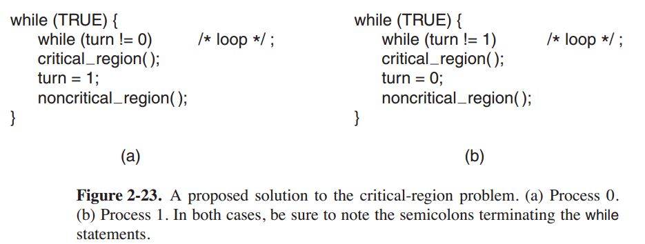

在没有获得自己的锁时，会持续等待，称为忙等`busy waiting`，用于忙等的锁称为自旋锁`spin lock`。

#### Peterson解法

结合锁变量与警告变量思想，首先提出了互斥问题的非严格轮转软件解决方案。


在进入临界区前现在意愿数组中标记欲进入，只有当其他人无进入临界区意愿时，才可进入临界区。

#### TSL指令

TSL指令是带有硬件支持的互斥解决方案。它先将内存字`word`读入寄存器`RX`中，再将一个非零数存入内存`lock`中。对`lock`的读取与写入操作保证是不可分割的，在TSL指令完成前其他进程无法访问内存字。CPU在执行TSL指令时会封锁内存总线直至指令结束。

值得注意的是，封锁内存总线和屏蔽中断是不同的。关中断后该处理机执行内存读写操作过程中并不会阻止内存总线上的其他处理机核心对该内存字的读写。

TSL指令使用一个共享变量`lock`来协调对共享内存的访问。`lock`为0时将其置1以访问内存，结束后将其还原为0。如果有进程作弊，如不还原`lock`为0，互斥便无法完成。仅在进程间合作的情况下TSL可行。

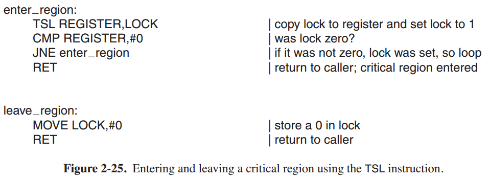

Intel的X86CPU在底层使用XCHG指令完成TSL指令功能。

### 睡眠与唤醒

皮特森算法以及TSL、XCHG的硬件解决方案都有忙等的缺陷。实质上，他们要求欲进入临界区的线程要先检查是否可进，若不可进则循环等待。这不仅浪费CPU资源，也可能造成优先级翻转等问题。现考虑将不能进入临界区的进程阻塞而非等待，最简单的是使用`sleep`与`wakeup`系统调用。

#### 生产者-消费者问题（有界缓冲区问题）

两个进程共享一个固定大小的缓冲区，向其中写入数据的是生产者，读出的是消费者。亦可将问题规模扩展为m个生产者与n个消费者。

当生产者尝试向已满缓冲区写入会有问题，消费者试图从空缓冲区取出亦然。可以设置一个缓冲区消息数`count`，生产者消费者在操作前都先判断`count`是否满足要求。如不满足要求，则休眠至对方将自己唤醒。

```c
#define N 100
int count = 0;
void producer(void){
    int item;
    while(true){
        item = produce_item();
        if(count==N) sleep(prodcer);
        insert_item(item);
        count++;
        if(count==1) wakeup(consumer);
    }
}
void consumer(void){
    int item;
    while(true){
        if(N==0) sleep(consumer);
        item = remove_item();
        count--;
        if(count==N-1) wakeup(producer);
        consume_item(item);
    }
}
```

考虑如下情况，当N\=\=0时，消费者会阻塞休眠。当N\=\=1时，生产者会唤醒消费者。若生产者唤醒信号在消费者睡眠之前到达，则消费者未被唤醒生产者会持续写入消息至缓冲区满而阻塞。最终两者都进入休眠状态。问题的本质在于唤醒信号的丢失，可以增加一个唤醒等待位，若欲休眠时换新等待位为1则不休眠并将等待位置0。

### 信号量

迪杰斯特拉在1965年提出用一个整形变量来存储唤醒信号以供后续使用。他将这种变量称为信号量`semaphore`。信号量的取值代表已存唤醒信号的数量。Dijkstra定义信号量上的两种操作为`down`和`up`（分别为`sleep`和`wakeup`的泛化）。`down`操作前会检查信号量是否大于0，若大于0则将信号量减1并继续执行；若等于0则进入休眠状态。对信号量的检测-修改或休眠操作是不可分的原子操作。信号量在同一时刻只允许一个进程操作。`up`操作增加对应信号量的值。若有一个或多个进程休眠等待该信号量，则`up`增加信号量后系统会随机选取一个休眠进程消耗该信号量。对信号量的`up`操作以及换新一个休眠线程的过程也是不可分割的。不会有线程因执行`up`而阻塞，如同不会有进程因执行`wakeup`阻塞一样。

> Dijkstra最初用`P`表示`down`，用`V`表示`up`。

#### 利用信号量解决生产者消费者问题

确保信号量操作以不可分割方式实现是很重要的。通常是将`up` `down`作为系统调用实现，操作系统在信号量检测、更新、以及休眠进程时短时间关闭中断。这些操作只涉及到极少的几个指令，运行速度很快，不会在关中断期间产生危害。若使用了多个CPU，则需对信号量加一个锁变量，使用`TSL`或`XCHG`指令来保证同一时刻只有一个CPU（进程）访问信号量（`TSL` `XCHG`以封锁内存总线的方式保障互斥）。

生产者消费者使用信号量带来的提升的主要原因是信号量操作要远快于生产者或消费者的操作。

```c
#define N 100
typedef int semaphore;
semaphore mutex = 1;
semaphore empty = N;//空闲存储格数（空间数）
semaphore full = 0;//已占存储格数（消息数）
void producer(void){
    int item;
    while(true){
        item = produce_item();
        down(&empty);//down，up以系统调用方式实现，执行过程中关中断。
        down(&mutex);
        insert_item(item);
        up(&mutex);
        up(&full);
    }
}
void consumer(void){
    int item;
    while(true){
        down(&full);
        down(&mutex);
        item = consume_item();
        up(&mutex);//先释放mutex离开临界区，让生产者可继续插入操作
        up(&empty);
        consume_procedure(item);
    }
}
```

信号量初始化为1，且被两个或多个进程使用以保证只有一个进程在一时刻进入临界区，被称为二元信号量`binary semaphore`。信号量有两种用途，一种是用户互斥的信号量，如`mutex`；另一种是用于同步的信号量，如`full`和`empty`。

### 互斥量

当信号量的计数功能不使用时的简单版信号量被称为互斥量。互斥量在管理共享资源的互斥问题时很有效。它们实现简单且高效，使得互斥量在用户空间实现线程包尤其有用。

互斥量是一个有两个状态的共享变量：解锁和上锁，互斥量只需要一比特存储。当线程或进程欲进入临界区时先调用`mutex_lock`，若互斥量未上锁则继续进行后续操作；若互斥量已上锁，线程或进程会阻塞直至临界区线程结束调用`mutex_unlock`。如果有多个线程在同一个互斥量上阻塞，在互斥量解锁时会随机选择一个线程抢占互斥量。

```assembly
;互斥量上锁、解锁简单汇编实现
mutex_lock:
	TSL REGISTER,MUTEX 		;将MUTEX值拷贝至寄存器，并将内存中MUTEX置1
	CMP REGISTER,#0			;将寄存器值与0做比较
	JZE ok					;如果寄存器值为0，则MUTEX未上锁，跳至ok（返回之前过程进入临界区）
	CALL thread_yield		;寄存器值为1，MUTEX已上锁，让出处理机（thread_yield在用户区）
	JMP mutex_lock			;再次尝试上锁（已退让处理机，休眠中）
ok: RET

mutex_unlock:
	MOVE MUTEX,#0			;将0存入MUTEX中
	RET						;返回调用过程，执行后续操作
```

`thread_yield`在用户空间调度线程，故速度很快且`mutex_lock` `mutex_unlock`均不需内核调用。

在用户空间的线程包在多线程访问`mutex`时没有问题，因其有公用的地址空间。但诸如Peterson算法等需要访问其他共享存储的方式就需要处理存储共享问题。进程的地址空间独立，如何使不同的进程有共享的空间存放信号量等共享变量。

有两种解决方案，第一种是将共享的数据结构，如信号量，存放在内核中且只能经过系统调用访问；第二种方式是提供一种让进程共享一部分地址空间给其他进程的方法，诸如linux和windows等系统都是这么设计的。

如果进程间共享全部的地址空间，尽管这种情况不存在，那么进程和线程的区别就很模糊了。两个共享内存的进程还是有着不同的打开文件、时钟计时器、和其他进程独立的属性；但进程内的线程共享这些信息。并且共享地址空间的多个进程在效率上比用户级线程低很多，因为进程间的许多操作需要经过内核。

#### 快速用户区互斥量Futex

随着并行程度的增加，高效的同步和锁机制对性能而言十分重要。自旋锁在等待时间很短时效率高，但是在等待时间长时浪费CPU时间。如果锁竞争很激烈（等待时间短）时，那么阻塞线程等待锁释放后由内核唤醒会很高效。不幸的是，在竞争激励时效果好；但如果开始时竞争很小，内核与用户空间的切换开销很大；更坏的是预测锁的竞争程度是很难的事情。

Futex（fast user space mutex）是结合以上两种优势的解决方案。Futex是Linux避免不必要陷入内核的基本锁实现方案。因内核与用户空间的切换开销昂贵，避免陷入内核可显著提升效率。Futex包含两个部分：一个内核服务与一个用户库。内核服务提供一个多进程对锁的等待队列。等待队列中的进程不会主动运行，等待内核的显示唤醒。加入内核等待队列需要系统调用，因系统调用陷入内核应避免此情况。如果没有竞争，那么Futex完全运行在用户空间。特别的，进程共享一个32位整数锁变量。当进程尝试获取Futex上锁失败时，会通过系统调用加入内核等待队列中。因进程未抢占锁会被阻塞，陷入内核的开销变得合理。当抢占锁线程结束时，会从等待队列中选取一个进程占锁运行。

#### Pthreads中的互斥量

Pthreads提供许多同步线程的函数，有互斥量和条件变量`condition variables`。互斥量在允许和阻塞线程进入临界区中很有用，条件变量允许线程在未达到某种变量时阻塞很有用。在生产者-消费者问题中，互斥量可以自动检测而不影响其他线程，但是在发现缓冲区满后，需要一种方式使生产者阻塞并在之后被唤醒。这种情况是条件变量的用途。

条件变量和互斥量经常一起使用。线程先抢占互斥量，再等待条件变量以运行。值得注意的是条件变量不像互斥量，不在内存中存储。如果信号发送出去没有线程接收，则信号丢失。程序员需要注意信号丢失的情况。

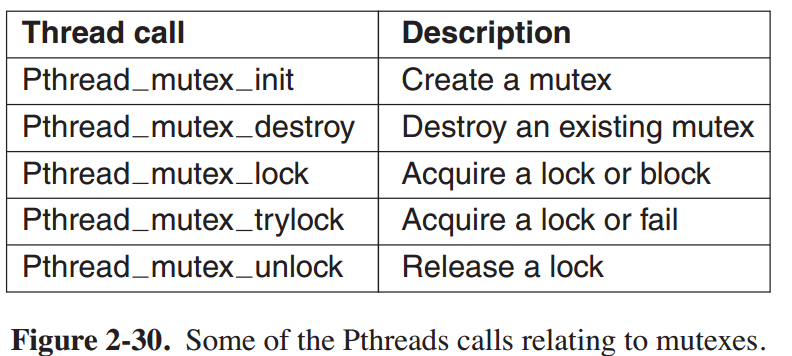

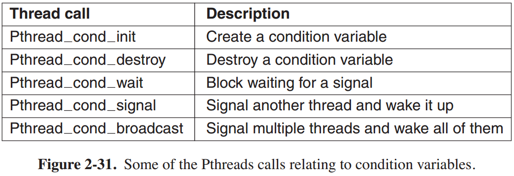

```c
#define MAX 1000000000
pthread_mutex_t the_mutex;//互斥量
pthread_cond_t condc,condp;//用于signal consumer、producer
int buffer = 0;//生产者与消费者间交互的共享内存
void *producer(void *ptr){//返回一个void指针，接收一个void指针
    for(int i = 0;i<MAX;i++){
        pthread_mutex_lock(&the_mutex);//抢占互斥量，获取缓冲区控制权
        while(buffer!=0) pthread_cond_wait(&condp,&the_mutex);
        buffer = i;//存入数据
        pthread_cond_signal(&condc);//唤醒消费者
        pthread_mutex_unlock(&the_mutex);
    }
    pthread_exit(0);
}
void *consumer(void *ptr){
    for(int i = 0; i < MAX; i++){
        pthread_mutex_lock(&the_mutex);
        while(buffer==0) pthread_cond_wait(&condc,&the_mutex);
        buffer=0;//取出数据
        pthread_cond_signal(&condp);
        pthread_mutex_unlock(&the_mutex);
    }
    pthread_exit(0);
}
```


### 管程

对信号量的编程比较复杂，考虑问题较多，容易出意想不到的问题。为了使正确编程更加简单，Brinch Hansen和Hoare分别在1973与1974年提出了高级语言同步原语-管程`monitors`。管程是一个特殊模块或包中的一系列变量、过程、数据结构的集合。进程可随时访问管程中的过程，但不能通过管程外过程访问管程内数据结构。C语言没有提供管程抽象。

管程的主要功能是：同一时刻在管程中只能有一个线程激活运行。管程是编程语言的一个结构，所以编译器知道如何特殊处理管程中的过程调用。通常，当进程调用管程中的过程时，该过程最初的几个指令先检查管程中是否有激活进程。如果有，则悬挂当前进程至运行进程退出管程；若没有，则当前进程进入管程继续执行。

如何实现管程中条目的互斥由编译器决定，但通常是使用互斥量或二元信号量方式。因为由编译器而非程序员实现互斥，所以更不容易出错。使用管程的程序员无需知晓编译器如何实现互斥，只需知道管程内的进程一时间只能有一个进程进入临界区。

尽管管程提供了一个简单的方式去实现互斥，我们仍需一种方式去阻塞有等待条件的进程。一种有效的方式是使用条件变量，`wait`和`signal`。当管程中一个过程发现其无法运行（等待条件）时，会对某个条件变量执行`wait`操作使当前进程阻塞。同时也会选择另一个进程进入管程。与`wait`作用条件变量对应的线程可以通过`signal`操作来唤醒阻塞等待中的进程。为了避免管程在`signal`操作后有两个激活的线程，我们需要定义`signal`后的操作。Hoare建议让唤醒的线程运行，而悬挂发出`signal`的进程。Brinch Hansen则建议进程运行`signal`后马上退出管程，即`signal`作为管程过程的最后一个操作。相比之下，Brinch Hansen的方式更容易实现，在`signal`后由系统调度器决定唤醒哪个进程。第三种实现方式是让被唤醒进程在执行`signal`进程退出管程再后运行。

条件变量不是计数器，不会累计`signal`信号供后续使用。为避免信号丢失，`wait`操作必须先于`signal`操作。这实现起来并不复杂，可以用一个变量去记录每个进程的状态，进程可以在执行`signal`操作前查看该变量。

管程中的`wait` `signal`操作和竞争变量中的`sleep` `wakeup`很相似，但后者在`sleep` `wakeup`同时发生时会出问题，而`wait` `signal`因管程一时刻只一进程运行不存在此问题。

Java语言提供用户级线程，且可将多个方法放于类中。通过加`synchronized`关键字于方法上可以保证该方法运行时类中其他`synchronized`修饰的方法不会运行。

```java
// an implementation of producer-consumer problem in java
public class ProducerConsumer{
    static final int N = 100;//固定缓冲区大小
    static producer p = new producer();
    static consumer c = new consumer();
    static our_monitor mon = new our_monitor();
    public static void main(String[] args){
        p.start();
        c.start();
    }
    static class producer extends Thread{
        public void run(){
            int item;
            while(true){
                item = produce_item();
                mon.inster(item);
            }
        }
        private int produce_item(){}
    }
    static class consumer extends Thread{
        public void run(){
            int item;
            while(true){
                item = mon.remove();
                consume_item(item);
            }
        }
        private void consume_item(int item){}
    }
    static class our_monitor(){
        private int[] buffer = new int[N];
        private int count = 0, lo = 0, hi = 0;
        public synchronized void insert(int val){
            if(count==N) go_to_sleep();
            buffer[hi]=val;
            hi=(hi+1)%N;
            count++;
            if(count==1) notify();
        }
        public synchronized int remove(){
            if(count==0) go_to_sleep();
            int val = buffer[lo];
            lo = (lo+1)%N;
            count--;
            if(count==N-1) notify();
            return val;
        }
        private void go_to_sleep(){}
    }
}
```

Java的同步方法不同于管程的经典实现，其没有内嵌的条件变量。反之，java提供wait和notify方法，分别于sleep与wakeup等价。

信号量与管程遇到的设计是为解决有共享存储的一个或多个CPU间的互斥问题。通过TSL或XCHG保护，在内存中存储信号量可避免竞争。当机器环境换为通过网络链接的分布式系统时，这些原语将失效（TSL通过锁内存总线，而分布式系统每个节点有自己的内存）。总而言之，信号量对程序员来说太底层，而管程又受限于特定的编程语言，并且两者都无法提供跨机器的信息交换方法。

### 消息传递

消息通道可已提供跨机器的信息交换，使用两个原语`send`和`receive`。

#### 消息传递系统的设计问题

消息传递系统设计存在许多信号量及管程不会出现的问题，特别在进程在不同机器上通过网络通信时。比如，消息在网络中丢失。为了监控信号丢失，接收方在收到消息后会回传一个确认消息`acknowledgement`。若发送方在一定时间间隔内未收到确认消息，它会重传信息。

如果消息正确到达接收方，但确认消息在网络中丢失，则发送发会重发消息，而接收反会收到该消息两次。这使得接收方需要判断收到的消息是新的消息还是重传的旧消息。通常这个问题通过在原始消息中加入序列号解决。若接收方收到序列号相同的两条消息，它会知晓这是一条重传的消息。在不可靠信道中实现消息的可靠传输是计算机网络研究的问题。

消息系统还需要解决进程命名问题，使得`send`和`recieve`进程不混淆。安全认证`Authentication`也是消息系统要解决的问题：如何判定和我通信的是真真的文件服务器而不是一个冒名顶替者。在同一物理机上消息系统比信号量或管程慢，如何提高消息系统性能也是研究的问题。

#### 用消息传递解决生产者消费者问题

```c
#define N 100
void producer(void){
    int item;
    message m;
    while(true){
        item = produce_item();
        receive(consumer,&m);
        build_message(&m,item);
        send(consumer,&m);
    }
}
void consumer(void){
	int item, i;
    message m;
    for(i=0;i<N;i++) send(producer,&m);//发送N个消息载体
    while(true){
        reveive(producer,&m);
        item = extract(&m);
        send(producer,&m);
        consume_item(item);
    }
}
```


### 屏障

屏障策略是用于进程组而不是生产者消费者双进程类型的。部分应用要求在所有线程到达某一阶段前不能进入下一阶段。我们可以通过在每个阶段的尾部设置一个屏障`barriers`来实现，当进程到达屏障时会等待其他进程到达后一起穿越。

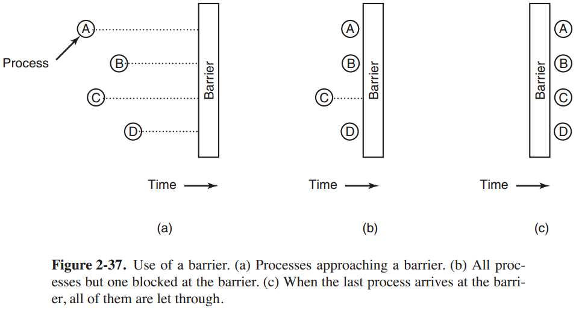

在大型的矩阵（如$1m\times 1m$）运算中，需要并行进程分解运算来加速计算过程。在每次迭代时设置屏障保障运算结果的正确性。

### 避免锁：读-复制-更新

最快的锁策略就是不加锁，问题也就是我们是否可以不对并发访问的共享数据结构上锁而保持正确性。通常情况下不上锁不行。

但是在某些特殊情况下，我们可以允许在有进程访问数据时其他进程对数据进行修改。重点是保证读数据进程要么读到最新数据要么读到旧数据，而不是读到中间计算时的数据。比如对一颗二叉树进行增删节点操作，要求读取到的要么是没改变的树要么是调整结束后的树。

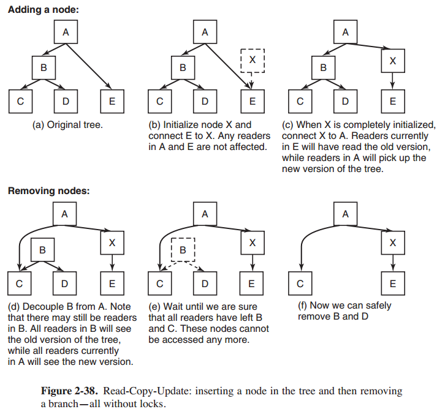

在插入时先将插入节点连接到其子节点，此时通过X去读取子节点会得到E（新），通过A去读子节点会得到E（旧），再将A子节点设置为X；在删除节点B时，先保留B到子节点的链接，让A连接到新子节点C上，再移除B。B、D节点的删除无需锁数据结构的原因是`RCU`将移除和再分配过程从更新操作中分离开来。另外一个要考虑的问题是何时移除节点B，可以对B设置一个宽限周期`grace period`，再宽限周期后再移除。


## 调度

当电脑运行多个程序时，多个进程或线程在同一时刻竞争CPU的情况很频繁。操作系统中决定哪个进程/线程运行的部分称为调度器`scheduler`，用于判定的算法称为调度算法`scheduler algorithm`。

大多数对进程调度的算法亦可用于线程，只有部分地方不同。当内核管理线程时，调度通常是以线程为单位的，不论线程是属于哪个进程。

### 调度简介

批处理阶段的调度很简单，顺序执行任务即可。在多道机系统中，多用户等待使用处理机使得调度算法变得复杂。一些大型机仍然保留着批处理和分时结合的调度策略。因为处理机时间是极度稀缺的资源，所以好的调度器可以在效率与用户体验上有很好的效果。

在调度时，调度器还要考虑到进程切换会带来昂贵的开销。在切换进程前，需要先从用户态切换到内核态。然后保存当前进程的状态，包括寄存器中的数据。部分系统还要保存内存中的引用数据。之后启用调度算法选择下一个要运行的进程。之后CPU的内存管理单元`MMU`加载新进程的内存地图。最后再启动新进程。另外，新进程可能因为无效的缓存引用再次从主存中加载数据。过多的进程切换回降低CPU效率。

花费大多数时间在计算上的进程称为CPU密集型，而花大量时间在等待IO上的称为IO密集型。随着CPU运行速度提升远高于磁盘速度提升，对IO密集型的调度更重要。

#### 何时调度

引发处理机调度事件：

1. 新进程创建时调度器需要判断运行之前进程还是新进程。
2. 有进程结束退出时。
3. 有进程因IO、信号量或其他原因阻塞时。
4. IO中断发生时需要调度参与。

如果硬件提供固定间隔的时钟中断，调度选择可以选择在每个时钟中断时完成。根据对时钟中断的响应可以将算法分为两类：抢占式与非抢占式。

- 非抢占式算法决定运行进程后会一直等待至进程结束、中断、或主动退让处理机。
- 抢占式算法给选定进程一个最大的运行时间片，在时间片结束时剥夺处理机。
- 抢占式算法在每个时钟中断时刻将控制权还给调度器。若硬件不提供时钟信息，则只能采用非抢占式算法。

#### 调度算法适用类别

有三种不同类型的系统值得探讨调度策略：批处理系统、交互系统、实时系统。

- 批处理系统在商业领域仍广泛使用，如核算工资、整理库存、兴趣计算等。批处理系统没有用户焦急等待结果，通常采用非抢占式调度策略，这可以节省进程切换带来的开销。
- 交互式系统为避免进程霸占CPU，需要抢占式调度策略。服务器也需要抢占式策略，因其服务多个突发用户。
- 实时系统中有时抢占是不需要的，因为进程通常不会长时间运行，所以常迅速完成工作后阻塞。实时系统只用来运行推进现有应用的程序，而交互式系统可运行任何作业。

#### 调度算法目标

- 所有系统：
  - 公平性：每个进程公平的CPU份额
  - 策略的强制执行
  - 平衡：各部分都在运行（CPU、IO）
- 批处理系统：
  - 吞吐量：每小时作业数
  - 周转时间：从提交到终止的最小时间
  - CPU利用率
- 交互式系统：
  - 响应时间
  - 均衡性：照顾每个用户
- 实时系统
  - 满足截止时间
  - 可预测性：多媒体系统中避免品质降低

### 批处理系统调度

#### 先来先服务FCFS

先来先服务算法易于理解、方便实现。对CPU密集型作业表现效果好，对IO密集型作业会浪费大量CPU时间等待IO完成，故FCFS不适用于调度IO密集型作业。

#### 短作业优先SJF

短作业优先在每次进程结束时选择运行时间最短的进程作为下一个运行进程。短作业优先可能会造成长作业时间进程长期饥饿等待。

短作业优先只在所有进程同时到达等待分配处理机时才是最优的。

#### 最短剩余时间优先SRTN

最短剩余时间优先算法是短作业优先算法的抢占式改进版本，每次运行剩余处理机时间最少的进程。每个进程的处理机占用时间需提前给出。

### 交互式系统调度

#### 轮转调度Round-Robin

每个进程分配一个可运行的时间段，被称为时间片`quantum`。轮转算法很容易实现，只需将时间片耗尽的进程加在调度队列尾部，顺序运行下一个进程即可。

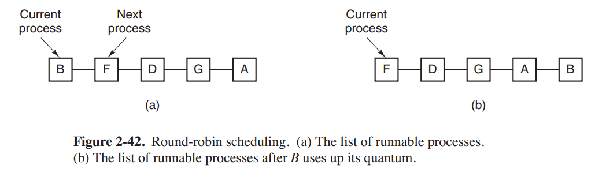

作业调度时进程切换会有比较大的开销，若时间片设置过短，则会导致过多的线程切换降低CPU的效率；若时间片过长又会给需要短时间响应的交互请求很差的体验。通常将时间片设置为20-50毫秒比较合适。

#### 优先级调度Priority

时间片轮转调度默认每个进程有着等同的优先度（重要程度）。

#### 多级队列Multiple Queues

#### 最短进程优先Shortest Process

#### 保证调度Guaranteed

#### 彩票调度Lottery

#### 公平分享调度Fair-Share

### 实时系统调度

### 策略和机制

调度机制与调度策略分离，将调度机制内置于内核（针对父进程），调度策略由用户进程决定（内部线程与子进程）。策略与机制分离是一种关键性思路。  

### 线程调度

用户级线程和内核线程最大的区别是性能。用户级线程的切换只使用少量的机器指令，速度较快。而内核级线程切换有陷入内核的开销，比用户级线程慢几个数量级。但内核级线程的基本调度单位是线程，单个线程阻塞不会导致进程内其他线程阻塞，而用户级线程单个线程阻塞会导致整个进程阻塞。

另一个重要的因素是用户级线程可以让应用程序有自己定义的线程调度器。

## 经典IPC问题

### 哲学家进餐问题

哲学家进餐问题是对多个进程竞争有限个互斥资源（同时需要2个及以上）问题的抽象模型。

```c
#define N 5 //5个哲学家
#define LEFT (i+N-1)%N //i哲学家左边的哲学家
#define RIGHT (i+1)%N //i右边的哲学家
#define THINKING 0
#define HUNGRY 1
#define EATING 2
typedef int semaphore;
int state[N];
semaphore mutex = 1;
semaphore s[N];

void philosopher(int i){
    while(true){
        think();
        take_forks(i);
        eat();
        put_forks(i);
    }
}
void take_forks(int i){
    down(&mutex);
    state[i]==HUNGRY;
    test(i);
    up(&mutex);
    down(&s[i]);
}
void put_forks(int i){
    down(&mutex);
    state[i]=THINKING;
    test(LEFT);
    test(RIGHT);
    up(&mutex);
}
void test(int i){
    if(state[i]==HUNGRY&&state[LEFT]!=EATING&&state[RIGHT]!=EATING){
        state[i]=EATING;
        up(&s[i]);
    }
}
```


### 读者写者问题

读者写者问题是对数据库访问问题的抽象模型。

```c
typedef int semaphore;
semaphore mutex = 1;
semaphore db = 1;
int rc = 0;//reader count
void reader(void){
    while(true){
        down(&mutex);
        rc++;
        if(rc==1)down(&db);//第一个读者
        up(&mutex);
        read_data_base();
        down(&mutex);
        rc--;
        if(rc==0) up(&db);//最后一个读者
        up(&mutex);
        use_data_read();
    }
}
void writer(void){
    while(true){
        think_up_data();
        down(&db);
        write_data_base();
        up(&db);
    }
}
```


## 进程线程相关研究


# 内存管理

引用帕金森定律“工作会不断延长以致填满整个工作时间”，“程序会不断扩张，直至用尽所有内存空间”。

程序员都希望有私有的、无限量的、足够快的内存，并且内存中的内容不掉电丢失。但是这不可能实现。这些年，人们创造了内存的层次结构，MB大小的高速、昂贵、易失缓存；GB大小的中速、中等价格、易失的主存；以及TB大小的低速、廉价、非易失静态磁盘存储。将这个结构合理的抽象并管理是操作系统的任务。

操作系统管理层次内存的结构称为内存管理器，它追踪每个部分内存使用量，将内存分配给进程并在使用结束时回收内存。

对缓存的管理基本上由硬件实现，此处我们主要关注对主存的管理。

## 无内存抽象

对内存最简单的抽象是不使用任何抽象。早期的大型机（<1960），早期的微型电脑(<1970)，早期的个人电脑(<1980)就没有内存抽象。程序多使用汇编语言直接针对物理内存操作。在这种条件下，同时在内存中运行两个程序不太可能。

即便是直接操作物理内存的阶段，也有多种内存抽象方式。

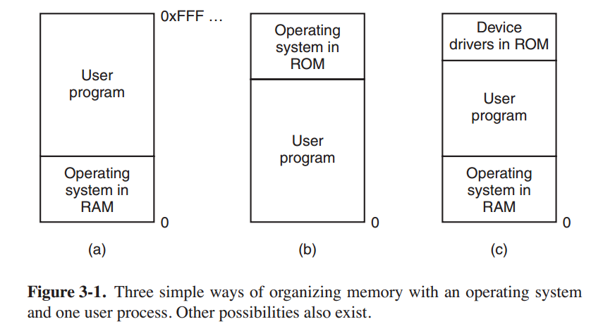

图3-1（a）将操作系统置于RAM底部，早期的大型机与微型电脑如此设计；（b）将操作系统置于静态ROM中，部分手持电脑和嵌入式系统如此设计；（c）将设备驱动放于ROM中，操作系统放于RAM底部，早期运行DOS系统的个人电脑如此设计。a，c抽象中有用户程序可以修改内存中操作系统代码的风险。

即便没有内存抽象，也可以实现多程序同时运行。操作系统需要做的是将内存中全部内容存入磁盘，再换入下一个程序。只要内存中只有一个程序运行就不会发生冲突。交换`swapping`。

## 地址空间存储器抽象

总之，将物理地址空间直接暴露给进程有很多缺点：

1. 如果用户可以访问内存的所有数据，那么他可以很轻松的清空操作系统所在内存空间。
2. 无内存抽象很难实现多程序的并发执行。

### 地址空间概念

实现多程序同时使用内存而不冲突需要解决保护`protection`和重定向`relocation`这两个问题。一个不错的解决方案是为内存引入新的抽象：地址空间`address space`。就像进程为程序提供CPU抽象，地址空间为程序提供内存抽象。地址空间是进程可以用于寻址内存的地址集合。每个进程拥有自己独立的内存空间。

> 与进程线程内存空间知识相关联。

地址空间不一定是数字组成，如同互联网的域名可以使用`.COM`等字符。相对困难的是如何映射每个程序内部逻辑地址到实际物理地址，使得不同程序的28逻辑地址在内存中不冲突。

#### 基址与限址寄存器

一个简单的解决方法是使用动态重定位`dynamic relocation`，将进程内逻辑地址映射到实际的物理地址上。经典的方式是为CPU添加两类特殊的寄存器：基址寄存器`base register`和限址寄存器`limit register`。这两个寄存器保障程序被加载到连续的空闲空间上且加载过程无需重定位。在程序运行时，基址寄存器记录程序起始物理地址，限址寄存器记录程序的长度。

每次该进程引用内存时，无论是取指、读写字，CPU的硬件会先自动的在引用地址上加上基础地址形成实际物理地址，同时也检地址是否超过限址寄存器长度。之后将实际物理地址送往内存总线。

基址与限址寄存器方案是实现进程内存空间独立的一种简单方案，因实际地址都是由硬件自动生成后送入内存总线中。在大多数实现中，基址与限址寄存器只允许操作系统访问。

基于基址与限址寄存器的重定位方案的一个劣势是每次获取对内存的引用都需要一次加法与一次比较操作。比较操作可以快速的完成，但是在没有特殊的加法电路情况下，加法操作因为进位传递时间问题执行缓慢。

### 交换技术

在物理内存足够大能装下全部进程的情况下，之前的方案或多或少可行。但是实际情况中，内存的容量远不能满足所有进程的需要。

有两种处理内存超载的通用方法：交换`swapping`和虚拟内存`virtual memory`。交换方式将一个进程换入内存运行一段时间，在不运行时将其换出至磁盘。非运行态的进程多存储在磁盘中。虚拟内存则允许程序部分载入内存的情况下运行。

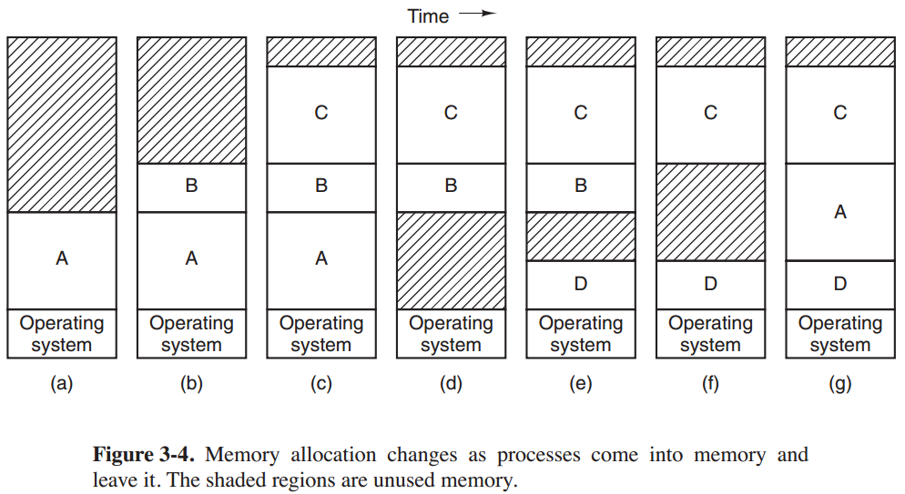

图3-4展示了交换技术的运行流程。

交换技术会在内存中产生许多的空隙，可以通过内存紧凑技术`memory compaction`将其合并，但因内存紧凑相当耗时故一般不经常调用紧凑。比如，在16-GB内存的机器上拷贝8比特需要8纳秒，完全紧凑整个内存需要16秒。

值得注意的一点是当进程在创建或换出/换入时需要分配多大的内存空间给它。如果分配给进程固定不变的大小空间，那么分配操作很简单。但是，如果进程的数据段可以增长，比如很多语言允许进程从堆中动态分配内存，那么在进程空间试图增长时问题就会出现。如果进程临接着空闲区，那么可使进程使用空闲区扩容。如果进程临接其他进程，那么则需将其换至有足够大小的空闲区，或者换出部分进程保障该进程扩展空间。如若都不行进程只能挂起等待。

如果假定大多数进程在运行时需要扩容空间，可在分配内存时为其分配一部分额外的扩展空间，以减少移动或换入换出进程带来的开销。但是，在将进程换出至磁盘时，只需换出进程使用空间，换出额外分配的扩展空间是不必要的。如图3-5所示。

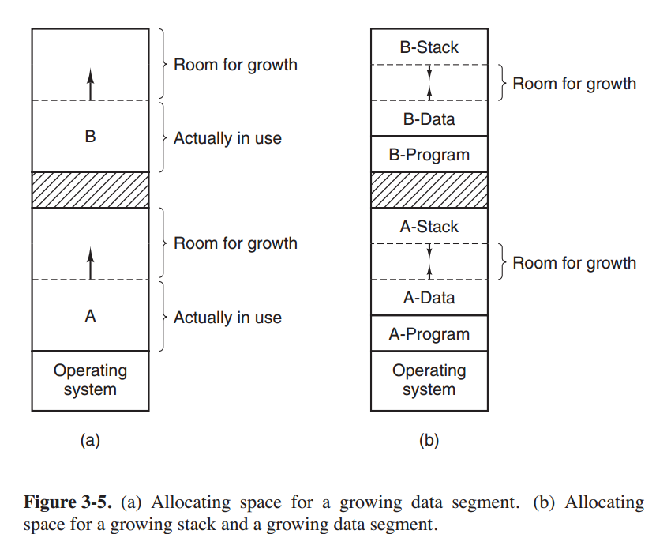

如果进程有两个需扩容的段，比如作为堆存储变量的数据段以及存放本地变量与返回地址的堆栈段，可以使用3-5(b)中的模式。将额外扩容空间放置在堆栈段与数据段中间。

### 空闲内存管理

当内存是动态分配时，操作系统必须对其进行管理。通常使用两种方式去跟踪内存使用：位图`bitmap`与空闲列表`free lists`。

#### 使用位图的内存管理

使用位图，可将内存划分为大小为几字至几千字节的基本单元。每个分配的单元在位图中占用一个位，0表示该单元空闲，1表示该单元被使用。

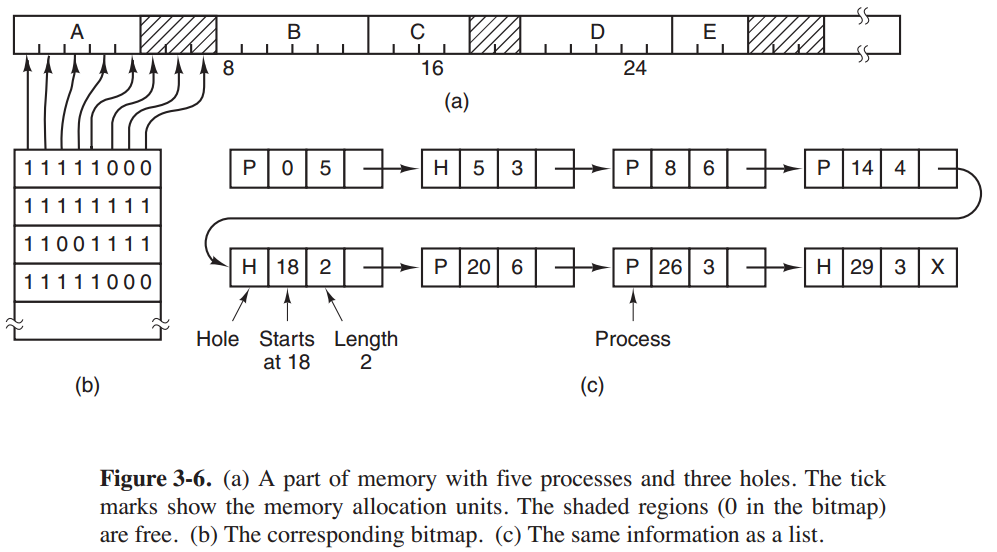

图3-6展示了部分内存与其位图3-6（b）。

基本单元的大小是一个重要的设计问题。基本单元越小，位图越大，反之亦然。设分配单元大小为4Bytes，那么32bits的内存需要1bit位图。32nbit大小的内存需要n个位图bit，所以位图会占用1/32的内存。如果基本单元大小设大一点，需要位图大小变小，但是在进程使用空间较小时会造成资源浪费。

因为内存与基本单元的大小决定了位图的大小，所以位图提供了一种跟踪内存使用情况的简单方案。位图的主要问题是在k个单元的内存请求中，内存管理器需要在位图中寻找k个连续的空间以分配给进程。在位图中寻找给定长度的连续空间是一个很缓慢的操作。

#### 使用链表的内存管理

另一种跟踪内存的方式是维护一个已分配内存以及空闲内存段链表。图3-6（c）为链表实现。


## 虚拟内存

尽管基址和限址寄存器可用于创建内存地址抽抽象，但管理软件大小增长得远比内存容量要快，使得许多软件不能在内存中装下。需要一个可以在内存中装入程序的一部分即可运行的机制。在20世纪60年代采用的方式是：覆盖`overlays`。尽管覆盖块的换入换出由操作系统管理，但是将程序分块的操作需要由程序员自己完成。分块操作不但耗时而且容易出错。

Fotheringham在1941年提出了虚拟内存`virtual memory`概念。虚拟内存基本思想是每个程序有自己的地址空间，这些地址空间被分割为多个页`page`。每个页是一个连续的地址空间。这些页会被映射到物理内存上，但是在程序运行过程中无需所有的页均存在与物理内存中。当引用到物理内存中存在的页时，硬件会执行必要的映射；当引用页不存在于内存中，将引发缺页中断，由内存从磁盘载入页面再运行相关指令。

> 内存命中：
>
> 缓存命中/块表命中：
>
> 缺页中断：
>
> 进程/线程状态切换：
>
> 内核态/用户态切换：

在某种程度上，虚拟内存时基址和限址寄存器的一种泛化/综合。8088为数据段与程序段设立了单独的基址寄存器。虚拟内存允许整个地址空间以相对较小的单元映射到物理空间上，而不是对数据段与程序段分别重定位。虚拟内存可在多处理机系统上工作，在进程等待换入页面时，CPU可以切换到其他进程运行。

### 分页

多数虚拟内存采用分页机制。当计算机执行`MOV REG, 1000`指令时，将内存1000地址中存储的内容拷贝到REG中（有的机器则刚好反向拷贝）。地址可以由索引、基址寄存器、段寄存器等产生。

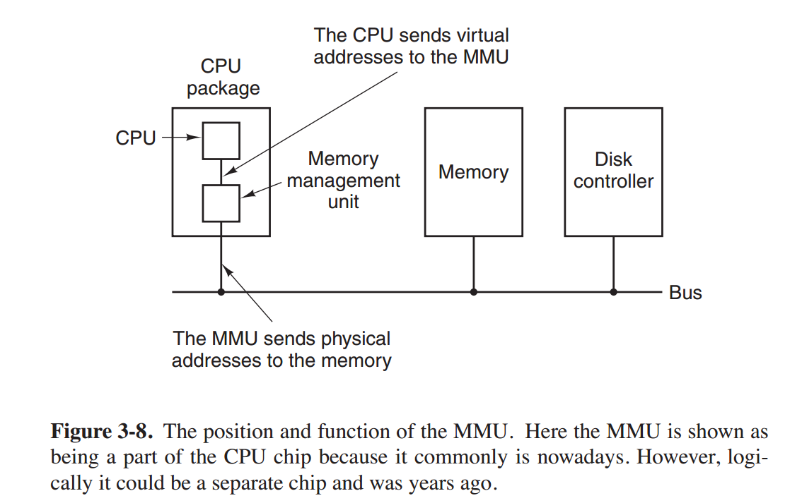

虚拟内存方式下，CPU将虚拟地址送给内存管理单元`MMU`，由`MMU`映射后将实际物理地址通过内存总线发送。无虚拟地址的计算机直接将物理地址发送至内存总线。

> 带映射的虚拟内存在逻辑上地址空间连续，在实际内存中物理地址空间可不连续，可使用链表方式的内存管理。

虚拟地址空间固定大小的单位为页/页面`page`，页在实际物理内存中对应的单位为页帧`page frame`，通常情况下页大小与页帧大小相同。内存与磁盘间的传输单位为页。许多处理机支持多种页面大小，如为设定用户程序页大小4kb，内核页大小1gb。

`MMU`的映射功能并没有解决虚拟地址空间远大于物理地址空间的问题，我们可以增加一位存在位`present/absent bit`标识虚拟地址对应内容是否在物理内存中。若`MMU`发现对应页面不存在内存中，会向操作系统发出一个页错误`page fault`。由操作系统选择换出部分页帧至磁盘，再换入所需页。

### 页表

通常，虚拟地址被分为页号（高位比特）以及偏移量（低位比特）。虚拟页号作为页表的索引以找到对应页帧。页表的作用是将虚拟页（高位）映射到物理页帧上。从数学的角度说，页表是一个接收虚拟页返回物理页帧的函数。

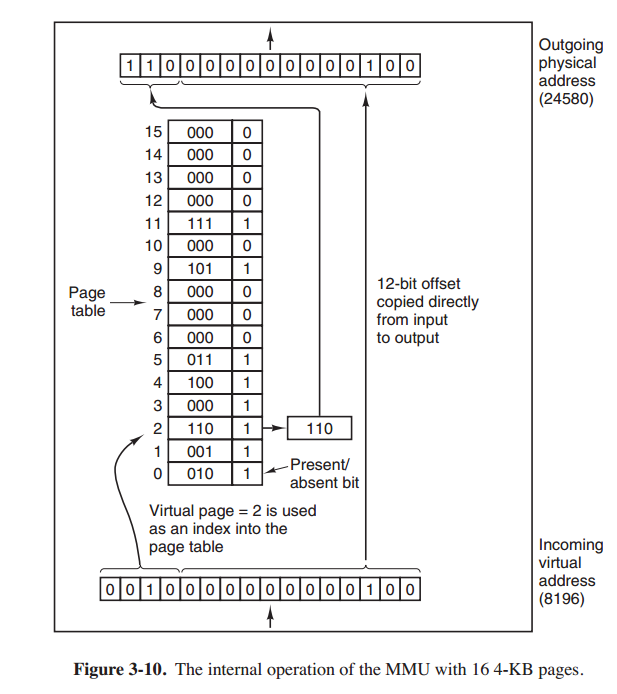

#### 页表项结构

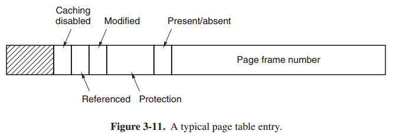

页表项具体结构高度机器相关，图3-11展示了经典的页表项结构。页表项大小各种机器实现不一，但32位是比较常见的大小。其中最重要的部分是**页帧号`page frame number`**，其次是驻留位`present/absent`表示对应页帧是否在内存中。保护位`protection`标志访问权限，0为读写，1为只读。

修改位`modified`与引用位`reference`用于跟踪页面使用情况，若页面被标记修改则需写回磁盘（缓存/寄存器中也有类似的标志位），若未被修改在不使用时直接丢弃即可。

引用位`reference`用于帮助OS在发生缺页中断时选择换出内存的页面。

缓存位`caching disabled`用于关闭缓存功能，缓存将虚拟页面映射到寄存器而非内存。

虚拟内存最本质的功能是提供了一个对物理内存的新抽象--地址空间，如同进程是CPU处理机的抽象。

### 加速分页

在分页系统中，我们遇到的两个主要问题是：

1. 对虚拟地址到物理地址的映射必须要快。
2. 虚拟地址空间增大的同时页表也会增大。

#### 转换检测缓冲区

通常页表被存放在内存中，但页式内存管理使得每次对内存的引用需要两次访存操作（一次页表取址，一次访存）。这会使得内存效率折半。根据观察，我们得知大部分程序会大量访问一小部分页面。因此，页表中只有很少的一部分被高频访问，其余部分很少被访问。

由此，可为计算机配备一个小型的硬件设备用以映射页面到页帧，而不经过内存。这种设备被称为**转换检测缓冲区`TLB translation lookaside buffer`**、**关联内存`associative memory`**、以及**快表**。快表被内置于内存管理单元`MMU`中，图3-12是一个快表示例。

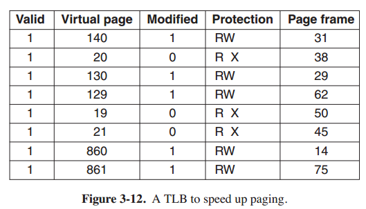

快表查询流程：	

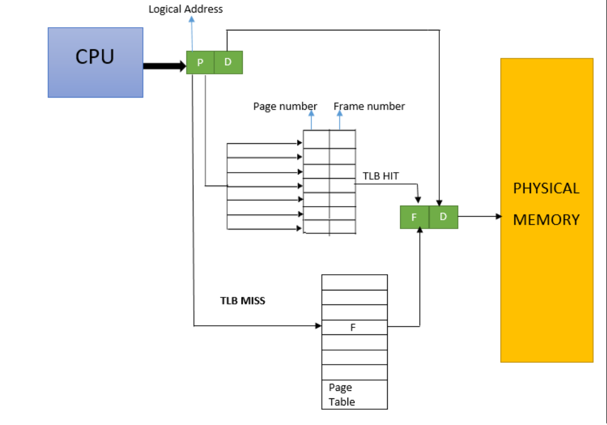


#### 软件TLB管理

前面说的TLB管理由MMU内部的硬件完成，对TLB的管理还可以通过软件实现。许多RISC机器使用软件管理TLB，快表项的管理由操作系统完成。当TLB未命中时，不由MMU处理，直接向操作系统发送TLB错误。由操作系统完成寻找页面，置换TLB项，以及恢复指令操作。

若TLB相对较大（如64个快表项），软件管理的TLB方式也有可接受的效率。通过软件实现TLB管理，可以给MMU节省很多空间用以添加更多的零部件用以提高CPU性能。

为减少TLB丢失率，部分操作系统会对接下来可能访问的页面进行预加载。

两类快表失效：软失效、硬失效

1. 软失效：页面未在快表中，但在内存中。
2. 硬失效：页面未在快表也不在内存中。

当前进程内存页表中不存在的内容有可能已存在于内存中，如在其他进程地址空间内。此时无需访问磁盘，直接在内存中映射该内容到页表中即可。

### 大内存中的页表

#### 多级页表

使用多级页表可以扩大页表表示范围而不过大增加页表大小，也避免将页表所有内容全放入内存中。

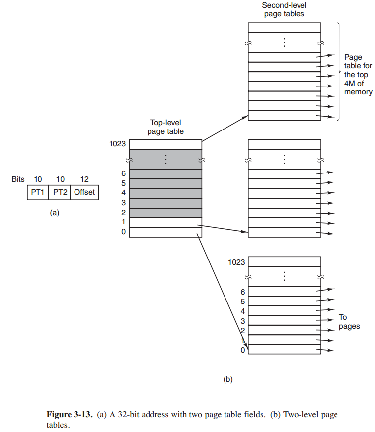

#### 反转页表/倒排页表

倒排页表中，存在内存中的项为页帧项，而不是表示虚拟地址的页表项。当页面大小4kb，内存4gb时，仅需1,048,576个页表项。倒排页表可以节省大量的空间，但会使虚拟地址到物理地址映射变得困难。

可以使用TLB来解决这个问题，如果TLB可以装下所有重度引用页面，虚拟到物理地址的转换和普通页表一眼快。使用散列表存储虚拟地址，有相同hash值的项链表连接。如果hash表的slot数量和物理页帧数相同，hash表的平均链表长度仅为1，极大加速映射过程。

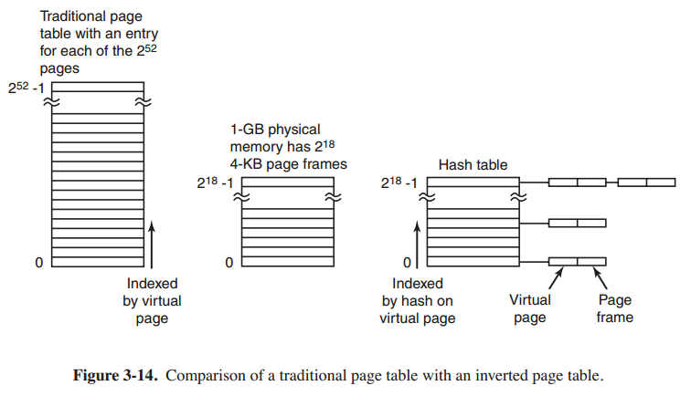

## 页面置换算法

当页错误发生时，操作系统需要选择一个页面换出以换入新的页面。如果被换出的页面在内存中被修改过，需要把新内容写回磁盘。未被修改的页面直接丢弃即可。主存中与磁盘内容不一致的页面称为脏页面，一致称为干净页面。

一个问题：选择换出的页面是局限在进程地址空间内，还是可以换出其他进程地址空间的页面。

### 最优页面置换算法 

最优页面置换每次将最完被使用的页面换出内存。因页错误发生时操作系统不知道每个页面在何时会被再次使用，故该算法无法实现。但是最优页面置换算法可在同一程序第二次执行时使用，以第一次运行的信息作为输入。可根据最优页面置换算法来评价实际页面置换算法的性能。

### 最近未使用页面置换算法NRU

为便于统计页面状态，会为每个页表项设置R和M位，R=1表示被引用过（R位每次时钟中断时会清0），M=1表示被修改过。根据R与M状态可将页面分为四类：

1. class0：R=0，M=0；未被引用，未被修改

2. class1：R=0，M=1；未被引用，被修改

3. class2：R=1，M=0；被引用，未被修改

4. class3：R=1，M=1；被引用，被修改

   > 问：为何被引用比被修改重要，class1为仅被修改而不是仅被引用。

NRU算法在缺页中断发生时，从非空的低到高队列中随机移除一个页面。

### 先进先出页面置换算法


### 二次机会页面置换算法

二次机会置换算法是对FIFO算法的改进，在移除页面时会先看R位，若R位为1则将该页面插入队列尾部，若R位为0则直接移除。若队列中页面最近均未被使用，则退化为FIFO。

### 时钟页面置换算法

尽管二次机会算法可行，但在R=1时有增删操作且其队列会无限延长。可使用固定大小的循环队列（类似时钟）改进，当R=1时，指针向前移位省略不做移出与插入操作；当R=0时，直接移出页面。

### 最近最少使用页面置换算法LRU

LRU每次移出使用次数最少的页面。LRU理论上可行但是实现起来代价高，可通过增加特殊硬件统计页面引用次数。

### 软件模拟LRU


### 工作集页面置换算法WS


### 工作集时钟置换算法

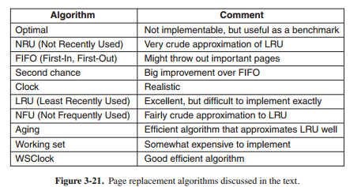

## 分页系统设计问题

### 局部和全局分配策略

一个主要的问题是如何在竞争的可运行进程中分配内存。在进程发生缺页中断时，是在当前进程地址空间内选择换出页面还是在全局选择换出页面。如图3-22所示，在每次换出age最小值的情况下，局部置换为(b)，全部置换为(c)。

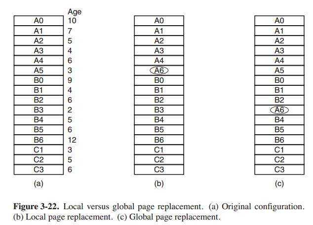

局部算法中每个进程固定内存大小，全局算法进程地址空间动态变化。全局算法通常情况下优于局部算法，局部算法容易出现`颠簸`(刚换出的页面又需要换入)。


### 负载控制

### 页面大小

如果页面过大，如果程序段、数据段、堆栈段不能装满整个页面，会出现许多内存碎片，降低内存利用率。如果页面过小，页表的长度会很大。

小页面能充分利用TLB空间。为平衡，操作系统中不同部分会使用不同的页面大小，如内核使用大页面，用户进程使用小页面。

### 分离指令和数据空间

为方便程序编程，将指令空间与数据空间分离。

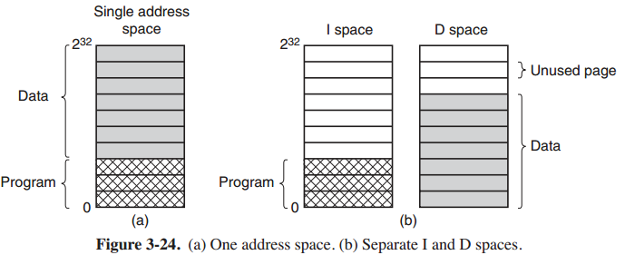

在使用分离空间的计算机中，两种地址空间独立，有自己的页表。

### 共享页面

在单机上多次运行同一程序，为避免内存中有一个页面的多个副本，可以使用共享页面。一般仅只读页面可以共享，如程序文本，数据页面不能共享。使用分离的指令和数据空间很容易实现，程序的多个进程共享一个指令空间，可选择性共享数据空间。

### 共享库

现代操作系统中，许多大型库被多进程使用，如浏览文件库及图形库等。把静态库与磁盘可执行程序绑定会使其特别庞大。一个更为通用的技术是使用共享库，如Windows中的DDL。

### 内存映射文件

共享库实际上是内存映射文件的一个特例。进程通过一个系统调用，将文件映射到内部虚拟地址空间的一部分。多数情况下，映射的页面不会实际读入页面内容，而在访问时一页页读入（驻留内存），磁盘文件仅做后备存储。。

### 清除策略

### 虚拟内存接口

## 相关实现问题

### 带分页的操作系统

### 缺页中断处理

### 指令备份

### 锁定内存中页面

### 后备存储

### 策略与机制的分离

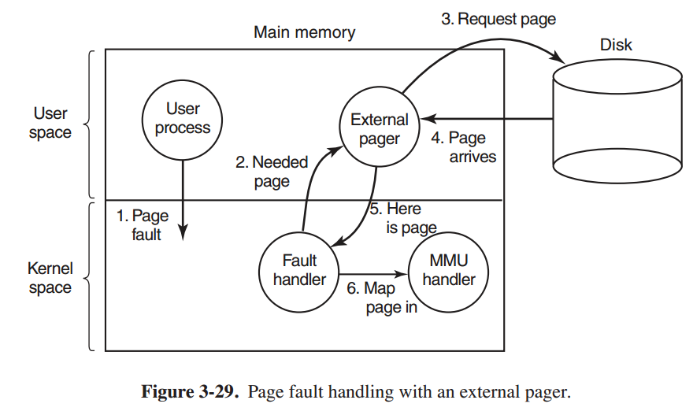

## 分段

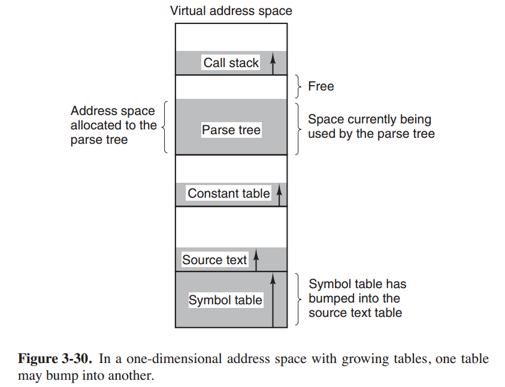

如图3-30所示，编译过程中符号表、源程序、常量表、语法分析树会不断增长，编译过程堆栈可增可减。需要一种不用程序员管理表扩大缩小的方法，因此引入段式管理，每个段相互独立，空间动态可扩展。

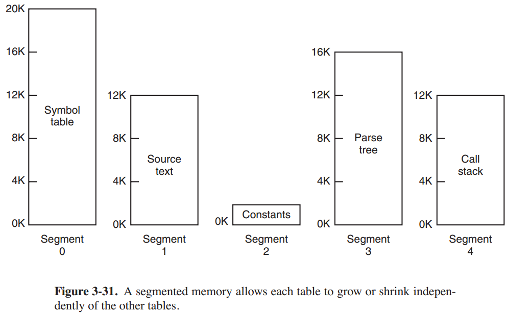

### 纯分段

分段和分页实现本质不同：页面是定长而段不是。段式管理产生外部碎片。

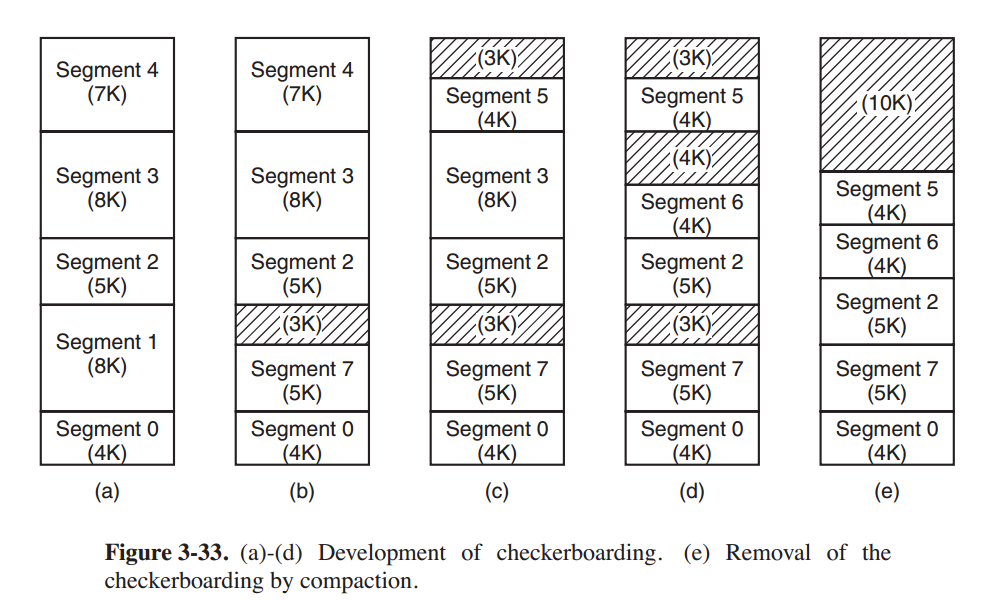

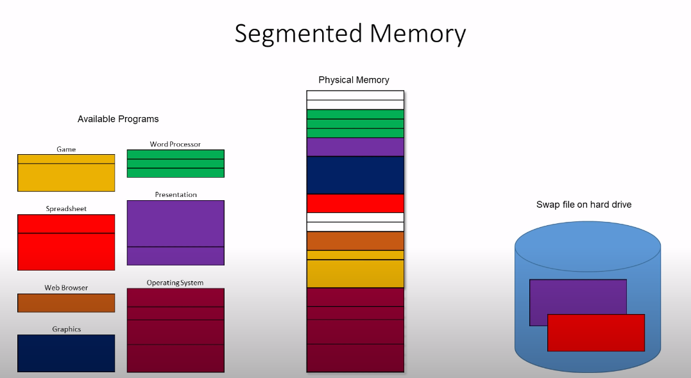

程序的程序段和代码相关，比如过程和函数。

程序的数据段和数据结构相关，比如栈、队列、图。

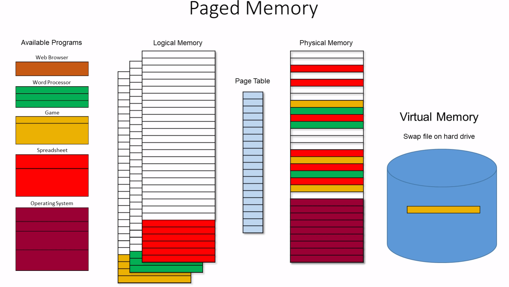

### 与MULTICS的段页结合

每个程序有一个段表，每个段表项对应一个页表。

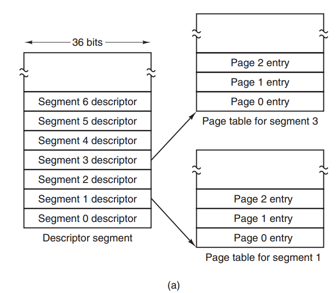

### 与X86的段页结合


## 内存相关研究


# 文件系统

进程的空间有限，且进程中的信息在运行结束时丢失。需要一个可持久化保存信息的方式，且这个方式允许多个进程同时访问。

进程/线程是计算机处理机抽象，地址空间是物理内存抽象，文件是进程创建信息的抽象/逻辑单元。

## 文件

#### 文件命名

文件是一个抽象机制，它提供对磁盘信息的读写功能，对外提供接口屏蔽底层细节。

UNIX系统文件名区分大小写。

多数文件系统使用两部分文件名，`a.txt`，前一部分表示名称，后一部分表示文件类型。

#### 文件结构

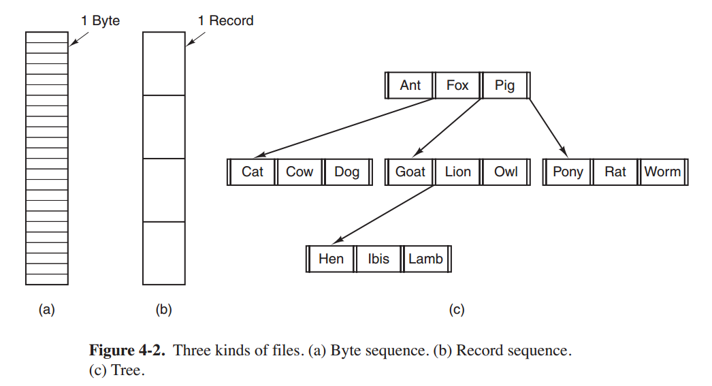

#### 文件类型

普通文件`regular file`包含用户信息，文件夹/目录`directories`管理文件系统结构，字符特殊文件`character special files`与串行IO设备相关，块特殊文件`block special files`和磁盘类设备相关。

#### 文件访问

#### 文件属性

#### 文件操作

#### 带系统调用的示例

## 文件夹/目录

单级目录

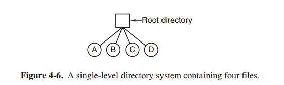

层级目录

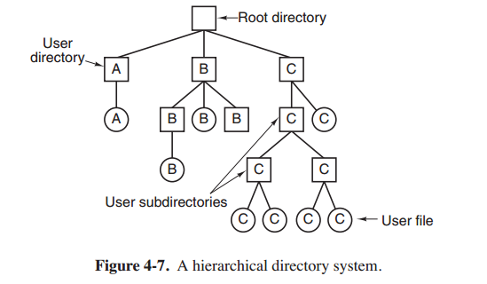

Unix目录树

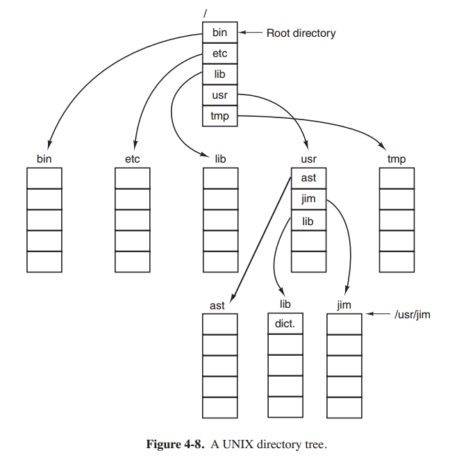

## 文件系统实现

文件系统实现关注于文件和目录如何存储、磁盘空间如何管理、以及如何使文件系统更加高效稳定。

### 文件系统布局

文件系统存于磁盘，多数磁盘可以被划分成多个区`partition`，每个区有自己独立的文件系统。磁盘的0号扇区`sector`被称为`MBR(Master Boot Record)`，用于引导计算机启动。MBR的末尾含分区表，表中记载每个区的起止位置。当计算机启动时，BIOS会读入并执行MBR中内容。MBR先定位活动分区，读入活动分区引导块`boot block`（分区第一个块），并执行引导块。引导块中的程序将装载该分区中的操作系统。为统一，每个分区都以引导块开始。

除了以引导块开始，磁盘的分区布局在不同文件系统中差异很大。通常文件系统会包含图4-9中的部分内容。

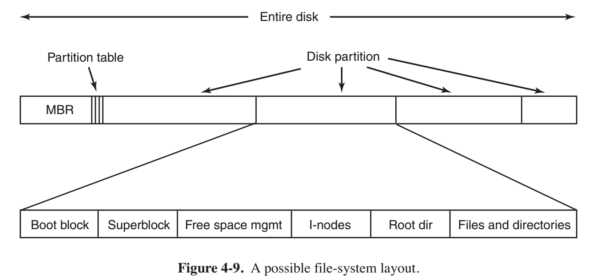

引导块之后是超级块`superblock`，其含有文件系统所有重要的参数，在操作系统启动或磁盘首次访问时载入内存。通常超级块中会包含一个确定文件系统类型的魔数、文件系统中块个数、以及其他管理信息。

之后是文件系统的空闲块信息`free space  mgmt`，如标志空闲信息的位图或链表。


### 实现文件

#### 连续分配

文件连续存储是最简单的方式，因起始地址加偏移量方式实现简单、访问迅速。但是长时间运行后，文件系统会产生许多不连续的碎片。

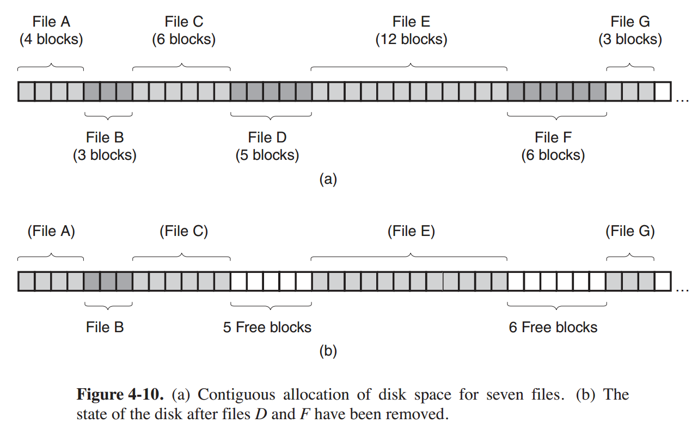

#### 链表分配

链表实现方式是将文件各个块以链表的方式连接，不会产生碎片，可以利用磁盘全部空间。但是在访问文件特定块时只能顺序查找，效率低。文件块链表指针占用存储空间，会使文件系统可使用容量小于整个磁盘的容量。


#### 使用内存表的链表分配

链表方式的两个缺点都可以通过将磁盘块指针放入内存表中的方式避免。内存中用于存放文件块指针的表称为`FAT(File Allocation Table)`。

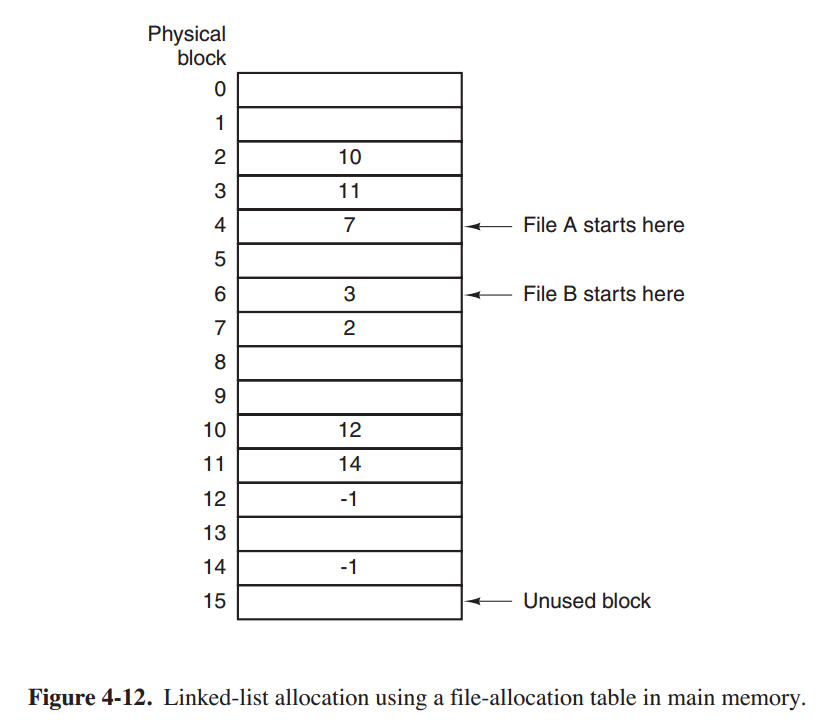

FAT方式的一个最大的弊端是需要将磁盘指针存入内存，当磁盘较大时，内存中FAT占用空间也很大。

#### I-nodes

I-node数据结构用于存放文件块的属性及磁盘地址空间，如图4-13所示。

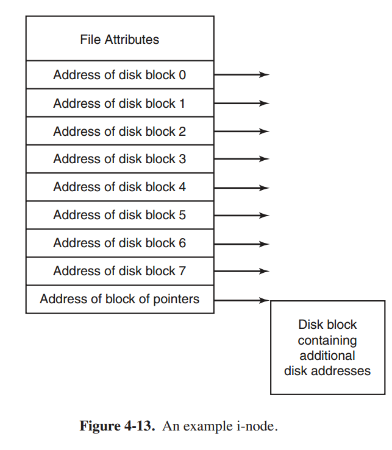

将I-nodes与FAT方式共用的最大好处是只有在文件被打开时，I-Node才需要存于内存中。

### 实现目录

目录项提供在磁盘中找到对应块所需的信息。在连续分配中提供文件的磁盘地址，链表方式中提供文件的第一个块号，I-node方式中提供I-node号。

文件含有许多属性，在何处存储这些属性是一个问题。一个方式是将其存入目录项中，如图4-14（a）。另一个方式是将这些属性存入I-node中，目录项中含有指向I-node的引用。

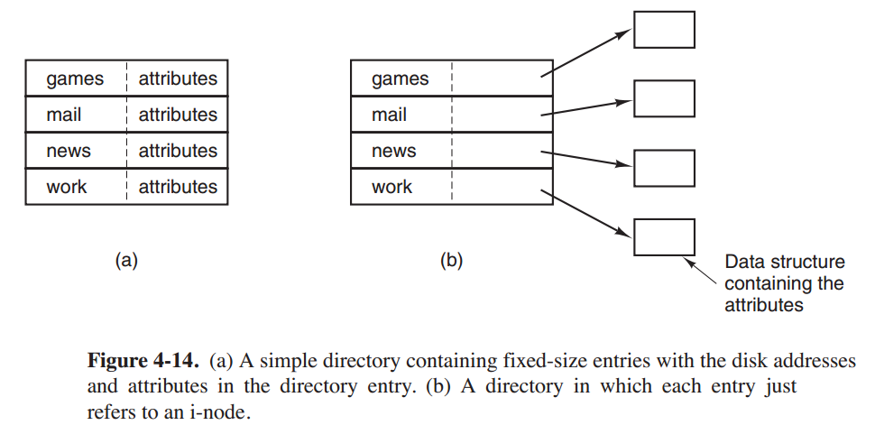

目前为止我们考虑的是定长的目录项，现代计算机文件名称可以很长，如何实现？

最简单的方式是限定文件名长度，给定目录项一个指定长度，但只有很少一部分文件名字常，这样会浪费大部分目录项空间。

另一种方式是使目录项长度可变。每个目录项以该项长度起始，在其他固定长度属性后接文件名，如图4-15（a）所示。在文件移走后引入了一个可变的空隙，下一个移入文件不一定适合该空隙。需要对目录进行紧凑操作。另一个问题是边长目录项在内存中可能不在一个页面上，在读取文件名时可能产生缺页中断。

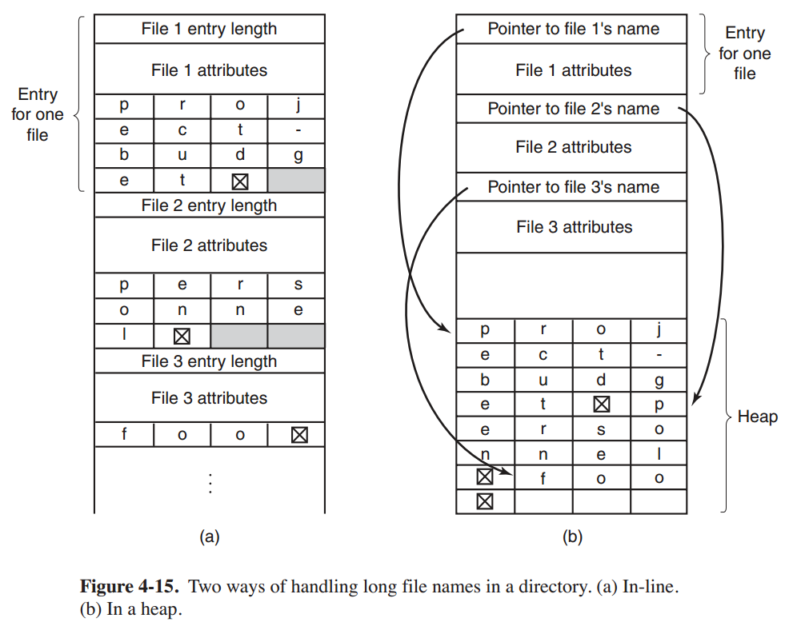

还有一种方式是固定目录项长度，将文件名存于堆中，目录项持有指向堆中名字指针。这种方式不会产生空隙，处理文件名时还是会发生缺页中断。

### 共享文件

同一项目的多个用户有共享文件的需求，如图4-16所示，B用户持有到C用户文件的引用。在持有连接后，文件系统是一个有向无环图`DAG`而不是树。

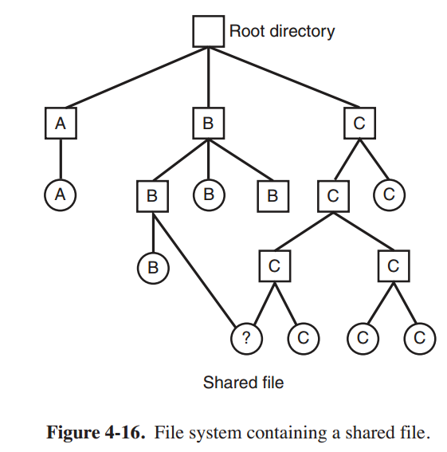

共享文件会带来一些问题，若目录包含磁盘地址，那么当文件进行链接时需要将地址也拷贝过去。如果B或C用户随后在文件中添加新内容，则新的数据块只会出现在加入者的目录中。新的改变对其他用户不可见。

第一种解决方案是不将磁盘块列入目录中，而将磁盘块列入小型数据结构中，目录指向该数据结构。如UNIX系统中的I-NODE。此种情况下，B中i-node持有一个指向C中i-node（C为所有者）的引用，当C想删除该i-node时不会移除该i-node，而是在将C与I-node的引用移除，此时会产生C为所有者的仅B持有的I-node。

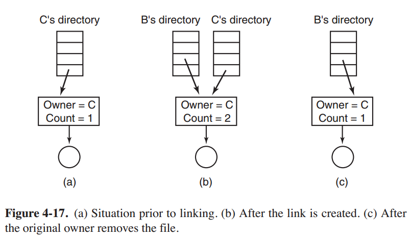

第二种方案是引入LINK类型文件，将连接文件放于B目录下，当访问该文件时会获取实际路径去访问源文件。与传统硬链接相比，这种称为符号链接`symbolic linking`。符号链接的问题是会带来额外的存储以及查询开销。

### 日志结构文件系统

磁盘的寻道时间的提升速度相比CPU、内存等小很多。多数的文件系统都遇到了性能瓶颈。伯克利推出的LFS（`log-structure file system`）能很好的改善这一情况。

LFS提出的主要原因是，CPU速度越来越快，内存容量越来越大，高速缓存容量也在增加。因此，不需要对磁盘进行操作也可以满足对文件系统的大量请求。

文件系统中，零碎的写操作频繁且效率低下，真正的磁盘写入时间不足整个操作时长的1%。因此，LFS重写UNIX文件系统，以日志结构方式实现。所有的写操作最初被缓存在内存中，周期性的以日志方式追加到文件系统中。此种方式会造成i-node在磁盘中不连续，需要在内存或缓存中维护一个i-node图，用于打开文件时的寻址。

LFS有一个清理线程，周期性的扫描日志，清除不使用的内容，对磁盘进行压缩。每次读取磁盘一个段，丢弃未被使用信息，将仍在使用的信息加入内存中等待写入下一个磁盘段中。因此，整个磁盘称为一个环形缓冲区，写线程从前面追加内容，清理线程将旧的内容从后移除。

LFS在零碎写性能上比UNIX高一个数量级，在大块读和写上与UNIX相差不大。

### 日志文件系统

日志结构文件系统因与现存文件系统高度不兼容而未被广泛使用，但他的思想被广方应用到其他文件系统中。日志文件系统`journaling file system`的基本思想是在系统执行操作前先将操作以日志方式记录下来，在操作过程中遇到意外时可通过日志恢复。日志系统的操作必须是`幂等的idemoptent`，即同一操作执行多次而无害。为增加可靠性，文件系统可以引入数据库中`原子事务atomic transaction`概念。

## 文件系统管理和优化

让文件系统工作和让其高效鲁棒的工作是两个不同的事情。

### 磁盘空间管理

文件通常存于磁盘上，因此对磁盘空间的管理是文件系统设计者主要考虑的事情。因连续存储方式在文件扩展时需要整体移动，而磁盘中移动速度远小于内存中移动速度，故几乎所有的文件系统都采用将文件分块存储的方式。

#### 块大小

一旦决定了采用分块存储的方式，问题就变为了采用多大的块大小。考虑到磁盘的设计，可以采用扇区、磁道、柱面等作为块的基本单位。如果块过大，则造成空间浪费；块过小，会导致多次寻道效率低下。2005年vu文件90%小于64KB。

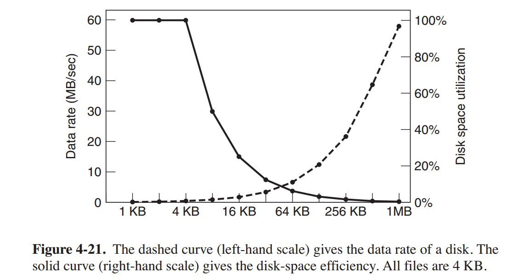

在磁盘空间普遍超过1TB的今天，磁盘空间不再那么紧缺，将块大小设为64KB接受一部分空间浪费能得到比较好的性能。

#### 记录空闲块

块大小决定后，下一个问题是如何记录空闲的块。一种是使用链表方式，一种是使用位图方式。

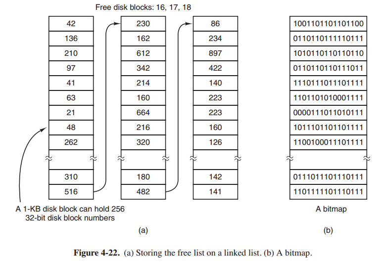


### 文件系统备份


### 文件系统一致性


### 文件系统性能

#### 高速缓存

最常用的提升性能手段是使用`块高速缓存block cache`或`缓冲区高速缓存buffer cache`。缓存在逻辑上属于磁盘，在实际中被放于内存中。

#### 块提前读

在需要用到块之前，试图提前将其写入高速缓存，从而提高命中率。  


# 输入输出

除了提供进程、地址空间、文件等抽象，操作系统还提供对I/O设备的管理。

## IO硬件原理

不同的人看IO硬件的方式不同。在电子工程师眼中，IO硬件是一些列芯片、电线、电源、马达等组成元件。程序员眼中，IO硬件是一个提供接口的软件。

### IO设备

IO设备大致可以分为两类：`块设备block devices`和字符设备`character devices`。块设备将信息存入固定块中，每个块有自己的地址，不同块之间读写独立。硬盘、U盘是常见的块设备。字符设备以字符为单位，发送或接收一个字符流。没有块结构，不可编址/寻址。打印机、网络接口、鼠标等是常见的字符设备。

### 设备控制器

IO设备一般由机械部分和电子部分构成，通常两部分分开处理以提供更标准、模块化的设计。电子部分称为`设备控制器device controller`或`适配器adapter`。PC中，电子部分多在主板芯片上。

控制器与设备间的接口很底层，如磁盘控制器处理串行比特流与字符块的转换并提供纠错功能。

### 内存映射IO

每个控制器都有几个寄存器，可与操作系统进行数据、命令的交互。除控制寄存器外，多数设备还有供操作系统读写的缓冲区。例如，屏幕显示像素用的缓冲RAM。

CPU如何与IO设备的寄存器及缓冲区通信？

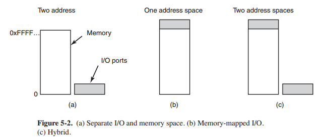

（a）为每个寄存器分配一个IO端口号，通过端口号访问寄存器。如`IN REG PORT`,`OUT PORT REG`。

> `IN R0 4`表示将IO端口4的内容读入寄存器R0，`MOV R0 4`表示将内存地址4的内容读入R0。

（b）将IO设备寄存器引入内存地址空间，分配给其无内存占用的内存地址。这类系统被称为`内存映射I/O memory-mapped I/O`。

（c）b的变种，将IO设备缓冲区引入内存地址空间，而控制寄存器有单独的IO端口。

当CPU想要读取一个字时，将想要读取的地址放到总线地址线上，然后在总线控制线上置一个`read`信号。对于有IO端口的设备还需要用另一条控制线来表明地址是内存空间还是IO空间。

优缺点：

1. 如果没有直接访问IO端口的指令，分配端口号方式需要额外编写读写的汇编代码；而内存映射I/O方式，控制寄存器只是内存中的一个变量，可以通过C语言驱动访问。

2. 对于内存映射I/O，无需阻止用户进程访问的特殊保护机制。

3. 对于内存映射I/O，可以引用内存指定操作控制寄存器。

4. 在有高速缓存的机器中，内存映射I/O方式中若寄存器被缓存，可造成后续只读取高速缓存中的值而不读IO控制寄存器中值。为此，内存必须提供页面静用高速缓存的功能。

5. 多总线结构中，内存映射IO方式需要特殊的处理措施使得IO设备可以探查到来自总线的IO信号。

   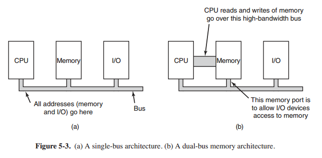

### 直接存储器存取

不论CPU以何种方式和IO寄存器及缓冲区相连，它需要寻址设备控制器以便数据交换。CPU可以每次从IO控制器处请求一字节数据，但这样浪费CPU时间，因此引进了`直接内存访问DMA direct memory access`模式。为简化介绍，以单总线模式为例。

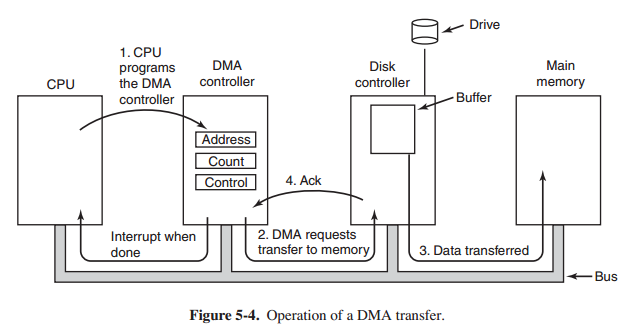

操作系统只有在硬件含有DMA控制器的条件下使用DMA模式，有时这些控制器会被集成到磁盘或其他控制器中。无论DMA控制器实际物理位置在哪里，它都能够独立与CPU而访问总线。DMA包含多个可读写寄存器，如内存地址寄存器、字节计数器、控制寄存器等。控制寄存器指定IO端口、方向、传送单位、以及单次传送字节数。

在没有DMA的时候：

1. 磁盘控制器从磁盘驱动器中按位读取块，直至整块信息放入磁盘缓冲区。
2. 磁盘控制器计算校验和，无误时产生一个中断。
3. 当操作系统开始运行（读数）时，从磁盘缓冲区中按字节或字为单位将数据读入内存中。

使用DMA时：

1. CPU将地址等相关信息存入DMA寄存器中。DMA将请求送至磁盘控制器，让磁盘控制器加载指定数据到其缓冲区并对其校验。
2. DMA通过总线向磁盘控制器发出一个DMA传送请求。要写入的内存地址在总线地址线上。
3. 磁盘控制器将数据写入内存。
4. 磁盘控制器发送响应信号到DMA。

不同DMA控制器区别很大，简单的控制器一次处理一路数据，复杂的控制器可一次处理多路数据。

### 重温中断

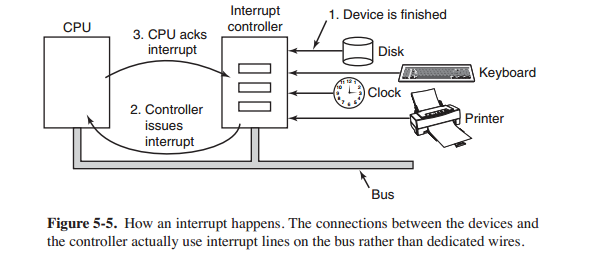

当IO设备产生中断时，通过总线分配给它的一根信号线将中断信号送至中断控制器。由中断控制器芯片决定下一步如何处理。

## IO软件原理

### IO软件目标

### 程序控制IO

### 中断控制IO

### 使用DMA的IO

## IO软件层次


## 盘

## 时钟

## 用户界面：键、鼠、显示器

## 瘦客户机

## 电源管理

# 死锁

## 资源

### 可抢占资源与不可抢占资源

可抢占资源可从其他进程中抢占而不产生副作用，如存储器是一类可抢占资源。

不可抢占资源是指在不引起相关的计算失败情况下，无法从其他进程中抢占过来。

### 资源获取

## 死锁简介

如果一个进程集合中每个进程都在等待集合中其他进程的事件，该进程集合是死锁的。由于所有进程都在等待，所以没有一个进程能够引发可以唤醒其他进程的事件。

多数情况下，进程等待事件是集合中其他进程释放所占有资源，这种死锁称作资源死锁。

### 资源死锁条件

1. 互斥条件：
2. 请求和保持条件：已经获得某个资源的进程可以请求新的资源。
3. 不可抢占条件：已经分配给进程的资源只能被显示释放不能被强制抢占。
4. 循环/环路等待条件：发生死锁时，已定有一个进程-资源的循环链，每个进程都在等待下一个进程所占用的资源。

### 死锁建模

Holt1972年指出如何使用有向图建立资源死锁四个条件的模型。在有向图中用圆形表示进程，方形表示资源。从**资源节点（方形）**到**进程节点（圆形）**的有向边代表该资源已被请求、授权并占用，图6-3（a）。进程节点（圆形）到资源节点（方形）的有向边表示当前进程正请求该资源并已被阻塞，图6-3（b）。

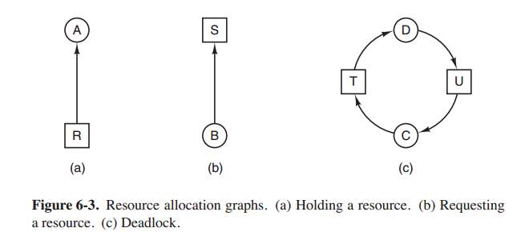

图6-3（c）中环为死锁情况。

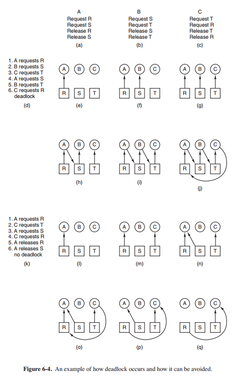

## 鸵鸟算法

最简单的方法：把头埋到沙子里，假装什么都没有发生。数学家认为要彻底防止死锁产生；工程师根据死锁发生的频率、系统严重程度等去决定如何对待死锁。

## 死锁检测和死锁恢复

第二种技术是死锁检测和恢复，系统允许死锁发生，在检测到死锁发生后，采取措施进行恢复。

### 每种类型一个资源的死锁检测

设每种类型资源只有一个，对这样系统构造一张资源分配图（方框资源，圆圈进程）。如图6-5所示，当有向图出现环时，死锁发生。

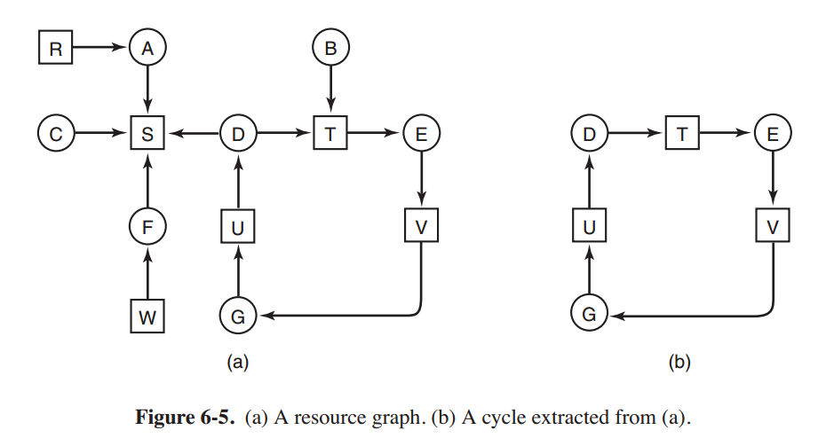


### 每种类型多个资源的死锁检测

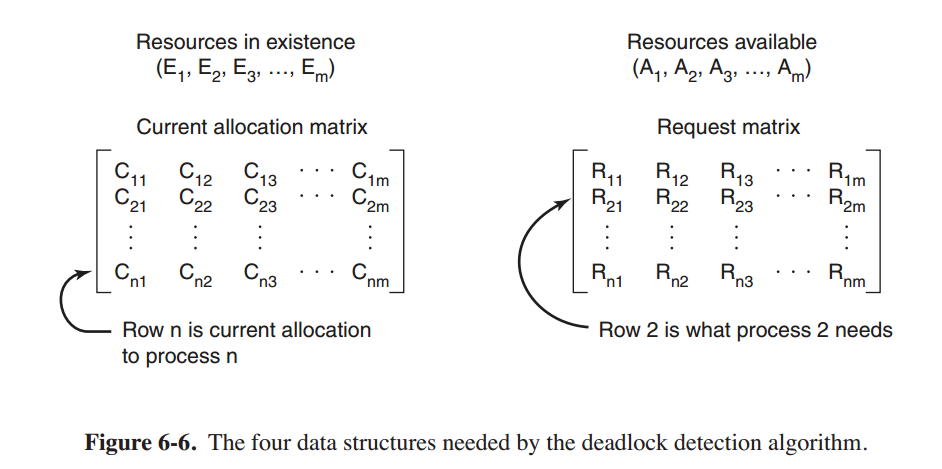

设有m种资源，$E_m$表示此种资源数量。另设有n个进程，矩阵$C_{n\times m}$表示进程已申请到的资源，矩阵$R_{n\times m}$表示现阶段进程运行还需要的资源量。$A_i$表示第i种资源剩余数量。

1. 找一个未被标记的进程$P_i$，要求$R_{ij}\le A_j$。
2. 标记进程i，将C中i行资源还至A中。相当于将A中资源分配给i进程，i进程执行完毕后归还资源。回到步骤1。
3. 如果没有这样进程，则终止。如果执行完毕后所有进程被标记，则不会发生死锁，否则会发生死锁。

### 从死锁中恢复

1. 利用抢占恢复：将某个资源从所有者中转移给另一个进程，多数情况下需要人工干预。
2. 利用回滚恢复：对进程进行周期性的检查点检查，在检测到死锁时，将资源回滚到上一个检查点状态。
3. 通过杀死进程恢复：

## 死锁避免

银行家算法避免死锁

### 资源轨迹图

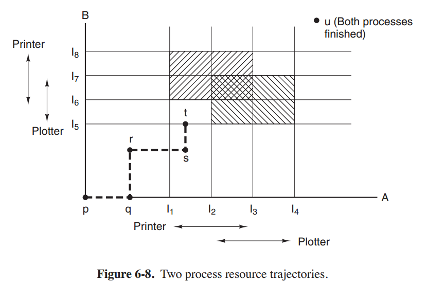


### 安全状态和不安全状态

如果没有死锁发生，并且即使所有进程突然请求对资源的最大需求，也仍然存在某种调度次序能够使得每一个进程运行完毕，则称该状态是安全的。如图6-9所示：

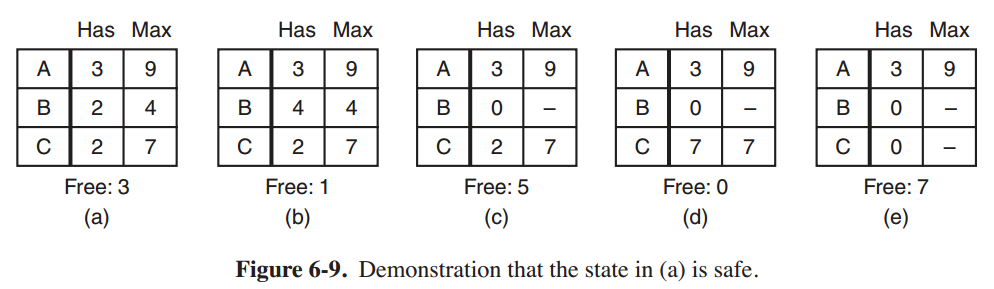

图6-10表示不安全状态，没有一个资源分配序列能够保证所有进程运行完毕。但不安全状态不等于死锁，甚至不安全状态中可有部分进程执行完毕。安全状态与不安全状态最大的区别是：安全状态下，系统可保证所有进程完成，不安全状态下没有这种保证。

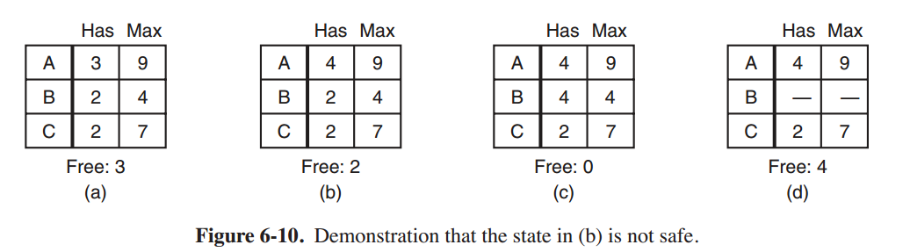

### 单个资源的银行家算法

Dijkstra在1965年提出第一个死锁避免算法，银行家算法banker's algorithm，是死锁检测算法的一个扩展。如果进程请求会导致不安全状态，悬挂请求；如果不会导致不安全状态，允许请求。

### 多个资源的银行家算法

## 死锁预防

### 破坏互斥条件

### 破坏占有并等待条件

一种是进程开始执行前一次性请求所需全部资源，但是许多情况下进程运行后才知道需要多少资源。

另一种实现是当进程请求资源时，先释放所占用资源再尝试一次性获取全部所需资源。

### 破坏不可抢占条件

### 破坏环路等待条件

## 其他问题

### 两阶段假设

### 通信死锁

### 活锁

### 饥饿