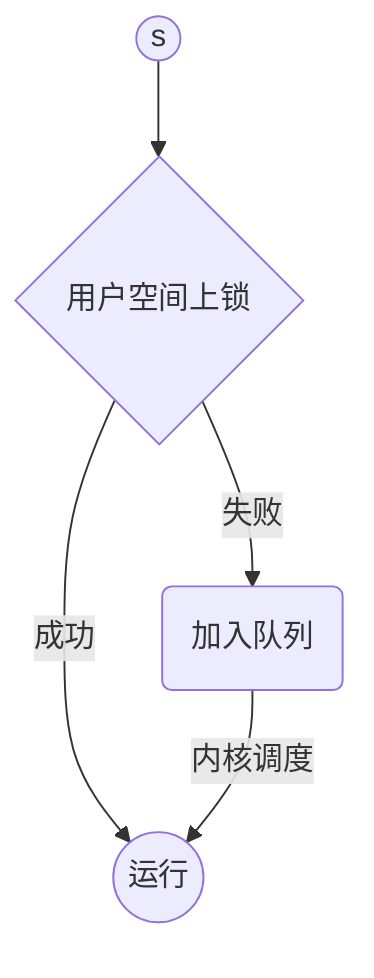

# 操作系统知识点

## 第一章 绪论

### 内核态与用户态

程序中的一个错误可能会影响许多进程（其他进程），可能会修改其他程序的数据，甚至会影响操作系统本身。因此引入操作系统用户态与核心态。

#### 用户态

当计算机系统运行用户程序执行创建文本文档或者使用其他用户程序时处于用户态。当应用程序从操作系统请求特定的系统服务、中断发生、或系统调用，需要从用户态切换到核心态来完成相关操作。用户态的程序没有直接访问系统硬件的权限，如磁盘等需要经过总线的访问操作，以及访问非自己进程内存空间。用户态程序需要调用系统提供的API访问底层。

#### 核心态

在核心态，运行代码不受限制，可以访问所有硬件。可以执行任意CPU指令，可以访问任意的内存地址。内核态通常保留给低级别被操作系统信任的功能。内核态的冲突是灾难性的，会导致整个PC的宕机。

#### 意义

因为这个限定，可以**把冲突限定在用户态**，且用户态的冲突多可恢复。

#### 什么时候从用户态转到核心态

应用程序请求操作系统服务、中断发生、系统调用发生。

比如：进程切换（处理机调度），IO（磁盘读写），缺页中断。

用户程序主动陷入内核只能通过三个系统调用：`open`,`read`,`write`。

### 系统调用

在OS中提供系统调用的目的，是使应用程序可以通过它间接调用OS中的相关过程，取得相应的服务。系统调用本质上是应用程序请求OS完成某功能的一种过程调用，但它是一种特殊的过程调用。

系统调用时运行在核心态，用户过程调用运行在用户态。运行系统调用会从用户态切换到内核态。

### 中断

中断是外部设备发送给CPU的信号，通常是IO设备发送。他们通知CPU停止当前的活动，执行相应的操作系统工作（需要核心态操作）。

有三种类型中断：

1. 硬件中断：硬件中断由硬件设备产生并通知CPU（提示其需要特定操作）。比如收到数据（如键盘、鼠标）；完成操作系统任务（比如从磁盘加载内容到内存）；
2. 软件中断：
3. 陷入指令：陷入指令由CPU产生，标志着某些错误发生或者某些条件达到需要操作系统支持（如请求IO）。


## 第二章 进程管理

### 进程

进程是处理机调度的基本单位，是提供给应用程序的处理机抽象。

#### 为何引进进程

多道机程序环境中，程序并发执行将失去封闭性，并具有间断性，程序结果不可再现。程序是不能参与并发执行的，因此引入了进程的概念。

#### 进程与程序区别

- 进程是程序的一次执行。
- 进程是动态的，程序是静态的。
- 进程一般位于内存中，程序一般存于磁盘内。
- 每次对程序的调用会产生一个新的进程。

#### 进程状态模型

就绪`ready`、阻塞`block`、运行`running`


- 进程创建时会处于就绪态。
- 不能从就绪态切换为阻塞态：就绪态没有抢占处理机，无法主动将自己阻塞，阻塞是如等待IO时的一种主动操作。


##### 引入挂起的五状态模型


- swapped out and waiting 对应就绪挂起态，是等待进程被换出至外存。就绪挂起态还包含其他情况。
- swapped out and blocked 对应阻塞挂起态，是阻塞进程被换出至外存。就绪挂起态还包含其他情况。

#### 引起进程创建主要事件

- 系统启动
- 用户请求创建进程
- 批处理作业初始化
- 运行进程执行了进程创建系统调用，如`fork`创建子进程

#### 引起进程销毁主要事件

1. 正常退出：进程主动调用退出进程的系统调用，UNIX为 exit ，Windows为 ExitProcess 。交互
服务的程序还提供退出可视化按钮。
2. 出错退出：程序发现错误主动退出，如找不到文件。
3. 严重错误：多由程序内部BUG导致，如执行了非法指令、访问了不存在的地址空间、执行除零操
    作。
4. 被其他进程杀死：UNIX为 kill ，WINDOWS为 TerminateProcess 。

#### 进程创建步骤

1. 创建事件发生，操作系统调用`creat()`原语。
2. 申请空白PCB
3. 为新进程分配资源（如内存地址空间）
4. 初始化进程控制块
5. 将新进程插入就绪队列

#### 进程销毁步骤

1. 根据PID从PCB中集中检索出PCB，读出该进程状态。
2. 若进程处于运行状态，立即终止该进程执行，置调度标志真，指示该进程终止后重新调度。
3. 若该进程还有子进程，将所有子孙进程终止，以防成为不可控进程。
4. 将被终止进程拥有的全部资源归还父进程或系统。
5. 将被终止进程PCB从队列中移除，等待其他程序搜集。

#### PCB包含内容与作用

进程管理相关：寄存器、程序计数器、程序状态字、栈指针、进程状态、优先级、进程ID、父进程、信号量、CPU使用时间、下次唤醒时间。

内存相关：到程序段的指针、到数据段的指针、到堆栈段指针。

文件相关：根目录、工作目录、...

> 为什么引入子进程，子进程有什么作用，和线程的区别？

作用：

1. 独立运行基本单位的标志：PID，各种存储寄存器等。
2. 能实现间断性运行方式：进程就绪或阻塞时，PCB中含必须的各种信息，被存于内存或外存中。
3. 提供进程管理需要信息：
4. 调度需要信息：进程状态、CPU使用时间
5. 与其他进程的同步与通信：信号量

### 线程

#### 为何引进线程

在许多应用中，多种活动同时运行（等待数据、运算、存储），其中部分会随着时间推移被阻塞。通过将应用分解为多个准并行的线程，可以简化编程模型。

线程共享相同的地址空间，而进程共享需通道等实现。

线程比进程更轻量，创建销毁更简单，通常比进程创建块10-1000倍。

CPU密集型应用，多线程提升不大；但IO密集型应用，多线程允许活动彼此重叠（并行），加快程序效率。

#### 线程与进程对比

1. 现代计算机中，进程是资源分配的基本单位（内存、文件分配等），线程是能独立运行的基本单位（CPU调度）。
2. 线程增加了并发度，如word文档一线程用于显示，一线程用于读入键盘输入，另一线程完成存储。
3. 进程拥有资源，线程本身不拥有系统资源。同进程中的线程共享进程地址空间，比进程共享存储更方便。
4. 线程切换、创建、销毁的开销都要小于进程。

##### 线程共享与私有资源


#### 线程模型


##### 用户级线程

在用户空间管理线程，每个进程需要一个自己的线程表，用于追踪每个线程的信息。线程表和内核空
间的进程表类似，但其只记录线程独有的属性，如PC、栈指针、寄存器、状态等等。线程表由进程自己管理。

###### 用户级线程优点：

1. 线程切换不需要转换到内核空间，节约模式切换的开销。
2. 调度算法可以是进程专用的，在不干扰OS调度的情况下，不同的进程可以根据自身需要选择不同的调度算法。
3. 用户级线程调度实现与OS无关，甚至可以在不支持线程的平台上实现。

###### 用户级线程缺点：

1. 系统调用的阻塞问题，当一个线程阻塞时，整个进程的线程都会被阻塞。
2. 在仅用户级空间实现线程中，内核每次分配给一个进程仅有一个CPU，若运行线程不主动退让处理机，那么进程内其他线程只能等待。

##### 内核级线程

在内核空间维护线程表，当一个线程想要创建新线程或销毁已存在线程时，需要调用内核调用以更新内核空间中的线程表。内核空间中的线程表拥有和用户空间线程表一样的内容，保存线程寄存器、状态、计数器等信息，只是存放在内核空间。内核空间也维护着原有的进程表。

因为内核空间线程的创建与销毁代价较大，一些系统会重复利用线程（类比线程池）。线程销毁只是逻辑上的销毁，在内核空间中将其标记为 inactive 。当有新线程被创建时，分配 inactive 线程，置标记为 active ，可节省一部分开销。用户级线程也可如此实现，只是用户级线程创建与销毁开销小，没有这个必要。

###### 内核级线程优点：

1. 多处理器系统中，内核能够同时调度同一进程中的多个线程并行执行。
2. 如果用进程中一个线程被阻塞，内核可以调度该进程中的其他线程或其他进程中线程。

###### 内核级线程缺点：

1. 用户态与内核态切换开销大。

##### 混合实现


### 进程间通信

进程间经常需要有信息交互，因此不使用中断在两个进程间提供优良机构的信息交互方式很重要。进程间通信主要有三方面的问题：

1. 进程间如何传递信息。
2. 如何避免交互进程相互干扰。
3. 在同步进程中如何保障正确的执行顺序。

第一个问题在线程中很容易解决，同一进程中的不同线程有共享的地址空间。但剩余两个问题线程和进程在处理方式上相同。

#### 临界资源与临界区

一次仅允许一个进程使用的资源成为临界资源，许多物理设备都属于临界资源，如打印机等。此外，还有许多变量、数据等都可以被共享的，也属于临界资源。

对临界资源的访问，必须互斥的进行。每个进程中对临界资源访问的那段代码称为临界区。保障互斥的过程中，只要保障同一时刻，只能有一个进程进入临界区即可。

同步：是指进程之间有执行循序要求。


#### 带忙等的互斥

##### 关中断`diabling interrupt`

在单核处理机系统中，进入临界区时禁用中断，在退出临界区时开启中断。关中断后时钟中断不会发生。处理机进程切换只会由时钟中断或其他中断产生。只要关闭中断，进程在处理共享数据时不用担心被其他进程干预。关中断是一种硬件解决方案。

优点：

1. 实现简单。

缺点：

1. 关中断给予用户线程关闭中断的权利，可能会导致长时间的中断丢失甚至永久的中断丢失。
2. 在多核心CPU上，关中断只作用于执行关中断功能的那个核心。因多核CPU的普及，关中断也越来与不适用。

操作系统的内核在某些更新变量等的指令上使用关中断可以带来很大的便利。总之，关中断对操作系统来说很有用，但不适合用户线程将其作为互斥的解决方案。

##### 锁变量`lock variables`

可以通过软件的解决方案上锁来解决多核心CPU上关中断无效问题。但是锁本身也是一个临界资源，亦会发生并发问题。

##### 严格轮转

```c
while(TRUE){
    while(turn!=0);//为0时可进入临界区
    critical_region();//进入临界区，执行互斥访问代码
    turn=1;//使用结束，另一进程进入临界区
    noncritical_region()
}
while(TRUE){
    while(turn!=1);
    critical_region();//进入临界区，执行互斥访问代码
    turn=0;//使用结束，另一进程进入临界区
    noncritical_region()
}
```

在没有获得自己的锁时，会持续等待，称为忙等`busy waiting`，用于忙等的锁称为自旋锁`spin lock`。

##### Peterson解法

结合锁变量与警告变量思想，首先提出了互斥问题的非严格轮转软件解决方案。

```c
#define FALSE 0
#define TRUE 1
#define N 2//进程数
int turn;
int interested[N];
void enter_region(int process){
    int other = 1 - process;
    interested[process] = TRUE;
    turn = process;
    while(turn==process&&interested[other]==TURE);//等待
    //因并发执行，turn变量可能在0进程进入置0后立即被1进程置1,此时说明0号进程先到，直接进入临界区
}
void exit_region(int process){
    interested[process]=FALSE;
}
```

在进入临界区前现在意愿数组中标记欲进入，只有当其他人无进入临界区意愿时，才可进入临界区。

0号进程`while`条件

1. `turn==0,interested[other]==FALSE`，直接进入临界区
2. `turn==1`，此时`turn`变量被欲进入临界区1号进程修改，但是0号进程先与1号进程访问`turn`，由0号进程进入临界区。

##### TSL指令

TSL指令是带有硬件支持的互斥解决方案。它先将内存字`word`读入寄存器`RX`中，再将一个非零数存入内存`lock`中。对`lock`的读取与写入操作保证是不可分割的，在TSL指令完成前其他进程无法访问内存字。CPU在执行TSL指令时会封锁内存总线直至指令结束。

值得注意的是，封锁内存总线和屏蔽中断是不同的。关中断后该处理机执行内存读写操作过程中并不会阻止内存总线上的其他处理机核心对该内存字的读写。

TSL指令使用一个共享变量`lock`来协调对共享内存的访问。`lock`为0时将其置1以访问内存，结束后将其还原为0。如果有进程作弊，如不还原`lock`为0，互斥便无法完成。仅在进程间合作的情况下TSL可行。

```asm
enter_region:
	TSL REGISTER,LOCK ;将LOCK变量拷贝至寄存器，并将内存中LOCK置1，整个过程锁内存总线，保障操作原子性
	CMP REGISTER,#0	
	JNE enter_region ;若LOCK为1，则已被上锁，循环等待。
	RET
	
leave_region:
	MOVE LOCK,#0 ;将0存入内存lock中，释放锁
	RET
```

Intel的X86CPU在底层使用`XCHG`指令完成`TSL`指令功能。

#### 睡眠与唤醒

皮特森算法以及TSL、XCHG的硬件解决方案都有**忙等**的缺陷。实质上，他们要求欲进入临界区的线程要先检查是否可进，若不可进则循环等待。这**不仅浪费CPU资源，也可能造成优先级翻转等**问题。现考虑将不能进入临界区的进程阻塞而非等待，最简单的是使用`sleep`与`wakeup`系统调用。

##### 生产者-消费者问题（有界缓冲区问题）

两个进程共享一个固定大小的缓冲区，向其中写入数据的是生产者，读出的是消费者。亦可将问题规模扩展为m个生产者与n个消费者。

当生产者尝试向已满缓冲区写入会有问题，消费者试图从空缓冲区取出亦然。可以设置一个缓冲区消息数`count`，生产者消费者在操作前都先判断`count`是否满足要求。如不满足要求，则休眠至对方将自己唤醒。

```c
#define N 100//定义缓冲区大小（最大消息容量）
int count = 0;
void producer(void){
    int item;
    while(true){
        item = produce_item();
        if(count==N) sleep(prodcer);//如果队列满，生产者睡眠
        insert_item(item);
        count++;
        if(count==1) wakeup(consumer);//如果队列仅一个，唤醒休眠的消费者
    }
}
void consumer(void){
    int item;
    while(true){
        if(N==0) sleep(consumer);//如果队列空，休眠消费者
        item = remove_item();
        count--;
        if(count==N-1) wakeup(producer);//如果队列有空闲，唤醒消费者
        consume_item(item);
    }
}
```

考虑如下情况，当N==0时，消费者会阻塞休眠。当N==1时，生产者会唤醒消费者。若生产者唤醒信号在消费者睡眠之前到达，则消费者未被唤醒生产者会持续写入消息至缓冲区满而阻塞。唤醒信号未作用，最终**两者都进入休眠状态**。问题的本质在于唤醒信号的丢失，可以增加一个唤醒等待位，若欲休眠时换新等待位为1则不休眠并将等待位置0。

#### 信号量

为解决唤醒信号丢失/未作用问题，可将唤醒信号存储。

迪杰斯特拉在1965年提出用一个整形变量来**存储唤醒信号以供后续使用**。他将这种变量称为**信号量`semaphore`**。信号量的取值代表已存唤醒信号的数量。Dijkstra定义信号量上的两种操作为`down`和`up`（分别为`sleep`和`wakeup`的泛化）。对信号量的检测-修改或休眠操作是不可分的原子操作。信号量在同一时刻只允许一个进程操作。若有一个或多个进程休眠等待该信号量，则增加信号量后系统会随机选取一个休眠进程消耗该信号量。

> Dijkstra最初用`P`表示`down`，用`V`表示`up`。

##### 利用信号量解决生产者消费者问题

确保信号量操作以不可分割方式实现是很重要的。**通常是将`up` `down`作为系统调用实现，操作系统在信号量检测、更新、以及休眠进程时短时间关闭中断。**这些操作只涉及到极少的几个指令，运行速度很快，不会在关中断期间产生危害。若使用了多个CPU，则需对信号量加一个锁变量，使用`TSL`或`XCHG`指令来保证同一时刻只有一个CPU（进程）访问信号量（`TSL` `XCHG`以封锁内存总线的方式保障互斥）。

生产者消费者使用信号量带来的提升的主要原因是信号量操作要远快于生产者或消费者的操作。

```c
#define N 100
typedef int semaphore;
semaphore mutex = 1;
semaphore empty = N;//空闲存储格数（空间数）
semaphore full = 0;//已占存储格数（消息数）
void producer(void){
    int item;
    while(true){
        item = produce_item();
        down(&empty);//down，up以系统调用方式实现，执行过程中关中断。
        down(&mutex);
        insert_item(item);
        up(&mutex);
        up(&full);
    }
}
void consumer(void){
    int item;
    while(true){
        down(&full);
        down(&mutex);
        item = consume_item();
        up(&mutex);//先释放mutex离开临界区，让生产者可继续插入操作
        up(&empty);
        consume_procedure(item);
    }
}
```

信号量初始化为1，且被两个或多个进程使用以保证只有一个进程在一时刻进入临界区，被称为二元信号量`binary semaphore`。信号量有两种用途，一种是用户互斥的信号量，如`mutex`；另一种是用于同步的信号量，如`full`和`empty`。

#### 互斥量

互斥量是特殊的信号量，有两个状态：解锁和上锁，只需要一比特存储空间。当线程或进程欲进入临界区时先调用`mutex_lock`，若互斥量未上锁则继续进行后续操作；若互斥量已上锁，线程或进程会阻塞直至临界区线程结束调用`mutex_unlock`。如果有多个线程在同一个互斥量上阻塞，在互斥量解锁时会随机选择一个线程抢占互斥量。

```assembly
;互斥量上锁、解锁简单汇编实现
mutex_lock:
	TSL REGISTER,MUTEX 		;将MUTEX值拷贝至寄存器，并将内存中MUTEX置1
	CMP REGISTER,#0			;将寄存器值与0做比较
	JZE ok					;如果寄存器值为0，则MUTEX未上锁，跳至ok（返回之前过程进入临界区）
	CALL thread_yield		;寄存器值为1，MUTEX已上锁，让出处理机（thread_yield在用户区）
	JMP mutex_lock			;再次尝试上锁（已退让处理机，休眠中）
ok: RET

mutex_unlock:
	MOVE MUTEX,#0			;将0存入MUTEX中
	RET						;返回调用过程，执行后续操作
```

`thread_yield`在用户空间调度线程，故速度很快且`mutex_lock` `mutex_unlock`均不需内核调用。

> TSL是非特权指令？运行时无需陷入内核？

在用户空间的线程包在多线程访问`mutex`时没有问题，因其有公用的地址空间。但诸如Peterson算法等需要访问其他共享存储的方式就需要处理存储共享问题。 

##### 进程共享存储

1. 将共享的数据结构，如信号量，存放在内核中且只能经过系统调用访问；

2. 提供一种让进程共享一部分地址空间给其他进程的方法，诸如linux和windows等系统都是这么设计的。

   > 如果进程间共享全部的地址空间，尽管这种情况不存在，那么进程和线程的区别就很模糊了。两个共享内存的进程还是有着不同的打开文件、时钟计时器、和其他进程独立的属性；但线程直接共享这些信息。因进程许多操作需要经过内核，共享地址空间的进程比用户级线程效率低。

##### 快速用户区互斥量Futex

随着并行程度的增加，高效的同步和锁机制对性能而言十分重要。

自旋锁在等待时间很短时效率高，但是在等待时间长时浪费CPU时间。如果锁竞争很激烈（等待时间短）时，那么阻塞线程等待锁释放后由内核唤醒会很高效。不幸的是，在竞争激励时效果好；但如果开始时竞争很小，内核与用户空间的切换开销很大；更坏的是预测锁的竞争程度是很难的事情。

Futex（fast user space mutex）是结合以上两种优势的解决方案。Futex是Linux避免不必要陷入内核的基本锁实现方案。因内核与用户空间的切换开销昂贵，避免陷入内核可显著提升效率。

Futex包含两个部分：

1. 一个内核服务：内核服务提供对锁的多进程的等待队列。等待队列中的进程不会主动运行，等待内核的显式唤醒。加入内核等待队列需要系统调用，应避免不惜要的陷入内核。
2. 一个用户库：如果没有竞争，那么Futex完全运行在用户空间。
3. 当进程在用户空间对Futex上锁失败时，会通过系统调用加入内核等待队列中。因进程未抢占锁会被阻塞，陷入内核的开销变得合理。当抢占锁线程结束时，会从等待队列中选取一个进程占锁运行。




#### 管程

对信号量的编程比较复杂，考虑问题较多，容易出意想不到的问题。为了使正确编程更加简单，Brinch Hansen和Hoare分别在1973与1974年提出了**高级语言同步原语-管程`monitors`**。**管程是一个特殊模块或包中的一系列变量、过程、数据结构的集合。**进程可随时访问管程中的过程，但不能通过管程外过程访问管程内数据结构。C语言没有提供管程抽象。

管程的主要功能是：**同一时刻在管程中只能有一个线程激活运行。**管程是编程语言的一个结构，所以编译器知道如何特殊处理管程中的过程调用。通常，当进程调用管程中的过程时，该过程最初的几个指令先检查管程中是否有激活进程。如果有，则悬挂当前进程至运行进程退出管程；若没有，则当前进程进入管程继续执行。

**如何实现管程中条目的互斥由编译器决定，但通常是使用互斥量或二元信号量方式**。 因为由编译器而非程序员实现互斥，所以更不容易出错。使用管程的程序员无需知晓编译器如何实现互斥，只需知道管程内的进程一时间只能有一个进程进入临界区。

管程只提供互斥中的阻塞，可使用条件变量`wait` 和`signal`去实现有等待条件的阻塞。管程中有等待条件的过程会对该条件变量执行`wait`操作使当前进程阻塞，同时也会选择另一进程进入管程。有相同等待条件的进程可以通过`signal`操作来唤醒阻塞等待中的进程。
> 为了避免管程在`signal`操作后有两个激活的线程，我们需要定义`signal`后的操作。
> 1. Hoare建议让唤醒的线程运行，而悬挂发出`signal`的进程。
> 2. Brinch Hansen则建议进程运行`signal`后马上退出管程，即`signal`作为管程过程的最后一个操作。相比之下，Brinch Hansen的方式更容易实现，在`signal`后由系统调度器决定唤醒哪个进程。
> 3. 第三种实现方式是让被唤醒进程在执行`signal`进程退出管程再后运行。

条件变量不是计数器，不会累计`signal`信号供后续使用。为避免信号丢失，`wait`操作必须先于`signal`操作。这实现起来并不复杂，可以用一个变量去记录每个进程的状态，进程可以在执行`signal`操作前查看该变量。

> 管程中的`wait` `signal`操作和竞争变量中的`sleep` `wakeup`很相似，但后者在`sleep` `wakeup`同时发生时会出问题，而`wait` `signal`因管程一时刻只一进程运行不存在此问题。

Java语言提供用户级线程，且可将多个方法放于类中。通过加`synchronized`关键字于方法上可以保证该方法运行时类中其他`synchronized`修饰的方法不会运行。

Java的同步方法不同于管程的经典实现，其没有内嵌的条件变量。反之，java提供wait和notify方法，分别于sleep与wakeup等价。

总而言之，信号量对程序员来说太底层，而管程又受限于特定的编程语言，并且两者都**无法提供跨机器的信息交换方法**。

```java
// an implementation of producer-consumer problem in java
public class ProducerConsumer{
    static final int N = 100;//固定缓冲区大小
    static producer p = new producer();
    static consumer c = new consumer();
    static our_monitor mon = new our_monitor();
    public static void main(String[] args){
        p.start();
        c.start();
    }
    static class producer extends Thread{
        public void run(){
            int item;
            while(true){
                item = produce_item();
                mon.inster(item);
            }
        }
        private int produce_item(){}
    }
    static class consumer extends Thread{
        public void run(){
            int item;
            while(true){
                item = mon.remove();
                consume_item(item);
            }
        }
        private void consume_item(int item){}
    }
    static class our_monitor(){
        private int[] buffer = new int[N];
        private int count = 0, lo = 0, hi = 0;
        public synchronized void insert(int val){
            if(count==N) go_to_sleep();
            buffer[hi]=val;
            hi=(hi+1)%N;
            count++;
            if(count==1) notify();
        }
        public synchronized int remove(){
            if(count==0) go_to_sleep();
            int val = buffer[lo];
            lo = (lo+1)%N;
            count--;
            if(count==N-1) notify();
            return val;
        }
        private void go_to_sleep(){}
    }
}
```

#### 消息传递

消息通道可已提供跨机器的信息交换，使用两个原语`send`和`receive`。

##### 消息传递系统的设计问题

消息传递系统设计存在许多信号量及管程不会出现的问题，特别是在不同机器上的进程通过网络通信时。比如，消息在网络中丢失。为了监控信号丢失，接收方在收到消息后会回传一个确认消息`acknowledgement`。若发送方在一定时间间隔内未收到确认消息，它会重传信息。

如果消息正确到达接收方，但确认消息在网络中丢失，则发送发会重发消息，而接收反会收到该消息两次。这使得接收方需要判断收到的消息是新的消息还是重传的旧消息。通常这个问题通过在原始消息中加入序列号解决。若接收方收到序列号相同的两条消息，它会知晓这是一条重传的消息。在不可靠信道中实现消息的可靠传输是计算机网络研究的问题。

消息系统还需要解决进程命名问题，使得`send`和`recieve`进程不混淆。安全认证`Authentication`也是消息系统要解决的问题：如何判定和我通信的是真真的文件服务器而不是一个冒名顶替者。在同一物理机上消息系统比信号量或管程慢，如何提高消息系统性能也是研究的问题。

##### 用消息传递解决生产者消费者问题

```java
#define N 100
void producer(void){
    int item;
    message m;
    while(true){
        item = produce_item();
        receive(consumer,&m);
        build_message(&m,item);
        send(consumer,&m);
    }
}
void consumer(void){
	int item, i;
    message m;
    for(i=0;i<N;i++) send(producer,&m);//发送N个消息载体
    while(true){
        reveive(producer,&m);
        item = extract(&m);
        send(producer,&m);
        consume_item(item);
    }
}
```

#### 屏障

屏障策略是用于进程组而不是生产者消费者双进程类型的。部分应用要求在所有线程到达某一阶段前不能进入下一阶段。我们可以通过在每个阶段的尾部设置一个屏障`barriers`来实现，当进程到达屏障时会等待其他进程到达后一起穿越。

[](https://github.com/jackyxie19/our-leetcode-notes/blob/double-pointer/操作系统/操作系统/image-20200629174808931.png)

在大型的矩阵（如$1m\times 1m$）运算中，需要并行进程分解运算来加速计算过程。在每次迭代时设置屏障保障运算结果的正确性。

#### 避免锁：读-复制-更新

最快的锁策略就是不加锁，问题也就是我们是否可以不对并发访问的共享数据结构上锁而保持正确性。通常情况下不上锁不行。

但是在某些特殊情况下，我们可以允许在有进程访问数据时其他进程对数据进行修改。重点是保证读数据进程要么读到最新数据要么读到旧数据，而不是读到中间计算时的数据。比如对一颗二叉树进行增删节点操作，要求读取到的要么是没改变的树要么是调整结束后的树。

[](https://github.com/jackyxie19/our-leetcode-notes/blob/double-pointer/操作系统/操作系统/image-20200629175750106.png)

在插入时先将插入节点连接到其子节点，此时通过X去读取子节点会得到E（新），通过A去读子节点会得到E（旧），再将A子节点设置为X；在删除节点B时，先保留B到子节点的链接，让A连接到新子节点C上，再移除B。B、D节点的删除无需锁数据结构的原因是`RCU`将移除和再分配过程从更新操作中分离开来。另外一个要考虑的问题是何时移除节点B，可以对B设置一个宽限周期`grace period`，再宽限周期后再移除。


### 处理机调度

在调度时，调度器还要考虑到进程切换会带来昂贵的开销。在切换进程前，需要先从用户态切换到内核态。然后保存当前进程的状态，包括寄存器中的数据。部分系统还要保存内存中的引用数据。之后启用调度算法选择下一个要运行的进程。之后CPU的内存管理单元`MMU`加载新进程的内存地图。最后再启动新进程。另外，新进程可能因为无效的缓存引用再次从主存中加载数据。过多的进程切换回降低CPU效率。

花费大多数时间在计算上的进程称为CPU密集型，而花大量时间在等待IO上的称为IO密集型。随着CPU运行速度提升远高于磁盘速度提升，对IO密集型的调度更重要。

#### 何时调度

引发处理机调度事件：

1. 新进程创建时调度器需要判断运行之前进程还是新进程。
2. 有进程结束退出时。
3. 有进程因IO、信号量或其他原因阻塞时。
4. IO中断发生时需要调度参与。

如果硬件提供固定间隔的时钟中断，调度选择可以选择在每个时钟中断时完成。根据对时钟中断的响应可以将算法分为两类：抢占式与非抢占式。

- 非抢占式算法决定运行进程后会一直等待至进程结束、中断、或主动退让处理机。
- 抢占式算法给选定进程一个最大的运行时间片，在时间片结束时剥夺处理机。
- 抢占式算法在每个时钟中断时刻将控制权还给调度器。若硬件不提供时钟信息，则只能采用非抢占式算法。

#### 常见算法

- 批处理系统
  - 先来先服务
  - 短作业有限
  - 最短剩余时间有限
- 交互式系统
  - 时间片轮转
  - 优先级
  - 多级队列
- 实时系统

#### 轮转调度Round-Robin

每个进程分配一个可运行的时间段，被称为时间片`quantum`。轮转算法很容易实现，只需将时间片耗尽的进程加在调度队列尾部，顺序运行下一个进程即可。

[](https://github.com/jackyxie19/our-leetcode-notes/blob/double-pointer/操作系统/操作系统/image-20200629220751815.png)

##### 时间片大小设置

作业调度时进程切换会有比较大的开销，若时间片设置过短，则会导致过多的线程切换降低CPU的效率；若时间片过长又会给需要短时间响应的交互请求很差的体验。通常将时间片设置为20-50毫秒比较合适。


### 经典IPC问题

#### 哲学家进餐问题

哲学家进餐问题是对多个进程竞争有限个互斥资源（同时需要2个及以上）问题的抽象模型。


#### 读者写着问题

读者写者问题是对数据库访问问题的抽象模型。

# 内存管理

引用帕金森定律“工作会不断延长以致填满整个工作时间”，“程序会不断扩张，直至用尽所有内存空间”。

程序员都希望有私有的、无限量的、足够快的内存，并且内存中的内容不掉电丢失。但是这不可能实现。这些年，人们创造了内存的层次结构，MB大小的高速、昂贵、易失缓存；GB大小的中速、中等价格、易失的主存；以及TB大小的低速、廉价、非易失静态磁盘存储。将这个结构合理的抽象并管理是操作系统的任务。

操作系统管理层次内存的结构称为内存管理器，它追踪每个部分内存使用量，将内存分配给进程并在使用结束时回收内存。

对缓存的管理基本上由硬件实现，此处我们主要关注对主存的管理。

## 无内存抽象

对内存最简单的抽象是不使用任何抽象。早期的大型机（<1960），早期的微型电脑(<1970)，早期的个人电脑(<1980)就没有内存抽象。程序多使用汇编语言直接针对物理内存操作。在这种条件下，同时在内存中运行两个程序不太可能。

即便是直接操作物理内存的阶段，也有多种内存抽象方式。

[](https://github.com/jackyxie19/our-leetcode-notes/blob/double-pointer/操作系统/操作系统/image-20200701103516872.png)

图3-1（a）将操作系统置于RAM底部，早期的大型机与微型电脑如此设计；（b）将操作系统置于静态ROM中，部分手持电脑和嵌入式系统如此设计；（c）将设备驱动放于ROM中，操作系统放于RAM底部，早期运行DOS系统的个人电脑如此设计。a，c抽象中有用户程序可以修改内存中操作系统代码的风险。

即便没有内存抽象，也可以实现多程序同时运行。操作系统需要做的是将内存中全部内容存入磁盘，再换入下一个程序。只要内存中只有一个程序运行就不会发生冲突。交换`swapping`。

## 地址空间存储器抽象

总之，将物理地址空间直接暴露给进程有很多缺点：

1. 如果用户可以访问内存的所有数据，那么他可以很轻松的清空操作系统所在内存空间。
2. 无内存抽象很难实现多程序的并发执行。

### 地址空间概念

实现多程序同时使用内存而不冲突需要解决保护`protection`和重定向`relocation`这两个问题。一个不错的解决方案是为内存引入新的抽象：地址空间`address space`。就像进程为程序提供CPU抽象，地址空间为程序提供内存抽象。地址空间是进程可以用于寻址内存的地址集合。每个进程拥有自己独立的内存空间。

> 与进程线程内存空间知识相关联。

地址空间不一定是数字组成，如同互联网的域名可以使用`.COM`等字符。相对困难的是如何映射每个程序内部逻辑地址到实际物理地址，使得不同程序的28逻辑地址在内存中不冲突。

#### 基址与限址寄存器

一个简单的解决方法是使用动态重定位`dynamic relocation`，将进程内逻辑地址映射到实际的物理地址上。经典的方式是为CPU添加两类特殊的寄存器：基址寄存器`base register`和限址寄存器`limit register`。这两个寄存器保障程序被加载到连续的空闲空间上且加载过程无需重定位。在程序运行时，基址寄存器记录程序起始物理地址，限址寄存器记录程序的长度。

每次该进程引用内存时，无论是取指、读写字，CPU的硬件会先自动的在引用地址上加上基础地址形成实际物理地址，同时也检地址是否超过限址寄存器长度。之后将实际物理地址送往内存总线。

基址与限址寄存器方案是实现进程内存空间独立的一种简单方案，因实际地址都是由硬件自动生成后送入内存总线中。在大多数实现中，基址与限址寄存器只允许操作系统访问。

基于基址与限址寄存器的重定位方案的一个劣势是每次获取对内存的引用都需要一次加法与一次比较操作。比较操作可以快速的完成，但是在没有特殊的加法电路情况下，加法操作因为进位传递时间问题执行缓慢。

### 交换技术

在物理内存足够大能装下全部进程的情况下，之前的方案或多或少可行。但是实际情况中，内存的容量远不能满足所有进程的需要。

有两种处理内存超载的通用方法：交换`swapping`和虚拟内存`virtual memory`。交换方式将一个进程换入内存运行一段时间，在不运行时将其换出至磁盘。非运行态的进程多存储在磁盘中。虚拟内存则允许程序部分载入内存的情况下运行。

[](https://github.com/jackyxie19/our-leetcode-notes/blob/double-pointer/操作系统/操作系统/image-20200707182832415.png)

图3-4展示了交换技术的运行流程。

交换技术会在内存中产生许多的空隙，可以通过内存紧凑技术`memory compaction`将其合并，但因内存紧凑相当耗时故一般不经常调用紧凑。比如，在16-GB内存的机器上拷贝8比特需要8纳秒，完全紧凑整个内存需要16秒。

值得注意的一点是当进程在创建或换出/换入时需要分配多大的内存空间给它。如果分配给进程固定不变的大小空间，那么分配操作很简单。但是，如果进程的数据段可以增长，比如很多语言允许进程从堆中动态分配内存，那么在进程空间试图增长时问题就会出现。如果进程临接着空闲区，那么可使进程使用空闲区扩容。如果进程临接其他进程，那么则需将其换至有足够大小的空闲区，或者换出部分进程保障该进程扩展空间。如若都不行进程只能挂起等待。

如果假定大多数进程在运行时需要扩容空间，可在分配内存时为其分配一部分额外的扩展空间，以减少移动或换入换出进程带来的开销。但是，在将进程换出至磁盘时，只需换出进程使用空间，换出额外分配的扩展空间是不必要的。如图3-5所示。

[](https://github.com/jackyxie19/our-leetcode-notes/blob/double-pointer/操作系统/操作系统/image-20200707184651821.png)

如果进程有两个需扩容的段，比如作为堆存储变量的数据段以及存放本地变量与返回地址的堆栈段，可以使用3-5(b)中的模式。将额外扩容空间放置在堆栈段与数据段中间。

### 空闲内存管理

当内存是动态分配时，操作系统必须对其进行管理。通常使用两种方式去跟踪内存使用：位图`bitmap`与空闲列表`free lists`。

#### 使用位图的内存管理

使用位图，可将内存划分为大小为几字至几千字节的基本单元。每个分配的单元在位图中占用一个位，0表示该单元空闲，1表示该单元被使用。

[](https://github.com/jackyxie19/our-leetcode-notes/blob/double-pointer/操作系统/操作系统/image-20200707191747191.png)

图3-6展示了部分内存与其位图3-6（b）。

基本单元的大小是一个重要的设计问题。基本单元越小，位图越大，反之亦然。设分配单元大小为4Bytes，那么32bits的内存需要1bit位图。32nbit大小的内存需要n个位图bit，所以位图会占用1/32的内存。如果基本单元大小设大一点，需要位图大小变小，但是在进程使用空间较小时会造成资源浪费。

因为内存与基本单元的大小决定了位图的大小，所以位图提供了一种跟踪内存使用情况的简单方案。位图的主要问题是在k个单元的内存请求中，内存管理器需要在位图中寻找k个连续的空间以分配给进程。在位图中寻找给定长度的连续空间是一个很缓慢的操作。

#### 使用链表的内存管理

另一种跟踪内存的方式是维护一个已分配内存以及空闲内存段链表。图3-6（c）为链表实现。

[](https://github.com/jackyxie19/our-leetcode-notes/blob/double-pointer/操作系统/操作系统/image-20200707191747191.png)

## 虚拟内存

尽管基址和限址寄存器可用于创建内存地址抽抽象，但管理软件大小增长得远比内存容量要快，使得许多软件不能在内存中装下。需要一个可以在内存中装入程序的一部分即可运行的机制。在20世纪60年代采用的方式是：覆盖`overlays`。尽管覆盖块的换入换出由操作系统管理，但是将程序分块的操作需要由程序员自己完成。分块操作不但耗时而且容易出错。

Fotheringham在1941年提出了虚拟内存`virtual memory`概念。虚拟内存基本思想是每个程序有自己的地址空间，这些地址空间被分割为多个页`page`。每个页是一个连续的地址空间。这些页会被映射到物理内存上，但是在程序运行过程中无需所有的页均存在与物理内存中。当引用到物理内存中存在的页时，硬件会执行必要的映射；当引用页不存在于内存中，将引发缺页中断，由内存从磁盘载入页面再运行相关指令。

> 内存命中：
>
> 缓存命中/块表命中：
>
> 缺页中断：
>
> 进程/线程状态切换：
>
> 内核态/用户态切换：

在某种程度上，虚拟内存时基址和限址寄存器的一种泛化/综合。8088为数据段与程序段设立了单独的基址寄存器。虚拟内存允许整个地址空间以相对较小的单元映射到物理空间上，而不是对数据段与程序段分别重定位。虚拟内存可在多处理机系统上工作，在进程等待换入页面时，CPU可以切换到其他进程运行。

### 分页

多数虚拟内存采用分页机制。当计算机执行`MOV REG, 1000`指令时，将内存1000地址中存储的内容拷贝到REG中（有的机器则刚好反向拷贝）。地址可以由索引、基址寄存器、段寄存器等产生。

[](https://github.com/jackyxie19/our-leetcode-notes/blob/double-pointer/操作系统/操作系统/image-20200710191325582.png)

虚拟内存方式下，CPU将虚拟地址送给内存管理单元`MMU`，由`MMU`映射后将实际物理地址通过内存总线发送。无虚拟地址的计算机直接将物理地址发送至内存总线。

> 带映射的虚拟内存在逻辑上地址空间连续，在实际内存中物理地址空间可不连续，可使用链表方式的内存管理。

虚拟地址空间固定大小的单位为页/页面`page`，页在实际物理内存中对应的单位为页帧`page frame`，通常情况下页大小与页帧大小相同。内存与磁盘间的传输单位为页。许多处理机支持多种页面大小，如为设定用户程序页大小4kb，内核页大小1gb。

`MMU`的映射功能并没有解决虚拟地址空间远大于物理地址空间的问题，我们可以增加一位存在位`present/absent bit`标识虚拟地址对应内容是否在物理内存中。若`MMU`发现对应页面不存在内存中，会向操作系统发出一个页错误`page fault`。由操作系统选择换出部分页帧至磁盘，再换入所需页。

### 页表

通常，虚拟地址被分为页号（高位比特）以及偏移量（低位比特）。虚拟页号作为页表的索引以找到对应页帧。页表的作用是将虚拟页（高位）映射到物理页帧上。从数学的角度说，页表是一个接收虚拟页返回物理页帧的函数。

[](https://github.com/jackyxie19/our-leetcode-notes/blob/double-pointer/操作系统/操作系统/image-20200710210746145.png)

#### 页表项结构

[](https://github.com/jackyxie19/our-leetcode-notes/blob/double-pointer/操作系统/操作系统/image-20200710210935868.png)

页表项具体结构高度机器相关，图3-11展示了经典的页表项结构。页表项大小各种机器实现不一，但32位是比较常见的大小。其中最重要的部分是**页帧号`page frame number`**，其次是驻留位`present/absent`表示对应页帧是否在内存中。保护位`protection`标志访问权限，0为读写，1为只读。

修改位`modified`与引用位`reference`用于跟踪页面使用情况，若页面被标记修改则需写回磁盘（缓存/寄存器中也有类似的标志位），若未被修改在不使用时直接丢弃即可。

引用位`reference`用于帮助OS在发生缺页中断时选择换出内存的页面。

缓存位`caching disabled`用于关闭缓存功能，缓存将虚拟页面映射到寄存器而非内存。

虚拟内存最本质的功能是提供了一个对物理内存的新抽象--地址空间，如同进程是CPU处理机的抽象。

### 加速分页

在分页系统中，我们遇到的两个主要问题是：

1. 对虚拟地址到物理地址的映射必须要快。
2. 虚拟地址空间增大的同时页表也会增大。

#### 转换检测缓冲区

通常页表被存放在内存中，但页式内存管理使得每次对内存的引用需要两次访存操作（一次页表取址，一次访存）。这会使得内存效率折半。根据观察，我们得知大部分程序会大量访问一小部分页面。因此，页表中只有很少的一部分被高频访问，其余部分很少被访问。

由此，可为计算机配备一个小型的硬件设备用以映射页面到页帧，而不经过内存。这种设备被称为**转换检测缓冲区`TLB translation lookaside buffer`**、**关联内存`associative memory`**、以及**快表**。快表被内置于内存管理单元`MMU`中，图3-12是一个快表示例。

[](https://github.com/jackyxie19/our-leetcode-notes/blob/double-pointer/操作系统/操作系统/image-20200710221127349.png)

快表查询流程：

[](https://github.com/jackyxie19/our-leetcode-notes/blob/double-pointer/操作系统/操作系统/image-20200710230508697.png)

[](https://github.com/jackyxie19/our-leetcode-notes/blob/double-pointer/操作系统/操作系统/Steps_In_a_Translation_Lookaside_Buffer.png)

#### 软件TLB管理

前面说的TLB管理由MMU内部的硬件完成，对TLB的管理还可以通过软件实现。许多RISC机器使用软件管理TLB，快表项的管理由操作系统完成。当TLB未命中时，不由MMU处理，直接向操作系统发送TLB错误。由操作系统完成寻找页面，置换TLB项，以及恢复指令操作。

若TLB相对较大（如64个快表项），软件管理的TLB方式也有可接受的效率。通过软件实现TLB管理，可以给MMU节省很多空间用以添加更多的零部件用以提高CPU性能。

为减少TLB丢失率，部分操作系统会对接下来可能访问的页面进行预加载。

两类快表失效：软失效、硬失效

1. 软失效：页面未在快表中，但在内存中。
2. 硬失效：页面未在快表也不在内存中。

当前进程内存页表中不存在的内容有可能已存在于内存中，如在其他进程地址空间内。此时无需访问磁盘，直接在内存中映射该内容到页表中即可。

### 大内存中的页表

#### 多级页表

使用多级页表可以扩大页表表示范围而不过大增加页表大小，也避免将页表所有内容全放入内存中。

[](https://github.com/jackyxie19/our-leetcode-notes/blob/double-pointer/操作系统/操作系统/image-20200711153143541.png)

#### 反转页表/倒排页表

倒排页表中，存在内存中的项为页帧项，而不是表示虚拟地址的页表项。当页面大小4kb，内存4gb时，仅需1,048,576个页表项。倒排页表可以节省大量的空间，但会使虚拟地址到物理地址映射变得困难。

可以使用TLB来解决这个问题，如果TLB可以装下所有重度引用页面，虚拟到物理地址的转换和普通页表一眼快。使用散列表存储虚拟地址，有相同hash值的项链表连接。如果hash表的slot数量和物理页帧数相同，hash表的平均链表长度仅为1，极大加速映射过程。

[](https://github.com/jackyxie19/our-leetcode-notes/blob/double-pointer/操作系统/操作系统/image-20200711154408313.png)

## 页面置换算法

当页错误发生时，操作系统需要选择一个页面换出以换入新的页面。如果被换出的页面在内存中被修改过，需要把新内容写回磁盘。未被修改的页面直接丢弃即可。主存中与磁盘内容不一致的页面称为脏页面，一致称为干净页面。

一个问题：选择换出的页面是局限在进程地址空间内，还是可以换出其他进程地址空间的页面。

### 最优页面置换算法

最优页面置换每次将最完被使用的页面换出内存。因页错误发生时操作系统不知道每个页面在何时会被再次使用，故该算法无法实现。但是最优页面置换算法可在同一程序第二次执行时使用，以第一次运行的信息作为输入。可根据最优页面置换算法来评价实际页面置换算法的性能。

### 最近未使用页面置换算法NRU

为便于统计页面状态，会为每个页表项设置R和M位，R=1表示被引用过（R位每次时钟中断时会清0），M=1表示被修改过。根据R与M状态可将页面分为四类：

1. class0：R=0，M=0；未被引用，未被修改

2. class1：R=0，M=1；未被引用，被修改

3. class2：R=1，M=0；被引用，未被修改

4. class3：R=1，M=1；被引用，被修改

   > 问：为何被引用比被修改重要，class1为仅被修改而不是仅被引用。

NRU算法在缺页中断发生时，从非空的低到高队列中随机移除一个页面。

### 先进先出页面置换算法

### 二次机会页面置换算法

二次机会置换算法是对FIFO算法的改进，在移除页面时会先看R位，若R位为1则将该页面插入队列尾部，若R位为0则直接移除。若队列中页面最近均未被使用，则退化为FIFO。

### 时钟页面置换算法

尽管二次机会算法可行，但在R=1时有增删操作且其队列会无限延长。可使用固定大小的循环队列（类似时钟）改进，当R=1时，指针向前移位省略不做移出与插入操作；当R=0时，直接移出页面。

### 最近最少使用页面置换算法LRU

LRU每次移出使用次数最少的页面。LRU理论上可行但是实现起来代价高，可通过增加特殊硬件统计页面引用次数。

### 软件模拟LRU

### 工作集页面置换算法WS

### 工作集时钟置换算法

[](https://github.com/jackyxie19/our-leetcode-notes/blob/double-pointer/操作系统/操作系统/image-20200715171951919.png)

## 分页系统设计问题

### 局部和全局分配策略

一个主要的问题是如何在竞争的可运行进程中分配内存。在进程发生缺页中断时，是在当前进程地址空间内选择换出页面还是在全局选择换出页面。如图3-22所示，在每次换出age最小值的情况下，局部置换为(b)，全部置换为(c)。

[](https://github.com/jackyxie19/our-leetcode-notes/blob/double-pointer/操作系统/操作系统/image-20200715161253821.png)

局部算法中每个进程固定内存大小，全局算法进程地址空间动态变化。全局算法通常情况下优于局部算法，局部算法容易出现`颠簸`(刚换出的页面又需要换入)。

### 负载控制

### 页面大小

如果页面过大，如果程序段、数据段、堆栈段不能装满整个页面，会出现许多内存碎片，降低内存利用率。如果页面过小，页表的长度会很大。

小页面能充分利用TLB空间。为平衡，操作系统中不同部分会使用不同的页面大小，如内核使用大页面，用户进程使用小页面。

### 分离指令和数据空间

为方便程序编程，将指令空间与数据空间分离。

[](https://github.com/jackyxie19/our-leetcode-notes/blob/double-pointer/操作系统/操作系统/image-20200715165602033.png)

在使用分离空间的计算机中，两种地址空间独立，有自己的页表。

### 共享页面

在单机上多次运行同一程序，为避免内存中有一个页面的多个副本，可以使用共享页面。一般仅只读页面可以共享，如程序文本，数据页面不能共享。使用分离的指令和数据空间很容易实现，程序的多个进程共享一个指令空间，可选择性共享数据空间。

### 共享库

现代操作系统中，许多大型库被多进程使用，如浏览文件库及图形库等。把静态库与磁盘可执行程序绑定会使其特别庞大。一个更为通用的技术是使用共享库，如Windows中的DDL。

### 内存映射文件

共享库实际上是内存映射文件的一个特例。进程通过一个系统调用，将文件映射到内部虚拟地址空间的一部分。多数情况下，映射的页面不会实际读入页面内容，而在访问时一页页读入（驻留内存），磁盘文件仅做后备存储。。

### 策略与机制的分离

[](https://github.com/jackyxie19/our-leetcode-notes/blob/double-pointer/操作系统/操作系统/image-20200715174208860.png)

## 分段

[](https://github.com/jackyxie19/our-leetcode-notes/blob/double-pointer/操作系统/操作系统/image-20200715174628910.png)

如图3-30所示，编译过程中符号表、源程序、常量表、语法分析树会不断增长，编译过程堆栈可增可减。需要一种不用程序员管理表扩大缩小的方法，因此引入段式管理，每个段相互独立，空间动态可扩展。

[](https://github.com/jackyxie19/our-leetcode-notes/blob/double-pointer/操作系统/操作系统/image-20200715174958045.png)

### 纯分段

分段和分页实现本质不同：页面是定长而段不是。段式管理产生外部碎片。

[](https://github.com/jackyxie19/our-leetcode-notes/blob/double-pointer/操作系统/操作系统/image-20200715175230787.png)

### 分段分页的对比

[](https://github.com/jackyxie19/our-leetcode-notes/blob/double-pointer/操作系统/操作系统/image-20200715195755745.png)

程序的程序段和代码相关，比如过程和函数。

程序的数据段和数据结构相关，比如栈、队列、图。

[](https://github.com/jackyxie19/our-leetcode-notes/blob/double-pointer/操作系统/操作系统/image-20200715200046114.png)

### 段页结合

每个程序有一个段表，每个段表项对应一个页表。

[](https://github.com/jackyxie19/our-leetcode-notes/blob/double-pointer/操作系统/操作系统/image-20200715192302394.png)

### 

## 

## 