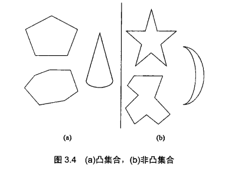

# 算法设计与分析 Anany Levitin

## 一.绪论

##### 七桥问题

从顶点出发, 经过所有的边edge一次并回到起点. 称为欧拉回路. 哈密顿回路为经过所有的点一次回到起点.

欧拉证明了只有所有顶点的度为偶数时存在欧拉回路; 或者仅有两个点度为奇数, 其余点度为偶数的情况, 且起点必须为奇数点之一.

因超过4个顶点且每个点度为奇数, 故七桥问题不存在欧拉回路. 加一座桥可以产生欧拉回路.

若所有顶点的度数大于等于N/2,则哈密顿回路一定存在.

##### 旅行商问题

即TSP问题（Traveling Salesman Problem）又译为旅行推销员问题、货郎担问题，它是组合优化中的一个NP难问题。

给定一系列城市和每对城市之间的距离，求解访问每一座城市一次并回到起始城市的最短回路。该问题实质是在一个带权完全无向图中，找一个权值最小的Hamilton回路。

> 哈密顿回路判定的是存在性问题, 旅行商问题求得是最优解问题.

早期的研究者使用精确算法求解该问题，常用的方法包括：分枝定界法、线性规划法、动态规划法等。但是，随着问题规模的增大，精确算法将变得无能为力，因此，在后来的研究中，国内外学者重点使用近似算法或启发式算法，主要有遗传算法、模拟退火法、蚁群算法、禁忌搜索算法、贪婪算法和神经网络等。

##### 图着色

图着色问题（Graph Coloring Problem, GCP） 又称着色问题，是最著名的NP-完全问题之一。给图的顶点着色, 使得没有相同颜色的顶点直连, 求使用的最少颜色数.

地图四色定理（Four color theorem）最先是由一位叫古德里（Francis Guthrie）的英国大学生提出来的。四色问题的内容是“任何一张地图只用四种颜色就能使具有共同边界的国家着上不同的颜色。”也就是说在不引起混淆的情况下一张地图只需四种颜色来标记就行。

1976年6月，在美国伊利诺斯大学的两台不同的电子计算机上，用了1200个小时，作了100亿个判断，结果没有一张地图是需要五色的，最终证明了四色定理，轰动了世界。

#### 数据结构

优先级队列可基于堆实现.

## 第三章 蛮力法

顺序查找, 字符串匹配, 最近对(如聚类分析), 凸包问题, 穷举查找(旅行商问题, 背包问题, 分配问题), 深度优先查找, 广度优先查找.

凸包问题: 许多应用要么本身就是凸包问题, 要么其中一部分需要按照凸包问题来解决. 大多数都基于这样一个原理: 凸包能方便地提供目标形状或给定数据集的一个近似. 如计算机动画中, 用五题的凸包替换物体本身加快碰撞检测的速度. 

最后, 凸包对求解许多最优化问题也有重要作用, 因为凸包的极值点限定了候选键的范围.

定义 对于水平面上的一个点集合, 如果以集合中任意两点p和q为端点的线段都属于该集合, 我们说这个集合是凸的.

直观地讲, 对于平面上n个点的集合, 他的凸包就是包含所有这些点(在内部或边界上)的最小凸多边形.

定义 一个点集合s的凸包(convex hull)是包含s的最小凸集合("最小"意指s的凸包一定是所有包含s的凸集合的子类).

凸包问题是为有n个点的集合构造凸包的问题. 解决凸包问题需要找出极点, 并决定哪些极点作为凸包的顶点连接起来.

$曼哈顿距离:d_M(p_1,p_2)=|x_1-x_2|+|y_1-y_2|.\\对于任意p_1,p_2,p_3有d_M(p_1,p_2)\le d_M(p_1,p_3)+d_M(p_2,p_3).$

$欧几里得距离:d_O(p_1,p_2)=\sqrt{(x_1-x_2)^2+(y_1-y_2)^2}.$