### 计算机网络

# 计算机网络和因特网

## 网络核心

网络核心包含网络层，链路层，物理层。

### 分组交换

源端向目的端发送报文，源将长报文分为更小的数据块，每个数据块称为分组packet。

#### 存储转发

在开始传输分组前，必须收到整个分组数据，把收到的分组缓存再转发。

#### 排队时延与分组丢失

若缓冲区满，会丢弃新到的分组，造成丢包。

#### 时延类型


#### 转发表和路由协议

数据报通过目的地址查转发表确定从路由器哪一端发出。路由协议确定网络端到端路径。路由选择算法（协议）动态更新转发表。

### 电路交换

虚电路。电路交换网络中，端系统通信会话期间，预留通信所需要的全部资源，建立一条端到端的链接。

#### 电路网络中的复用

频分复用（FDM）：不同信号使用不同频段，如有线电视。

时分复用（TDM）：把时间分为固定期间的帧frame，每个帧划分为固定数量的时隙slot。


#### 电路交换与分组交换比较

- 电路交换：简化“边缘”，复杂网络

  - 电话网络演化而来。
  - 核心业务是实时通话：需要严格的时间、可靠性要求保障的服务。
  - 非智能终端：电话、传真。

- 分组交换：简化网络，复杂“边缘”

  - 多用于计算机之间数据交换：”弹性“服务，没有严格时间需求。

  - 智能终端系统：计算机，可自适应、性能控制、差错恢复。

    

## 协议层次及服务模型


### 7层OSI参考模型


### 因特网TCP/IP5层协议


# 应用层

## 原理

### 网络应用体系架构

#### 客户服务器体系结构

客户发送请求，接收服务器响应。如web应用，文件传输FTP应用。

#### P2P体系结构

无专用服务器，通信在对等实体之间直接进行。

### 因特网提供的运输服务

#### TCP服务

面向连接：

可靠数据传输：

#### UDP服务

不提供不必要功能的轻量级传输协议。

#### SSL

全称Secure Sockets Layer，在传统TCP上加了一层封装，用于宝行加密、数据完整性以及端点鉴别等安全需求。

#### 因特网运输协议不提供的服务

因特网提供定时和带宽保证。

### 进程寻址SOCKET


 


## HTTP

对象的寻址使用URI。HTTP采用CS模式，客户端请求，服务端响应。

URI包含URL和URN。


### HTTP报文

#### 报文流


#### 报文组成

报文包括起始行、头部、主体三个部分。


HTTP报文分为请求报文与响应报文两种。


```xml
	<!-- 请求报文格式 -->
	<method> <request-URL> <version>
	<header>
    
	<body>
    method:GET，POST，HEAD
    version:HTTP/1.1
	<!-- 响应报文格式 -->
	<version> <status> <reason-phrase>
    <header>
        
    <body>
```


#### 报文头


#### 状态码

##### 1xx

- 100 Continue:

  -  客户端向服务器发送主体前想知道服务段是否会接收该主体，变发送100 Continue Expect请求头报文，等待服务端响应。

  - > 100 Continue应为一个优化，客户端应只发送服务端无法处理的大实体时才使用100 Continue。

##### 2xx 成功

- 200 OK：请求无误
- 201 Created：
- 202 Accepted：服务端接收到请求，不保证完成请求
- 203 Non-Authoritative Information：
- 204 No Content：请求已成功处理，但返回报文主体部分无实体。主要用于不打开新文档情况下，对其进行刷新，比如刷新表达页面。
- 205 Reset Content：告知客户端浏览器清除所有表单元素。
- 206 Partial Content：表示客户端的范围请求成功。响应中包含Context-Range、Date等，Context-Range中包含请求的范围内容。

##### 3xx 重定向

- 300 Multiple Choices：客户端请求一个实际有多个资源的URL时返回，比如一个HTML页面又多个语言版本。返回状态码时带有一个选项列表。
- 301 Moved Permanently：永久重定向，请求URL已被移除。响应的Location首部应包含资源现在所处的URL。
- 302 Found：临时重定向，客户端需临时将新的URL封装到Location首部再次访问，后续的请求仍然使用旧URL。1.0版本客户端发送一个POST请求，返回302后希望客户端向新的URL发送一个GET请求。
- 303 See Other：HTTP/1.1使用303实现HTTP/1.0中302希望客户端向新的URL发送GET请求的功能。临时重定向功能1.1使用307完成。302状态留给1.0版本使用。
- 304 Not Modified：客户端可以通过发送带条件的请求首部。如是否被修改等：If-Match，If-Modified-Since，If-Non-Modified-Since，If-Range，If-Non-Match。如果不满足条件，服务器返回304代码。
- 305 Use Proxy：说明必须通过一个代理来访问资源。
- 307 Temporary Redirect：HTTP1.1中临时重定向。

##### 4xx 客户端错误

- 400 Bad Request：客户端发送了错误请求，如请求报文存在语法错误。
- 401 Unauthorized：客户端在获取资源访问权之前，需要对自己认证。
- 403 Forbidden：请求被服务器拒绝，可在响应主体中标注拒绝原因，但一般服务器不像说明拒绝原因时才使用403。
- 404 Not Found：
- 405 Method Not Allowed：
- 406 Not Acceptable：客户端可以指定需求什么类型的实体，当服务端对应URL无法满足时返回406。
- 408 Request Timeout：客户端完成请求时间过长，服务端可返回408并关闭连接。

##### 5xx 服务端错误

- 500 Internal Server Error：服务器在执行请求时发生错误。
- 501 Not Implemented：客户端发送了超出服务器功能的请求，如使用服务器不支持的请求方法。
- 502 Bad Gateway：
- 503 Service Unavailable：服务器无法提供请求，如服务器超载或进行停机维护。
- 504 Gateway Timeout：

#### 方法


### 连接管理


HTTP紧挨着TCP，所以HTTP事务的性能在很大程度上取决于底层TCP的性能。


#### HTTP延时与性能

HTTP事务延迟的主要原因：

1. 客户端根据URI确定Web服务器IP地址和端口号：若最近无对该URI的访问，则需要使用DNS解析IP，可能花费数十秒。
2. TCP三次握手建立连接耗时。
3. 因特网传输请求报文以及服务器处理时延。
4. 返回HTTP请求耗时。

常见的TCP引起相关时延：

1. TCP建立连接三次握手：

   

2. TCP慢启动。

3. 数据聚集的nagle算法。

4. 用于捎带的TCP延时确认算法。

5. TIME_WAIT时延和端口耗尽。

#### 串行事务处理时延

#### 提高HTTP性能连接

##### 并行连接：

单个页面打开多个TCP连接。


##### 持久连接：

重用目标服务器已打开的连接可以节省连接建立与关闭的时间，避免开始慢启动带来的阻塞，可更快的传送数据。


HTTP/1.0+keep alive：通过在HTTP请求与响应报文头部，将Connection值置为Keep-Alive。1.0默认不开启长连接，客户端需发送Connection：Keep-Alive来请求开启长连接。


HTTP/1.1 persistent connection：1.1默认激活长连接，除非头部包含Connection: Close。

##### 管道化连接：（流水线）


### 缓存


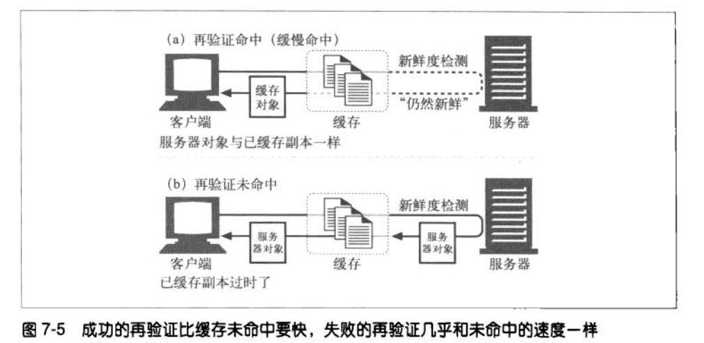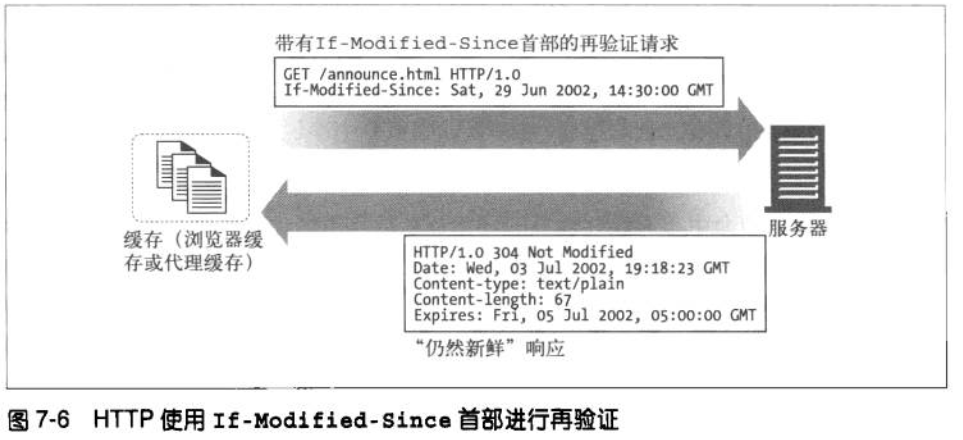

HTTP在验证时服务器返回结果：

1. 再验证命中，返回304，页面未被修改。
2. 再验证未命中，返回200携带新的页面内容，页面被修改。
3. 返回404Not Found，页面被删除。

HTTP不会返回数据是来自缓存还是来自原始服务器，客户端可以通过HTTP的Date首部判断信息来源。

#### 缓存的拓扑结构：

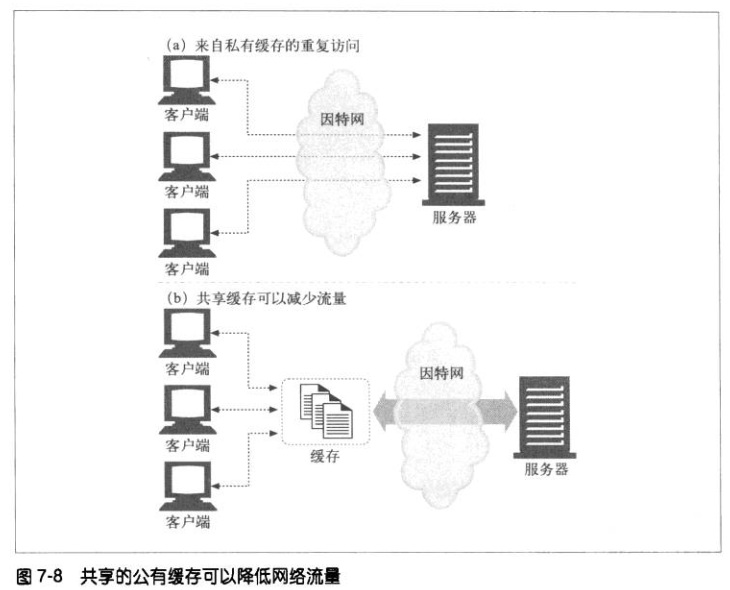

#### GET缓存流程：

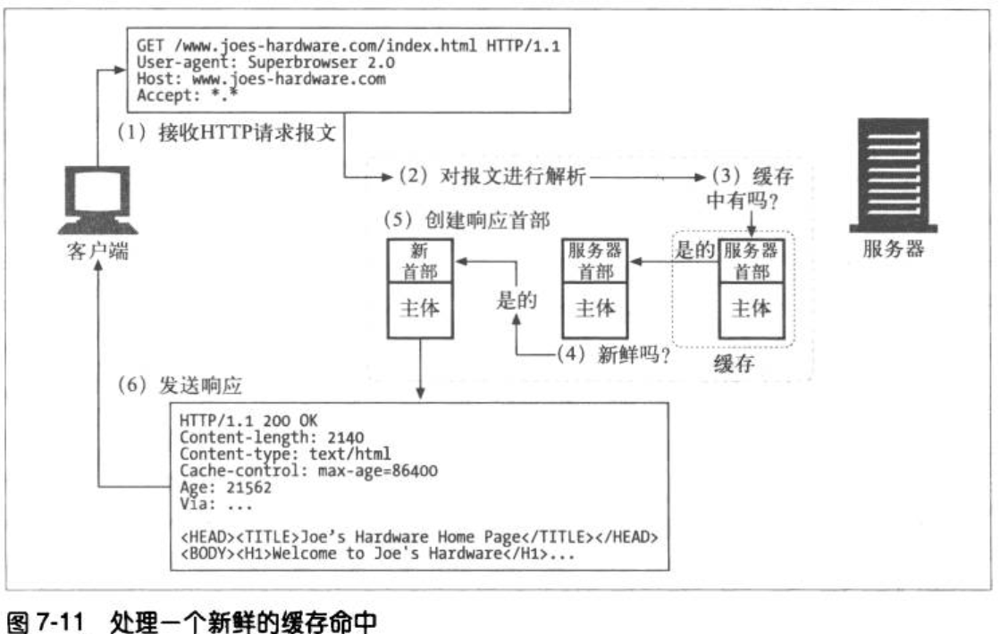


#### 时效：

通过头部EXPIRES与Cache-Control字段控制缓存时效。

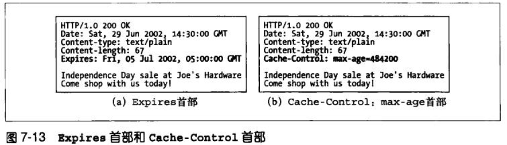

### 客户端识别与cookie

HTTP是一个匿名、无状态的请求/响应协议。但是很多场景需要获取用户状态，如网络购物购物车等。


#### 用户登录：

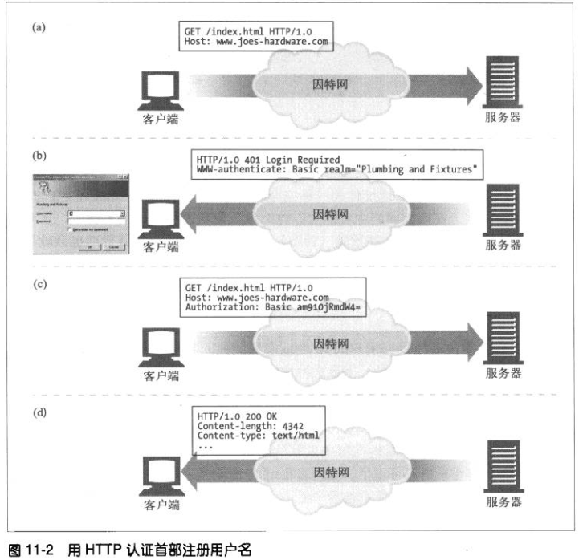

#### Cookie：

Cookie分为会话Cookie和持久Cookie：会话Cookie在用户退出浏览器会自动删除，持久Cookie在时效期内保存。会话Cookie没有设置Discard参数或者Expires/Max-age参数，持久Cookie在参数有效期内保存。

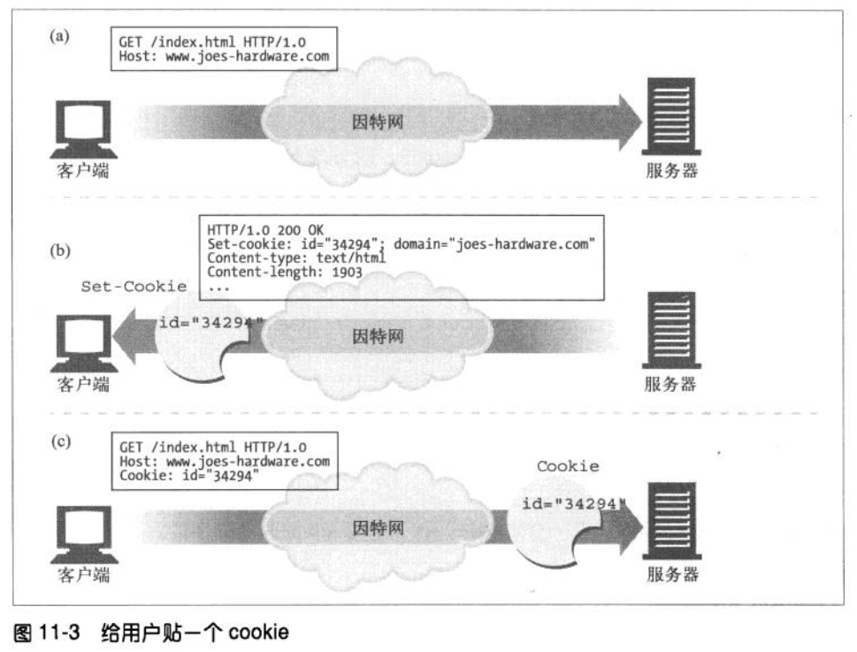

#### Cookie与会话跟踪：

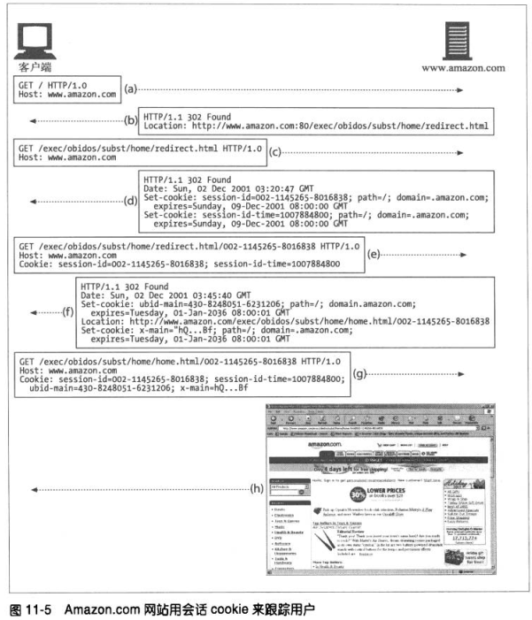

#### Cookie与Session：

Session是一个抽象的概念，指的是将客户端与服务端的一次会话抽象成一个Session，进而引出Session状态。Cookie是一个实际存在的东西，存在与HTTP的Header中，可以理解为是一个Session实现。

而今天所说的“Session”是为了绕开Cookie限制，通常借用Cookie和服务器后端存储实现，是一种高级的会话状态实现。当浏览器禁用Cookie时，可使用Session ID作为URL的参数（胖URL）进行传递。

### HTTPS

HTTPS是最流行的HTTP安全形式，以https://开头。HTTPS在HTTP之上增加了一个传输级的密码安全层，可以使用SSL或TLS。HTTPS在将报文交给TCP前先经过安全层加密。HTTP默认端口80，HTTPS默认端口443。

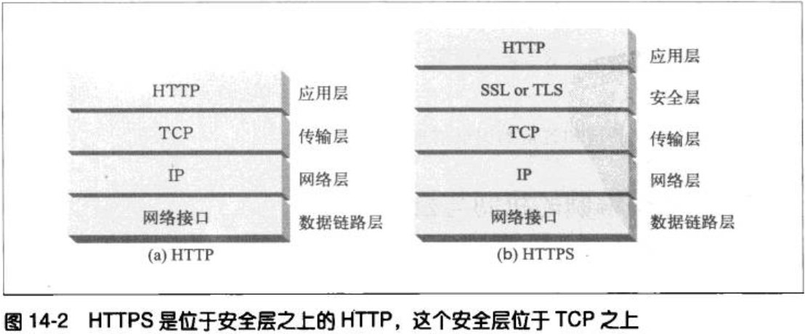

#### HTTPS与安全服务器建立连接：

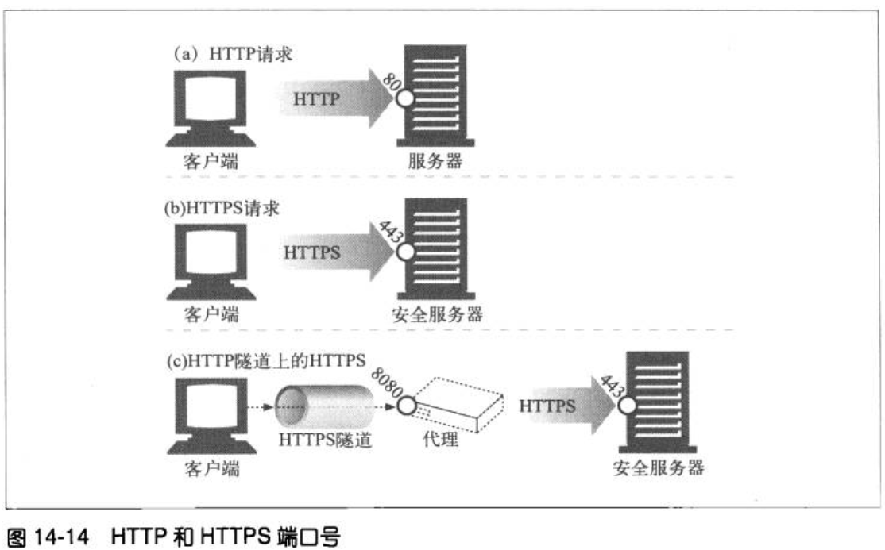

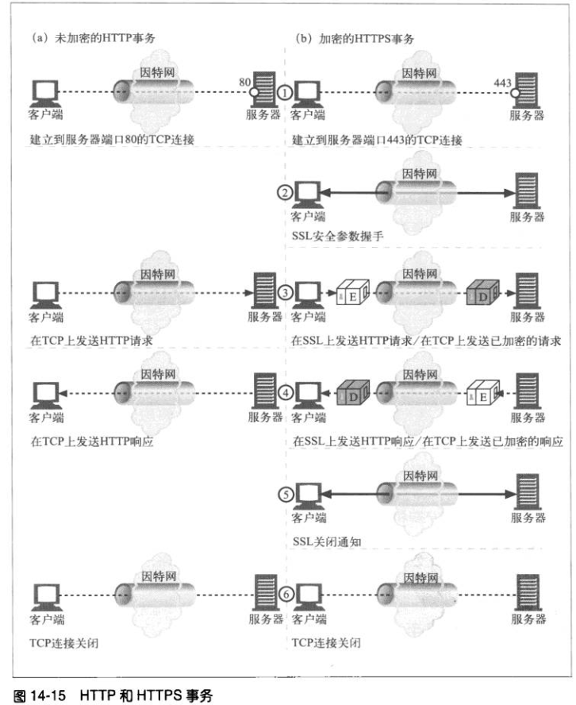

#### SSL握手过程：（上图②步）

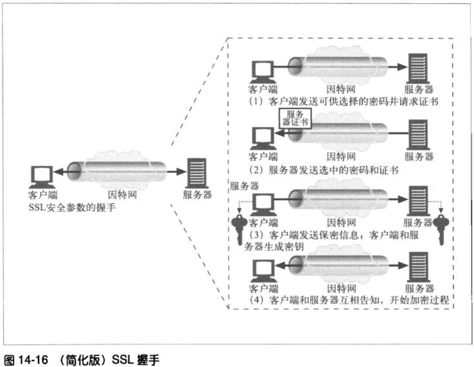

HTTPS比HTTP耗时10倍左右。

## DNS

DNS（Domain Name System）是一个TCP/IP应用程序的一个**分布式**数据库，提供主机名到IP地址之间的映射服务以及有关电子邮件的选路信息。

用户程序在使用TCP或UDP发送数据前，先要将主机域名替换为IP地址，通过DNS服务实现。OS内核的TCP/IP协议族对DNS一无所知。

DNS均支持TCP和UDP两种方式，域名解析使用UDP，区域传送使用TCP。一般情况下使用UDP，名字解析器和名字服务器自己处理超时与重传。UDP定长报文长度，不含状态，对于超过长度的信息截断丢失后部；TCP可对信息分组传送。

DNS通常是由其他应用层协议使用。

任何DNS的查询既可以是迭代的，也可以是递归的。

DNS服务器在一段时间后丢弃缓存信息（通常两天）。

### DNS层次组织：

DNS名字空间和Unix的文件系统相似，也有层次结构。

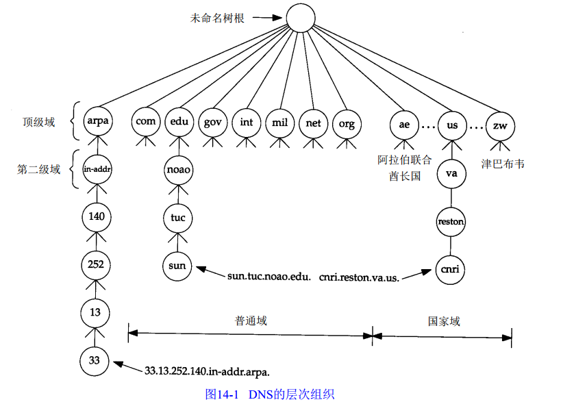

### DNS报文：

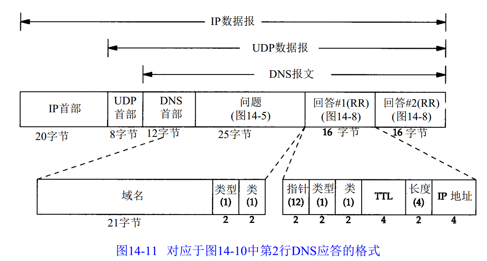

## DHCP


步骤：

1. 客户端向子网发送DHCP DISCOVER广播请求，源为0.0.0.0，通过UDP68端口；发向255.255.255.255，UDP67端口。
2. 服务器以DHCP OFFER响应客户端，带有yiaddr预分配地址。
3. 客户端发送DHCP REQUEST请求。
4. 服务端返回DHCP ACK确认。

DHCP8-10小时需要renew。

## FTP

文件传输File transfer由FTP完成，文件存取File access由NFS完成。

FTP采用两个TCP链接（一个控制连接：21端口，一个数据连接：20端口）传输一个文件。每个文件传输建立一个连接。

FTP有主动和被动两种方式：主动模式要求客户端和服务端同时打开并监听端口以创建连接。被动模式只要求服务器产生并监听一个端口即可。

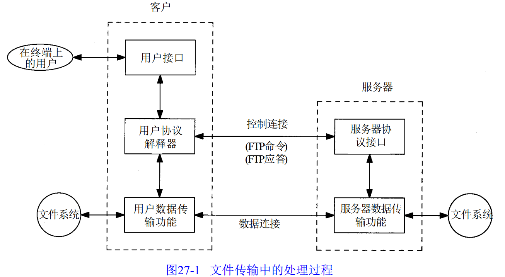

## P2P

纯P2P架构没有服务器，任意端系统之间直接通信，节点阶段性接入Internet，节点可能更换IP地址。


## 常用端口

|  协议  |           端口            | 传输层  |
| :----: | :-----------------------: | :-----: |
|  DNS   |            53             | TCP/UDP |
|  DHCP  |   67(server)/68(client)   |   UDP   |
|  SNMP  |          161/162          |   UDP   |
|  FTP   | 20(数据)/21(控制)[SERVER] |   TCP   |
| TELNET |            23             |   TCP   |
|  HTTP  |            80             |   TCP   |
|  SMTP  |            25             |   TCP   |
|  POP3  |            110            |   TCP   |
|  IMAP  |            143            |   TCP   |


# 运输层

## UDP

UDP是一个简单的**面向数据报**的传输层协议：进程的每个输出操作都产生一个UDP数据报，并封装成IP数据报。与面向数据流的TCP协议不同，应用程序产生的数据与真正发送的单个数据报没有什么联系。

UDP**不提供可靠传输**：UDP将数据交付IP，但是不保证到达目的地。缺乏可靠性。发送数据前，不需要建立连接，发送数据后没有确认信息。**TCP有超时和重传机制，但UDP没有**。TCP包含差错检测，错误恢复。

UDP速度一般快于TCP，原因：TCP三次握手；TCP返回确认；TCP超时重传。

应用程序必须关心IP数据报的长度，如果超过网络的MTU，那么需要对IP数据报分片。

TCP与UDP端口号独立，TCP可用53，UDP可以用53。

IP层本身没有超时重传机制--由更高层的协议来负责超时和重传（**TCP有超时和重传机制，但UDP没有**。）如果数据报分片的是中间路由器，而不是端系统，那么端系统无法知道数据报如何分片，应避免分片。

UDP封装：

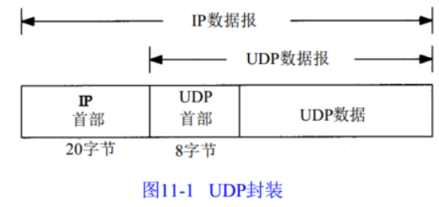

UDP头：


> udp长度为头部加数据的字节长度。
>
> ip数据报长度是数据报全长。

校验和：

UDP校验和覆盖头部和数据。IP首部校验和支覆盖IP头。UDP校验和可选，TCP校验和必选。

UDP检验和是端到端的检验和，由发送端计算，接收端验证。

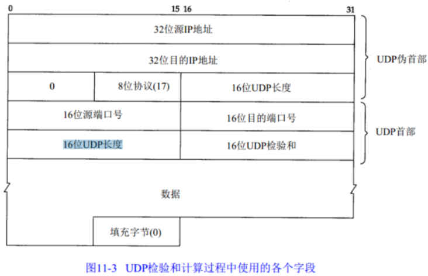


## 可靠传输原理

可靠数据传输协议：在不可靠信道上实现可靠数据传输的服务抽象。检验和、序号、定时器、肯定和否定确认。

### RDT

#### 完全可靠信道rdt1.0

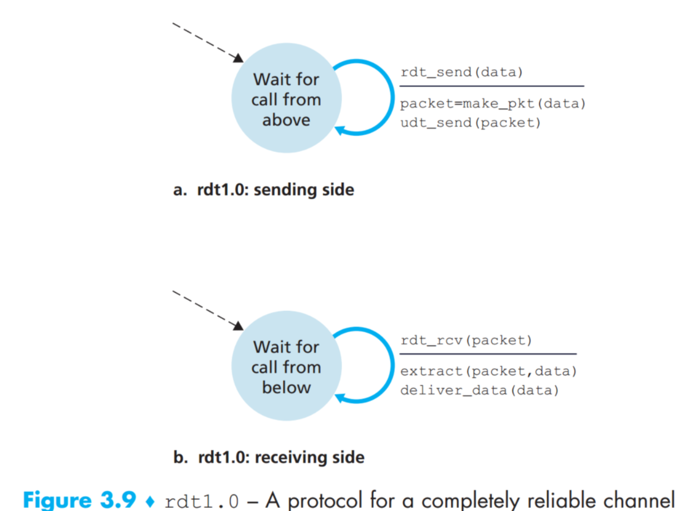


#### 有比特差错信道rdt2.0

比特差错：翻转，0变1，1变0。

自动重传请求需要的其他功能：差错检测，接收方反馈（ACK,NAK），重传(send())。

rdt2.0被称为停等协议：在接收到ACK前部不改变状态（发送下一个数据）。

问题：rdt2.0没有考虑到反馈信息ACK/NAK受损的可能性。

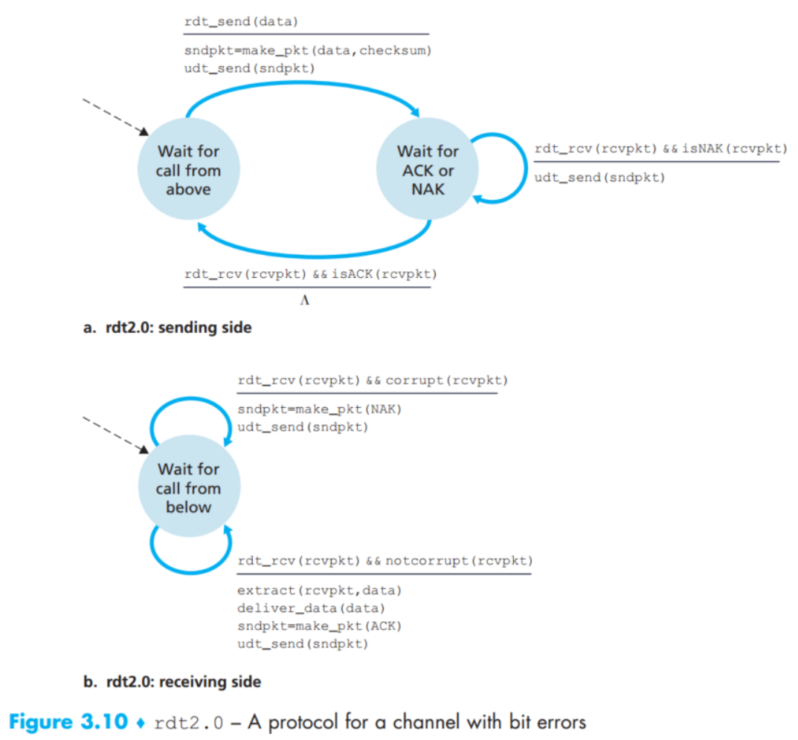

##### rdt2.1

引入序号，解决ACK/NAK重传消息归属问题（失序分组问题）。

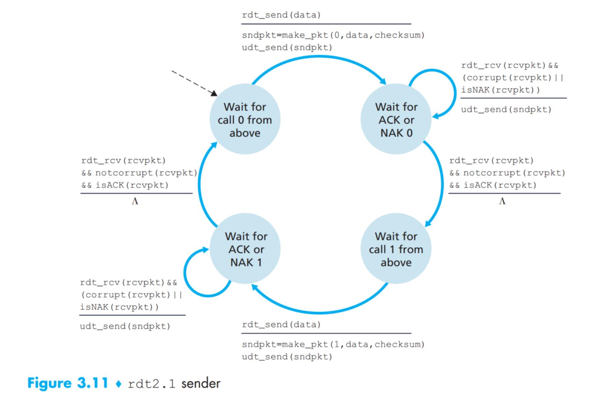

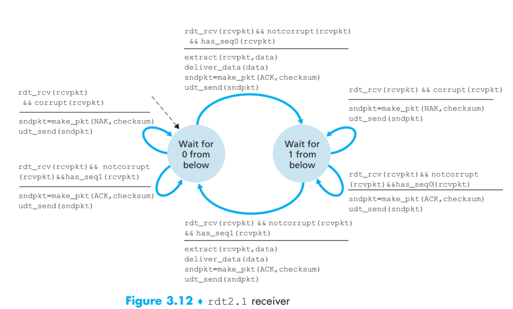

##### rdt2.2

rdt2.2在有比特差错的信道上实现无NAK的可靠数据传输协议。用ACK0,1表示原ACK/NAK。


#### 有比特差错的丢包信道rdt3.0

引入丢包，让发送方负责检测和恢复丢包工作（引入超时重传机制）。

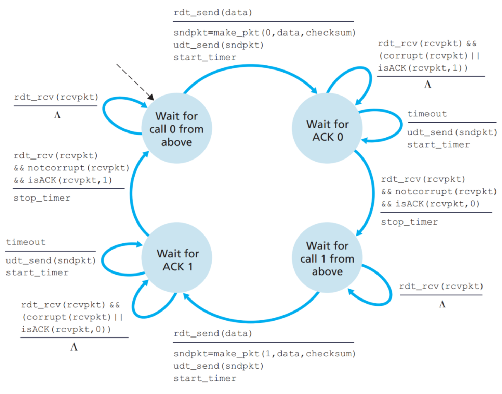

### 流水线可靠信道传输协议

RDT协议是停等协议，流水线改进停等。改进细节：

1. 增加序号范围，RDT需要1比特表示01。
2. 发送接收双方可能需要发送与接收缓冲。
3. 流水线处理丢失、损坏及超时的方式：后退N步（GBN）；选择重传（SR）。

### GBN后退N帧协议

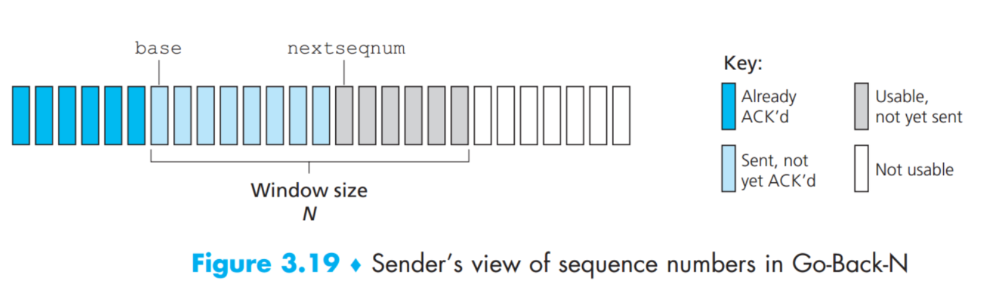

N常被称为窗口长度，GBN协议也称为滑动窗口协议。GBN采用累积确认方式，接收方回应ACK时表示，序号在其之前的段都已收到。

若接收端先收到后续的包时会丢弃，只按序接收数据包。

GBN重传序号后所有数据包。

### SR选择重传协议

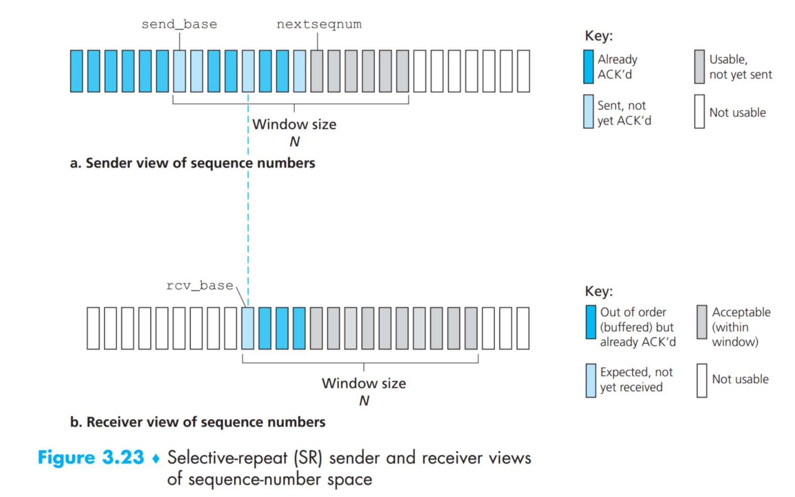

SR在接收到失序的后续包时将其缓存，直至窗口数据全部缓存。

SR重传单个序号包。

## 阻塞控制原理

### 拥塞的原因及代价

#### 情况一：两个发送方和一台具有无穷大缓存的路由器

当发送速率接近于链路最大速率时，分组将会经历巨大的排队时延。

#### 情况二：两个发送发和一台具有有限缓存的路由器

代价：发送发必须执行重传以补偿因缓存溢出而丢弃（丢失）的分组。

代价：发送端在遇到大时延所进行的不必要的重传会引起路由器不必要的转发分组。

#### 情况三：4个发送发和具有优先缓存的多台路由器及多跳路由

代价：当一个分组沿一条路径被丢弃时，每个上游路由器用于转发该分组到丢弃而使用的传输容量最终被浪费掉了。

### 拥塞控制方法

端到端的拥塞控制：TCP，网络层不提供拥塞控制。

网络辅助的拥塞控制：

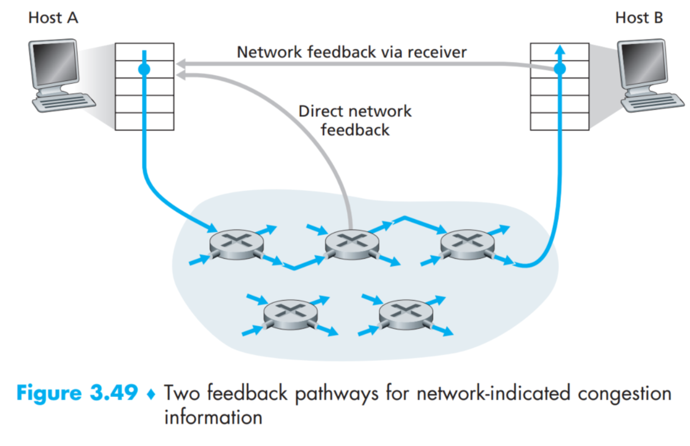

## TCP

TCP面向连接，在通信前要先建立TCP连接（三次握手）。

TCP不用于广播和多播，仅有两方进行彼此间通信，UDP可用于广播。

TCP提供可靠性方式：

- 将数据分割成合适的数据块发送（编号）。
- 自适应的超时重传（rdt3.0丢包）。
- 收到确认机制。
- 端到端检验和（rdt2.0比特差错）。
- 失序，重排（序号rdt2.1解决失序问题）。
- 接收端丢弃重复分组（超时重传相关）。
- 流量控制，双方都有固定大小的缓冲区（）。

TCP提供字节流服务。

### TCP报文格式

### 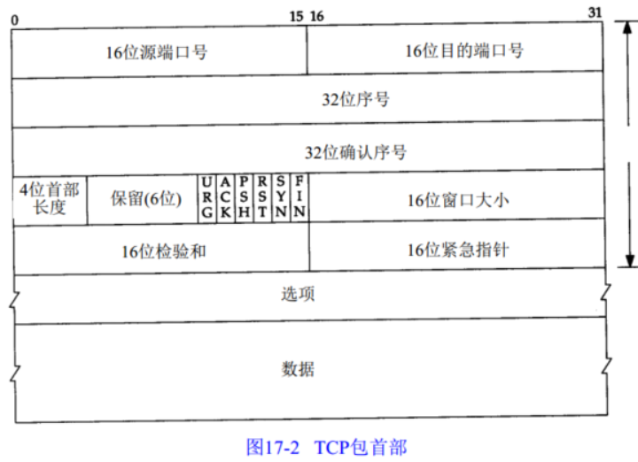

插口对（socket）可唯一确定互联网中每个TCP连接双方。

TCP序号对字节计数。

TCP确认序号是上次成功接收到数据字节序号加一，在ACK标志为1时确认序号字段有效。

TCP为应用层提供全双工服务，数据能在两个方向上独立传输。因此，连接的每一方需要保持每个方向上的数据传输序号。

TCP可表述为一个没有选择确认或否认的滑动窗口协议。


### TCP连接建立与终止

#### 三次握手：

- c向s发送syn为1的请求建立连接报文，携带syn序号。
- s向c恢复请求，携带自己的syn号，并将确认序号置为收到的syn+1。
- c向s发送ack信息，ack序号为s发送syn号加一。此ack信息可捎带于发送数据中。

TCP是全双工连接，完成双向独立数据传送。一来一回两次建立一条单向的可靠连接。第一次请求连接的ACK可捎带于第二次（反方向）连接的请求当中。故三次握手建立双向TCP连接。

#### 四次挥手：

TCP是半关闭协议（half-close），允许单边连接存在。因此，每个方向必须单独地广播连接。收到一个FIN只意味着这一方向上没有数据流动。

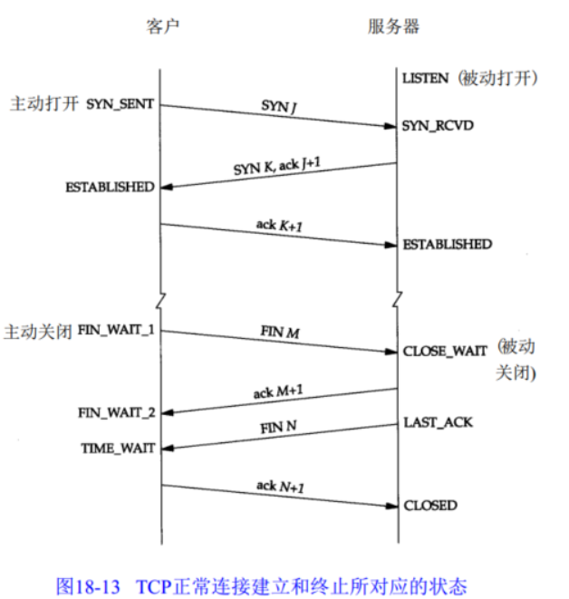

TIME_WAIT状态也成为了2MSL状态。MSL（Maximum Segment Lifetime）指的是TCP段在被丢弃前在网络中的最长时间。TCP使用IP传输，IP数据报有TTL限制（IP的TTL指跳数）。RFC793指出MSL为2分钟，而现实中常用30秒、1分钟、2分钟。

TIME_WAIT等待2MSL原因：

- 若ACK丢失，可处理对方重发的FIN断开连接请求。
- 在2MSL等待时，任何迟到的报文段都会被丢弃。

UDP、TCP在目的端口没有被侦听时的处理：

- UDP会使用ICMP返回一个端口不可达信息。
- TCP使用RST复位。


#### 滑动窗口

使用TCP的滑动窗口协议时，无需确认每一个分组。TCP中的ACK是累积的--标志接收方已经正确接收到ACK减一的所有字节。

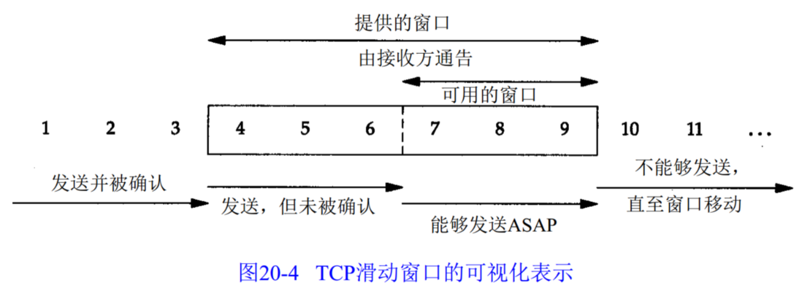

#### 超时与重传

TCP设置一个计时器，当定时器溢出时未收到确认便重传数据。关键是如何定义超时重传策略，即超时间隔和重传频率。

RTT往返时间：传播时延（往返链路）+排队时延（路由器交换机）+数据处理时延（端应用）


#### TCP拥塞控制

TCP拥塞控制算法（Jacobson）主要由三个部分组成：慢启动、拥塞避免、快速重传与快速恢复。

感知拥塞的信息：超时、确认ACK、冗余ACK。

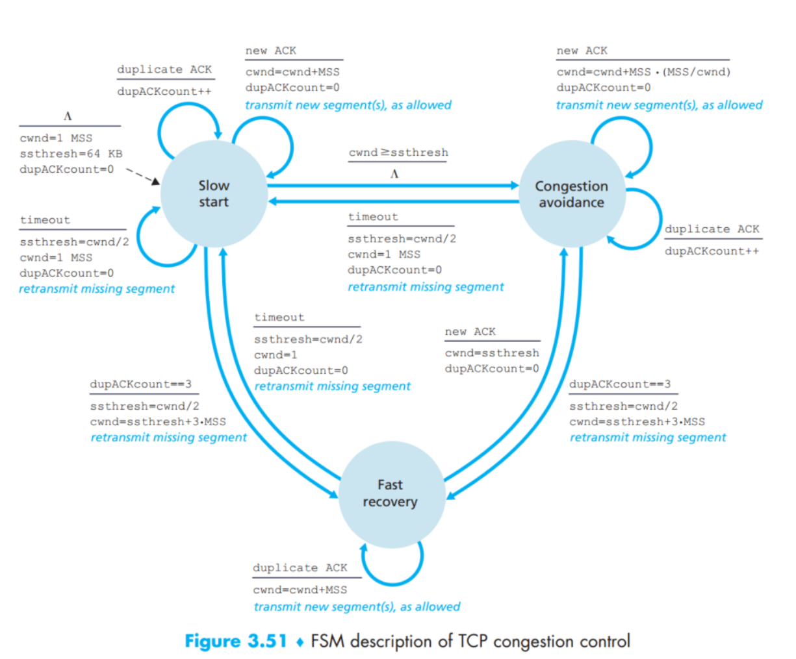

##### 慢启动

在连接刚建立时，不清楚网络负载情况，以从小到达增加拥塞窗口数值的方法探测网络负载情况。避免发生拥堵。

新分组进入网络的速率应于另一端确认返回的速率相同。

拥塞避免算法和慢启动算法时两个目的不同、独立的算法。但是拥塞发生时，可用慢启动来实现降低分组进入网络的传输速率。

- 慢启动在发送方增加一个拥塞窗口CWND。建立TCP连接时，拥塞窗口初始化为1个报文段。每接收到一个ACK，拥塞窗口大小加一个报文段（cwnd单位为字节，慢启动以报文段为单位）。ssthresh被初始化为65535个字节。
- 拥塞窗口是发送方的流量控制，通告窗口是接收方的流量控制。
- 当拥塞发生时，ssthresh被设置为当前窗口的一半（cwnd和接收方通告窗口的最小值，最少为2个报文段）。如果是超时引起拥塞，则cwnd设为1个报文段。
- 如果cwnd$\le$ssthresh，则正在进行慢启动，否则正在进行拥塞避免。

##### 拥塞避免

一旦进入拥塞避免状态，cwnd大约是上次遇到拥塞时值得一半。

拥塞避免阶段“线性增，乘性减”。

##### 快速重传与快速恢复


#### 流量控制

TCP为应用程序提供流量控制服务，以消除发送方使接收方缓存溢出的可能。

TCP让发送方维护一个接收窗口rwnd，用以记录接收方缓存剩余大小。rwnd=RcvBuffer-[lastRead-lastReceive]。

##### 拥塞控制与流量控制

流量控制与拥塞控制方法相似，但是因为不同原因采取的措施。

流量控制是点对点通信量的控制，是端到端问题。保障发送方速率不超过接收方处理的速率。

拥塞控制是防止过多数据诸如网络中，使网络中的路由器或立案率不至于过载。


# 网络层


# 链路层