# 计算机网络

# 计算机网络和因特网

## 网络核心

网络核心包含网络层，链路层，物理层。

### 分组交换

源端向目的端发送报文，源将长报文分为更小的数据块，每个数据块称为分组packet。

#### 存储转发

在开始传输分组前，必须收到整个分组数据，把收到的分组缓存再转发。

#### 排队时延与分组丢失

若缓冲区满，会丢弃新到的分组，造成丢包。

#### 时延类型


#### 转发表和路由协议

数据报通过目的地址查转发表确定从路由器哪一端发出。路由协议确定网络端到端路径。路由选择算法（协议）动态更新转发表。

### 电路交换

虚电路。电路交换网络中，端系统通信会话期间，预留通信所需要的全部资源，建立一条端到端的链接。

#### 电路网络中的复用

频分复用（FDM）：不同信号使用不同频段，如有线电视。

时分复用（TDM）：把时间分为固定期间的帧frame，每个帧划分为固定数量的时隙slot。

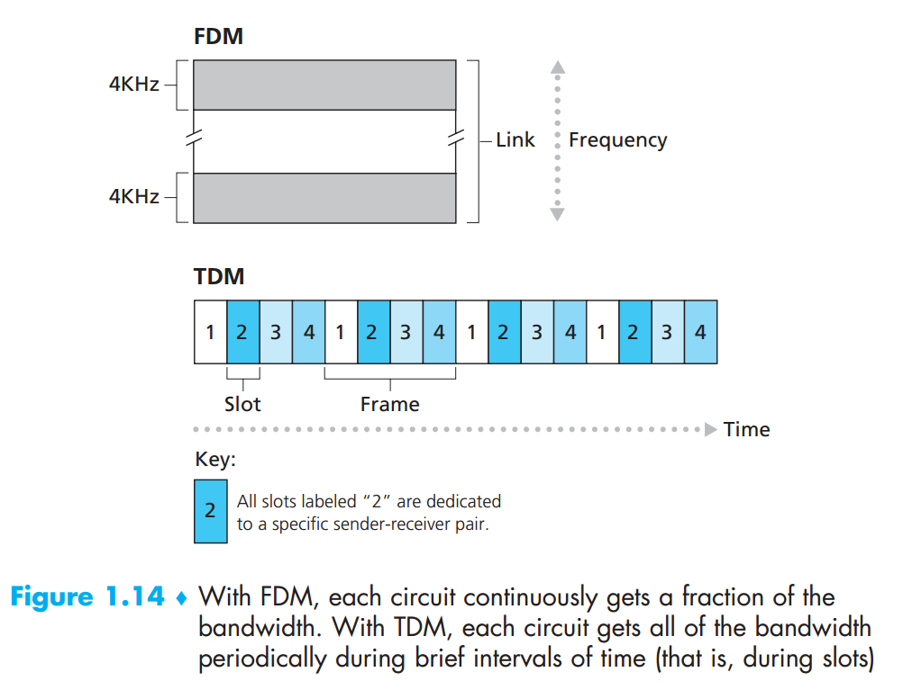

#### 电路交换与分组交换比较

- 电路交换：简化“边缘”，复杂网络

  - 电话网络演化而来。
  - 核心业务是实时通话：需要严格的时间、可靠性要求保障的服务。
  - 非智能终端：电话、传真。

- 分组交换：简化网络，复杂“边缘”

  - 多用于计算机之间数据交换：”弹性“服务，没有严格时间需求。

  - 智能终端系统：计算机，可自适应、性能控制、差错恢复。

    

## 协议层次及服务模型

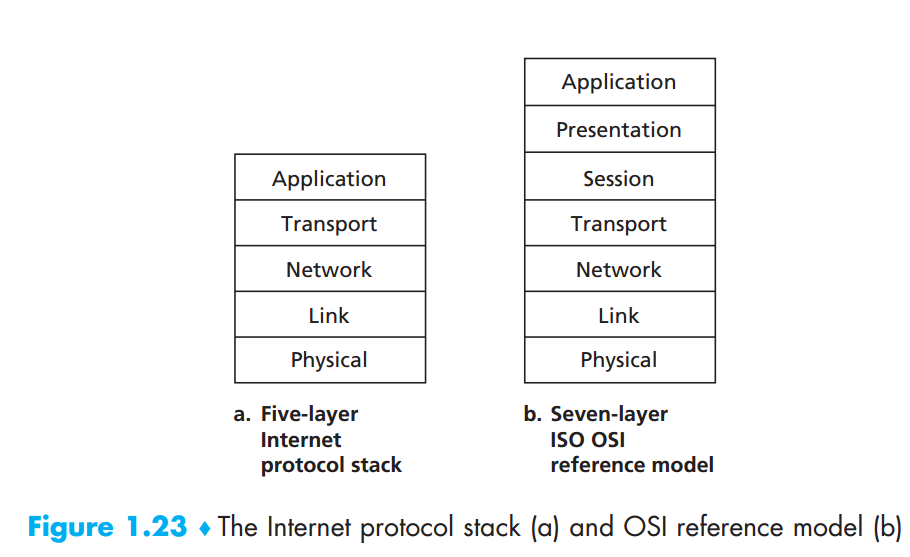

### 7层OSI参考模型

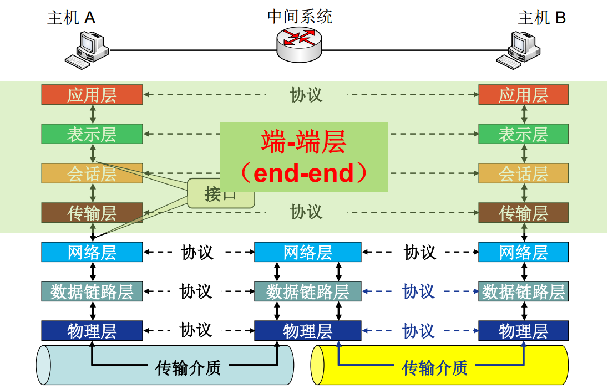


### 因特网TCP/IP5层协议

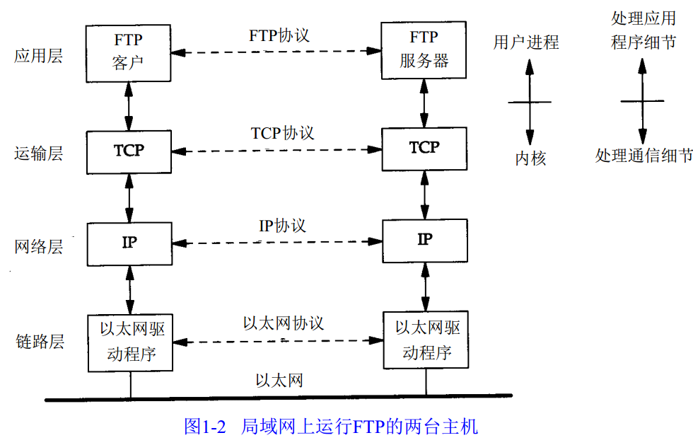

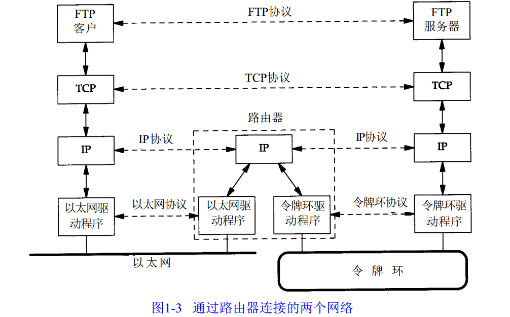

# 应用层

## 原理

### 网络应用体系架构

#### 客户服务器体系结构

客户发送请求，接收服务器响应。如web应用，文件传输FTP应用。

#### P2P体系结构

无专用服务器，通信在对等实体之间直接进行。

### 因特网提供的运输服务

#### TCP服务

面向连接：

可靠数据传输：

#### UDP服务

不提供不必要功能的轻量级传输协议。

#### SSL

全称Secure Sockets Layer，在传统TCP上加了一层封装，用于宝行加密、数据完整性以及端点鉴别等安全需求。

#### 因特网运输协议不提供的服务

因特网提供定时和带宽保证。

### 进程寻址SOCKET

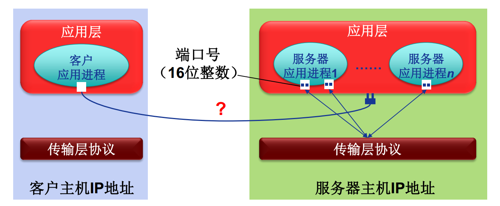

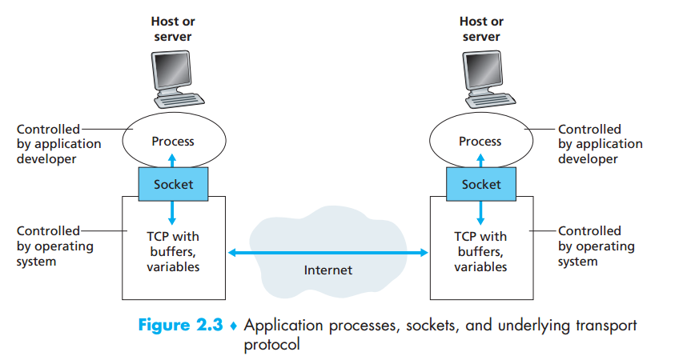 


## HTTP

对象的寻址使用URI。HTTP采用CS模式，客户端请求，服务端响应。

URI包含URL和URN。


### HTTP报文

#### 报文流

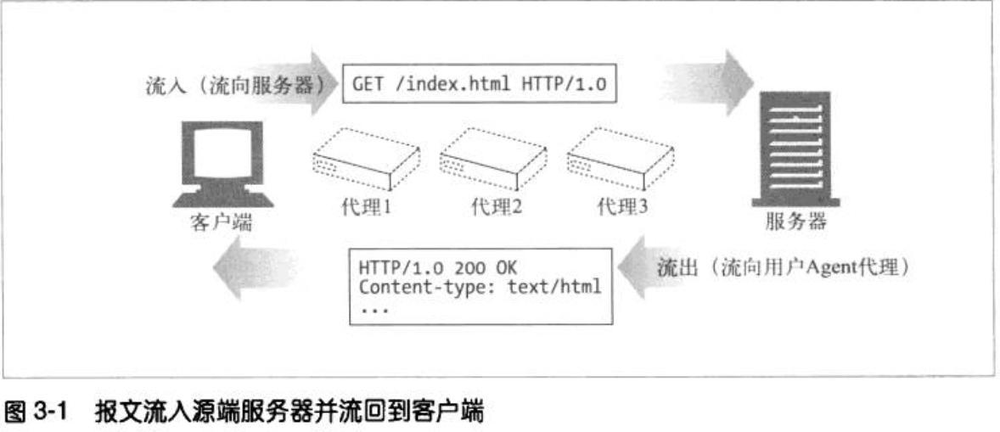

#### 报文组成

报文包括起始行、头部、主体三个部分。

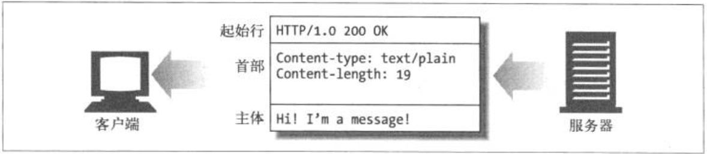

HTTP报文分为请求报文与响应报文两种。

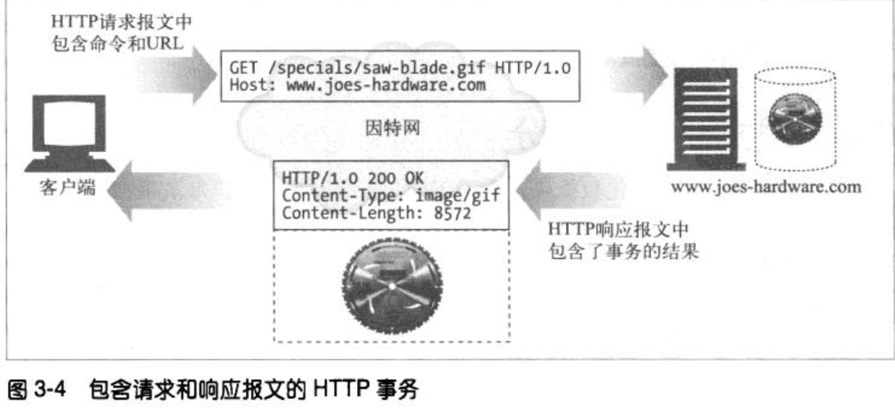

```xml
	<!-- 请求报文格式 -->
	<method> <request-URL> <version>
	<header>
    
	<body>
    method:GET，POST，HEAD
    version:HTTP/1.1
	<!-- 响应报文格式 -->
	<version> <status> <reason-phrase>
    <header>
        
    <body>
```

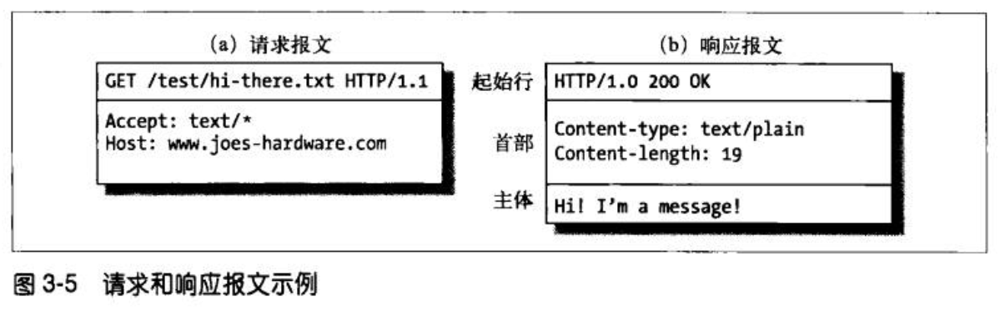

#### 报文头

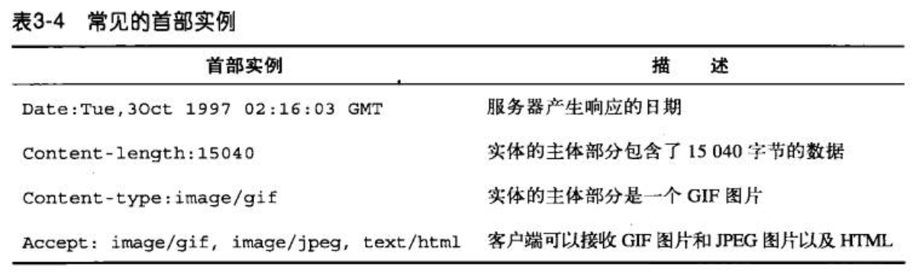

#### 状态码

##### 1xx

- 100 Continue:

  -  客户端向服务器发送主体前想知道服务段是否会接收该主体，变发送100 Continue Expect请求头报文，等待服务端响应。

  - > 100 Continue应为一个优化，客户端应只发送服务端无法处理的大实体时才使用100 Continue。

##### 2xx 成功

- 200 OK：请求无误
- 201 Created：
- 202 Accepted：服务端接收到请求，不保证完成请求
- 203 Non-Authoritative Information：
- 204 No Content：请求已成功处理，但返回报文主体部分无实体。主要用于不打开新文档情况下，对其进行刷新，比如刷新表达页面。
- 205 Reset Content：告知客户端浏览器清除所有表单元素。
- 206 Partial Content：表示客户端的范围请求成功。响应中包含Context-Range、Date等，Context-Range中包含请求的范围内容。

##### 3xx 重定向

- 300 Multiple Choices：客户端请求一个实际有多个资源的URL时返回，比如一个HTML页面又多个语言版本。返回状态码时带有一个选项列表。
- 301 Moved Permanently：永久重定向，请求URL已被移除。响应的Location首部应包含资源现在所处的URL。
- 302 Found：临时重定向，客户端需临时将新的URL封装到Location首部再次访问，后续的请求仍然使用旧URL。1.0版本客户端发送一个POST请求，返回302后希望客户端向新的URL发送一个GET请求。
- 303 See Other：HTTP/1.1使用303实现HTTP/1.0中302希望客户端向新的URL发送GET请求的功能。临时重定向功能1.1使用307完成。302状态留给1.0版本使用。
- 304 Not Modified：客户端可以通过发送带条件的请求首部。如是否被修改等：If-Match，If-Modified-Since，If-Non-Modified-Since，If-Range，If-Non-Match。如果不满足条件，服务器返回304代码。
- 305 Use Proxy：说明必须通过一个代理来访问资源。
- 307 Temporary Redirect：HTTP1.1中临时重定向。

##### 4xx 客户端错误

- 400 Bad Request：客户端发送了错误请求，如请求报文存在语法错误。
- 401 Unauthorized：客户端在获取资源访问权之前，需要对自己认证。
- 403 Forbidden：请求被服务器拒绝，可在响应主体中标注拒绝原因，但一般服务器不像说明拒绝原因时才使用403。
- 404 Not Found：
- 405 Method Not Allowed：
- 406 Not Acceptable：客户端可以指定需求什么类型的实体，当服务端对应URL无法满足时返回406。
- 408 Request Timeout：客户端完成请求时间过长，服务端可返回408并关闭连接。

##### 5xx 服务端错误

- 500 Internal Server Error：服务器在执行请求时发生错误。
- 501 Not Implemented：客户端发送了超出服务器功能的请求，如使用服务器不支持的请求方法。
- 502 Bad Gateway：
- 503 Service Unavailable：服务器无法提供请求，如服务器超载或进行停机维护。
- 504 Gateway Timeout：

#### 方法

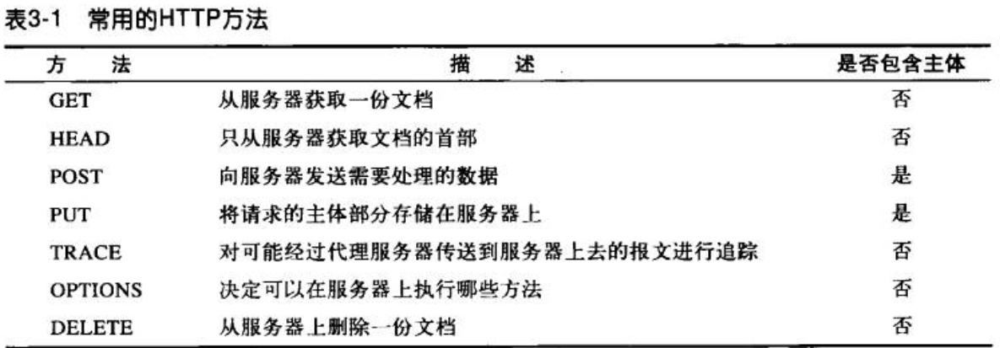


### 连接管理

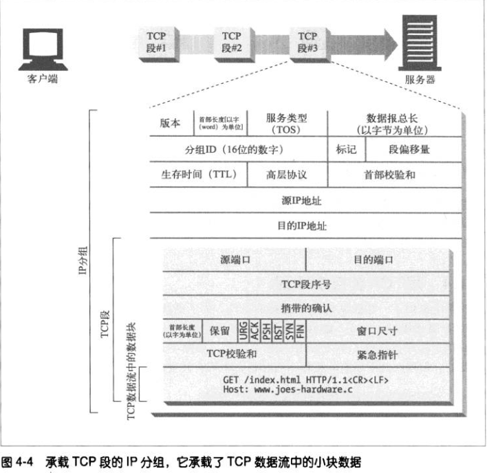

HTTP紧挨着TCP，所以HTTP事务的性能在很大程度上取决于底层TCP的性能。

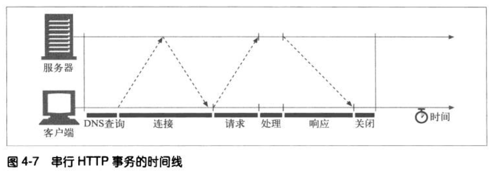

#### HTTP延时与性能

HTTP事务延迟的主要原因：

1. 客户端根据URI确定Web服务器IP地址和端口号：若最近无对该URI的访问，则需要使用DNS解析IP，可能花费数十秒。
2. TCP三次握手建立连接耗时。
3. 因特网传输请求报文以及服务器处理时延。
4. 返回HTTP请求耗时。

常见的TCP引起相关时延：

1. TCP建立连接三次握手：

   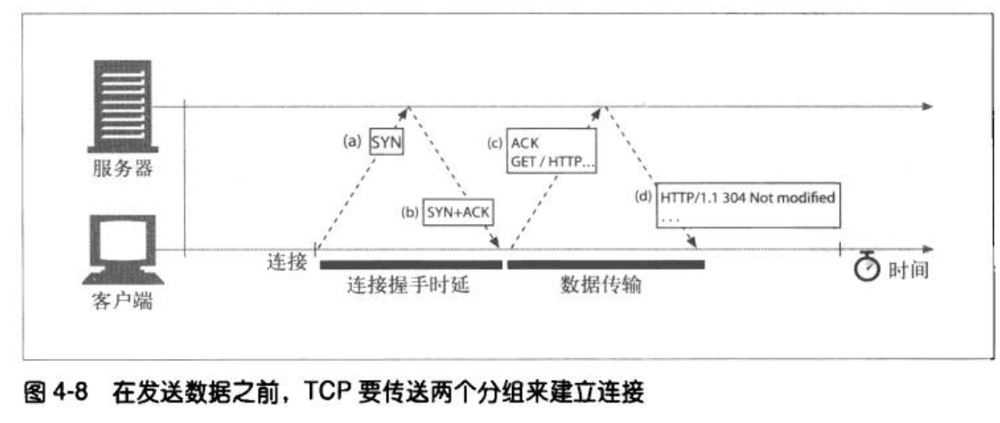

2. TCP慢启动。

3. 数据聚集的nagle算法。

4. 用于捎带的TCP延时确认算法。

5. TIME_WAIT时延和端口耗尽。

#### 串行事务处理时延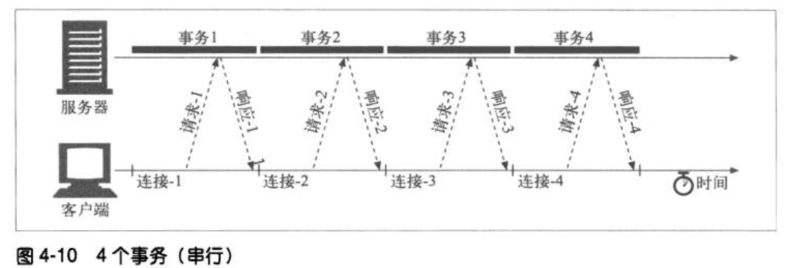

#### 提高HTTP性能连接

##### 并行连接：

单个页面打开多个TCP连接。

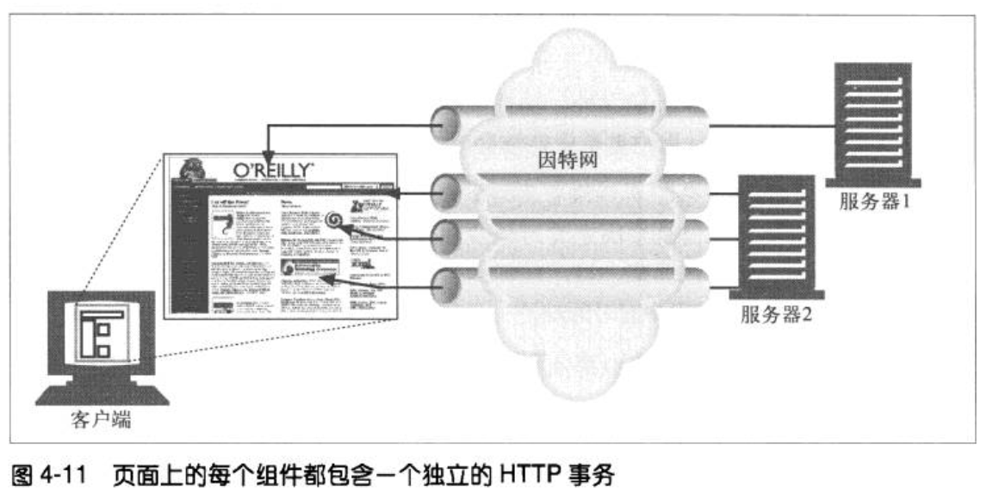

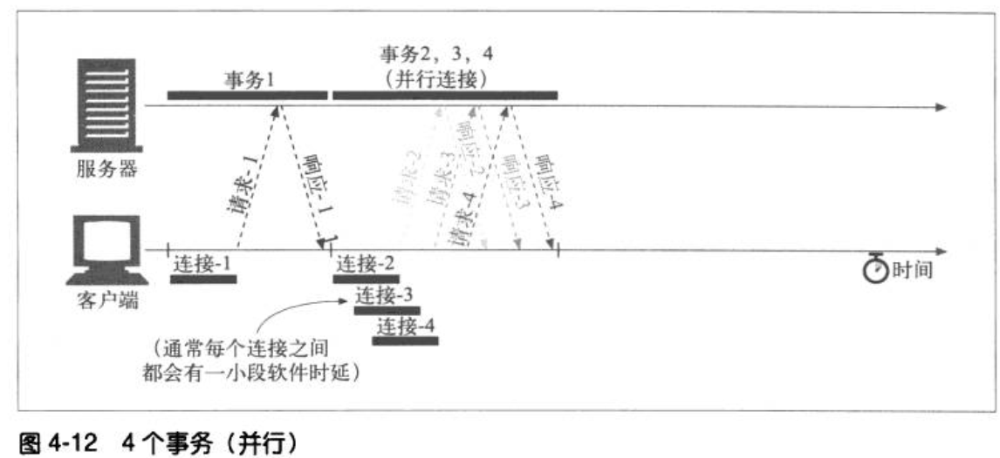

##### 持久连接：

重用目标服务器已打开的连接可以节省连接建立与关闭的时间，避免开始慢启动带来的阻塞，可更快的传送数据。

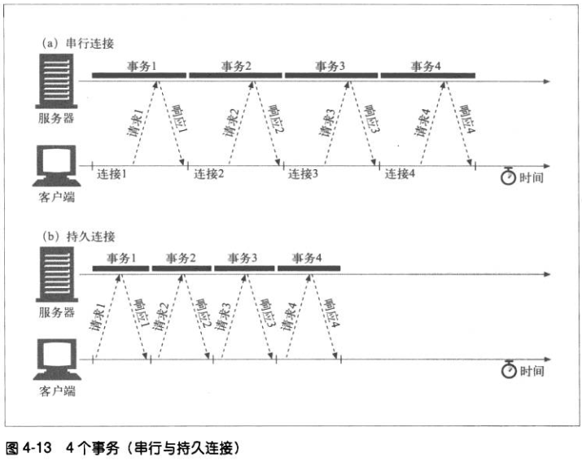

HTTP/1.0+keep alive：通过在HTTP请求与响应报文头部，将Connection值置为Keep-Alive。1.0默认不开启长连接，客户端需发送Connection：Keep-Alive来请求开启长连接。

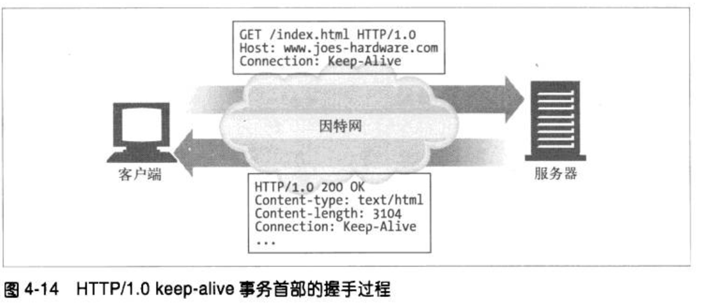

HTTP/1.1 persistent connection：1.1默认激活长连接，除非头部包含Connection: Close。

##### 管道化连接：（流水线）

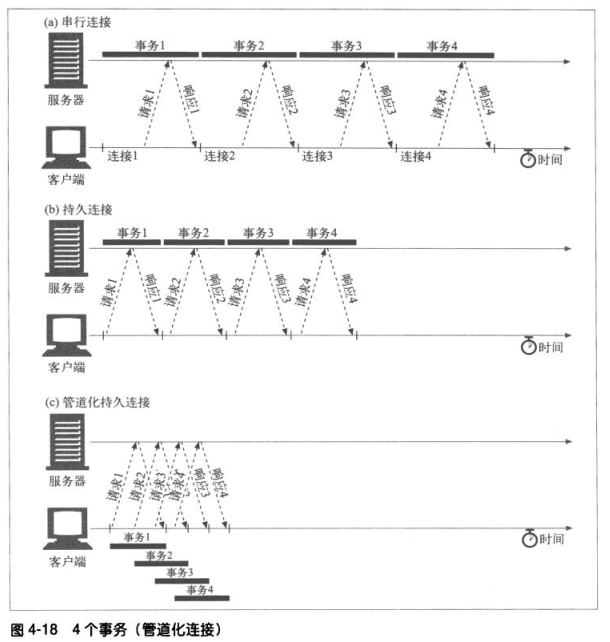


### 缓存


### 客户端识别与cookie

### HTTPS


## DNS

## DHCP

## FTP

## SMTP

## P2P

# 运输层


# 网络层


# 链路层