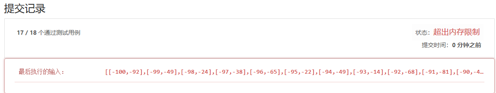

# 谢佳奇的贪心笔记

### [455. 分发饼干](https://leetcode-cn.com/problems/assign-cookies/)

#### 第一眼思路

类似于0-1背包问题，每块饼干是不可再分的基本单位。猜测基本贪心算法是否不总能达到最优解，需动态规划求解最优解？如果最优策略的标准是分配最多孩子饼干的方案，那么对孩子饼干需求量和饼干实际重量升序排列是否可得到最优解？

> 贪心只能得到一个最优解，无法获得全部最优解。

分配问题可延伸到内存分配，在连续内存分配方式中会产生外部碎片。外部那些不连续的内存块就像饼干，待分配对象对内存的需求就好比孩子对饼干的需求。

### [435. 无重叠区间](https://leetcode-cn.com/problems/non-overlapping-intervals/)

#### 思路

统计每个区间与其他区间重叠的次数, 逆序排列次数, 优先移除高重叠次数区间.

> 在冲突项间加一条边, 可将冲突关系引申为图, 本题则变为移除最少的顶点以消除图中所有的边.

##### 问题: 是否每次移除区间后重新检测全部区间? 有无方式移除区间后无需检测全体?

有无方式移除区间后将与其冲突的区间标记-1, 在所有区间冲突项为0时跳出. 采用二维数组记录冲突, 移除冲突项删除该行/列的冲突标记**(二维数组方式爆内存)**.

冲突项为零的区间可以不考虑.

##### 问题: 如何检测冲突项?

区间两两比较, n个区间需比较$\frac{n(n+1)}{2}$次, 复杂度$O(n^2)$.

记两区间为a,b, 则冲突方式有:

- a真包含于b, 或b真包含于a
- a右侧与b左侧有交集
- a左侧与b右侧有交集

##### 问题: 如何存储冲突次数?

~~采用K-V方式存储, 可使用Map或者利用各区间索引构建新冲突项数组, 两者索引对应~~.***亦需记录冲突次数, 二维数组只做标志, 冲突次数为后续排序及移除操作使用. 只是可通过求行列1个数求得区间冲突次数.***

~~若利用索引方式实现, 比较方法需添加索引入参.~~ ***以上方式在移除区间时不变删除对应项的冲突值***

构建二维数组记录冲突项, 主对角线为其自身可忽略不计. 因冲突关系无方向性, 故按行方式存储冲突关系只需要不含对角线的上三角区域$U$. **为方便后续移除操作, 整个二维组中除主对角线外均存放冲突关系, 只是在构建二维组时可根据其为实对称矩阵减少比较次数.** 可定义存在冲突关系置1, 不存在冲突关系置0. 在移除时, 将行列中对应项冲突次数-1.**JAVA二维int数组只通过大小创建时会对所有元素赋初值0, 故只需更新冲突项.**

##### 问题: 反转后冲突数及索引如何存储

以每次删除节点后要判断是否还存在边, 是否可以通过删除边的方式进行?

##### 结果内存爆了

原因可能为区间更多, 构造二维数组(边数组)超出了内存限制, 同样问题如两个大数`int`相乘.

#### 改进

剔除无冲突区间.

采用稀疏矩阵的存储方式.

用链表存储.

每次消除元素后重新计算新数组的重复次数.(耗时)

#### 贪心策略选择

按区间长度贪心还是区间重复次数贪心?

贪心思想每次选择的是局部最优, 那么这个局部最优可能不是整体范围内的最优选项. 本题每次选择选取在冲突的区间中选取最短的即可.

### [406. 根据身高重建队列](https://leetcode-cn.com/problems/queue-reconstruction-by-height/)

#### 第一眼思路

按身高聚集, 相同身高的防到一起, 从身高低的开始排列. 第一组拍了后第二组在空的位置插入.

#### 看完解答后

解答的思路是从队列前部按照身高和排序插入, 数组每次插入会将后续元素顺序后移. 

为什么没考虑此方式? 最初的想法是数组插入顺序移位带来开销很大, 之前考虑思路是插入部分只有$O(n)$复杂度, 将复杂的部分放在选择插入元素以及判断插入位置操作上. 

`可能性方案:`按照身高从低到高排序, 以特殊的方式通过身高和序号确定该元素所在的最终位置. 以身高汇集, 将每个身高的相对次序放入一个队列中.  按顺组顺序, 每次放入当前位置的最终元素.

### [121. 买卖股票的最佳时机](https://leetcode-cn.com/problems/best-time-to-buy-and-sell-stock/)

#### 第一眼思路

高位低位双指针分别寻找当前min与max.

#### 看完解答

贪心算法的局部最优解只需要记录其数值即可, 多数情况下无需知道最优解是如何而来(如何构成), 以及有多少个最最优解.

### [122. 买卖股票的最佳时机 II](https://leetcode-cn.com/problems/best-time-to-buy-and-sell-stock-ii/)

#### 第一眼思路

股票多次买入, 应在极小值买入, 极大值卖出.

#### 股票的贪心思想如何体现?贪心策略是什么?代码贪心实现方式是什么？

股票一按时间顺序从左往右扫描, 维护当前最高收益. 

#### 

#### 